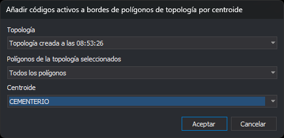

# ANADIR\_CODIGOS\_BORDES\_POLIGONOS\_TOPOLOGIA
<!-- id: anadir-codigos-bordes-poligonos-topologia -->

Añade los códigos activos a las líneas que forman el borde de los recintos de una topología: de todos los recintos, de los que tienen centroide o de los que tienen un centroide con un texto determinado.

## Parámetros

No admite parámetros.

## Observaciones

La orden necesita al menos una topología cargada. Si no hay ninguna, la opción del menú está desactivada; si tecleas la orden, muestra el aviso «No hay ninguna topología cargada», emite el sonido de error y termina.

### Cuadro de diálogo

Esta orden solicita los datos en el cuadro _Añadir códigos activos a bordes de polígonos de topología por centroide_:

| Campo | Descripción | Valor por defecto |
| :--- | :--- | :--- |
| Topología | Topología con la que trabaja la orden. La lista contiene las topologías cargadas, por nombre y en orden alfabético | La primera de la lista |
| Polígonos de la topología seleccionados | Recintos que procesa la orden: _Todos los polígonos_, _Los polígonos que tengan cualquier centroide_ o _Los polígonos que tengan un centroide específico_ | Todos los polígonos |
| Centroide | Texto del centroide de los recintos que procesa la orden. La lista contiene, en orden alfabético y sin repetir, los textos de los centroides de la topología elegida en todos sus archivos. Solo está activo con _Los polígonos que tengan un centroide específico_ | _Ninguno_ |

Al cambiar de topología, la lista de centroides se vuelve a llenar y queda sin ningún centroide elegido. El botón _Aceptar_ solo está activo si hay una topología elegida y, con _Los polígonos que tengan un centroide específico_, también un centroide.

La orden no recuerda los valores: cada vez que se ejecuta, el cuadro muestra los valores por defecto.

Si pulsas _Cancelar_, la orden termina sin modificar nada.

### Funcionamiento

La orden solo procesa la parte de la topología que corresponde al archivo de dibujo activo. Para cada recinto que cumple la condición elegida, añade los códigos activos a cada línea de su borde exterior y de sus huecos:

* La comparación con el centroide elegido es por el texto del centroide y distingue mayúsculas de minúsculas.
* Una línea compartida por dos recintos se modifica una sola vez. Si el recinto vecino no cumple la condición, la línea compartida recibe los códigos igualmente, porque también forma parte del borde del recinto que sí la cumple.
* Si la línea ya tiene uno de los códigos activos, la orden no lo repite, salvo que la opción [Permitir códigos repetidos](/digi3d-ai/referencia/cuadros-de-dialogo/configuracion/diging/permitir-codigos-repetidos.md) lo permita. Si una línea no recibe ningún código nuevo, la orden no la modifica.

La orden sustituye cada línea modificada por una línea nueva con los mismos vértices, color, grosor y atributos, y con los códigos añadidos al final. La topología pasa a usar la línea nueva, de modo que sigue cargada y se puede volver a ejecutar la orden sobre ella.

[UNDO](/digi3d-ai/referencia/ventana-de-dibujo/ordenes/u/undo.md) deshace de una vez todos los cambios de la orden.

## Características de la orden

| Tipo de orden | Orden inmediata |
| :--- | :--- |
| Repite automáticamente | No |
| Opción del menú donde aparece la orden | Topología/Añadir códigos activos a bordes de polígonos topológicos... |
| Barra de herramientas en la que aparece la orden | _Esta orden no tiene asociado ningún botón en ninguna barra de herramientas_ |
| Extensión | DigiNG.OrdenesTopologia.dll |
| Variables relacionadas | No tiene variables relacionadas |
| Órdenes relacionadas | [CAMBIA\_CODIGO\_LINEAS\_DENTRO\_POLIGONOS\_TOPOLOGIA](/digi3d-ai/referencia/ventana-de-dibujo/ordenes/c/cambia-codigo-lineas-dentro-poligonos-topologia.md) [UNDO](/digi3d-ai/referencia/ventana-de-dibujo/ordenes/u/undo.md) |
| Nombre interno | {99A1A919-D4B5-4491-B171-C0585C429F47} |
