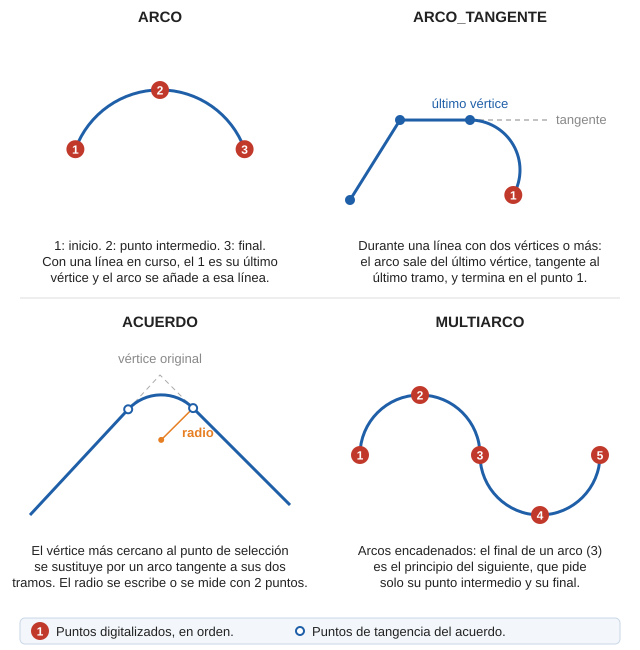

# ARCO\_TANGENTE

Dibuja un arco tangente al segmento anterior.

## Parámetros

No admite parámetros.

## Observaciones

La orden solo funciona mientras dibujas una línea con la orden [LINEA](/digi3d-ai/referencia/ventana-de-dibujo/ordenes/l/linea.md) y la línea tiene ya dos vértices o más. El arco sale del último vértice, tangente al último tramo, y termina en el punto que digitalizas. Sus vértices se añaden a la línea en curso.

## Características de la orden

| Tipo de orden | [Orden interactiva](arco-tangente.md) |
| :--- | :--- |
| Repite automáticamente | No |
| Opción del menú donde aparece la orden | Dibujar/Arco tangente |
| Barra de herramientas en la que aparece la orden | Polilíneas |
| Extensión | DigiNG.OrdenesStandard.dll |
| Variables relacionadas | [PITA](/digi3d-ai/referencia/ventana-de-dibujo/variables/p/pita.md) — activa o desactiva las señales acústicas |
| Nombre interno | {D5414D6A-1903-4120-8022-30BAFE0E1C60} |

