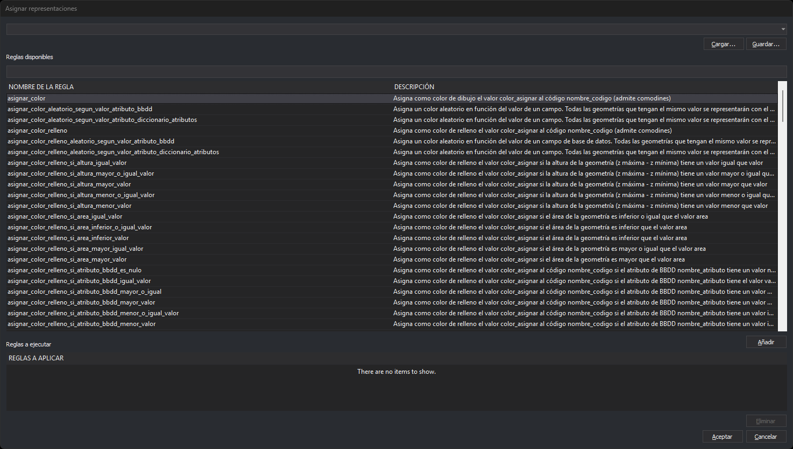
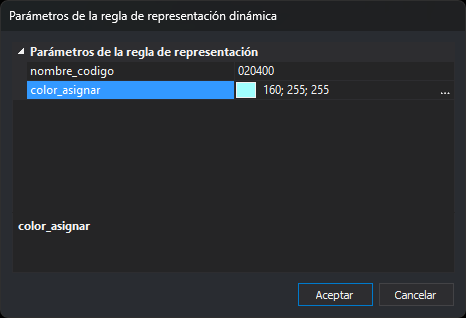

# ASIGNAR\_REPRESENTACIONES
<!-- id: asignar-representaciones -->

Asigna una lista de reglas de representación dinámica, definidas en Python en la tabla de códigos, para modificar la representación de las geometrías en pantalla.

## Parámetros

No admite parámetros.

## Observaciones

La orden abre el cuadro de diálogo **Asignar representaciones**.



El cuadro se abre con la lista **Reglas a ejecutar** vacía. No muestra las reglas asignadas anteriormente.

### Reglas disponibles

La lista **Reglas disponibles** muestra las funciones del código de la pestaña [Entorno Python](/digi3d-ai/referencia/editor-de-tablas-de-codigos/pestanas/entorno-python.md) de la tabla de códigos que cumplen dos condiciones:

* Llevan el decorador `@dynamic_representation_rule()`.
* Tienen al menos tres parámetros.

La columna **Nombre de la regla** muestra el nombre de la función. La columna **Descripción** muestra su cadena de documentación (*docstring*); si la función no tiene, muestra `None`. Si la tabla de códigos no define ninguna regla, la lista lo indica.

Digi3D.AI llama a cada regla con tres argumentos con nombre, así que los tres primeros parámetros de la función tienen que llamarse así:

* `geometry`: la geometría que se va a dibujar.
* `code_drawing`: el código con el que se dibuja.
* `representations`: la lista de representaciones calculada por las reglas anteriores, o la del código si es la primera regla.

La función devuelve la lista de representaciones con la que se dibuja la geometría. Los parámetros a partir del cuarto son los parámetros propios de la regla. Escríbelos como nombres simples, sin valor por defecto ni anotación de tipo:

```python
@dynamic_representation_rule()
def mi_regla(geometry, code_drawing, representations, nombre_codigo, color_asignar):
    """Descripción que aparece en la columna Descripción"""
    ...
    return representations
```

### Filtrar las reglas

El cuadro de texto situado debajo de **Reglas disponibles** filtra la lista por el nombre de la regla. Escribe una o varias palabras separadas por espacios. La lista muestra las reglas cuyo nombre contiene todas las palabras. El filtro distingue mayúsculas de minúsculas y no busca en la descripción.

### Añadir y eliminar reglas

Para añadir una regla a **Reglas a ejecutar**, selecciónala y pulsa **Añadir**, o haz doble clic sobre ella. Las reglas se aplican en el orden de la lista, y una regla puede añadirse varias veces con parámetros distintos.

Si la regla tiene parámetros propios, se abre el cuadro **Parámetros de la regla de representación dinámica**.



El cuadro muestra una fila por parámetro, bajo la categoría **Parámetros de la regla de representación**. Cada fila lleva el nombre del parámetro tal como está escrito en la función, por ejemplo `nombre_codigo`, y su valor. Al abrirse, la primera fila está seleccionada. El panel inferior muestra el nombre de la fila seleccionada y la cadena de documentación (*docstring*) de la regla; Python no permite describir cada parámetro por separado.

* Un parámetro cuyo nombre contiene `color`, en minúsculas, se pide con un selector de color. Empieza en negro. Pulsa el botón situado a la derecha del valor para abrir el selector. La regla recibe el color como texto `"R G B"`, por ejemplo `"255 0 0"`.
* El resto de parámetros empieza vacío y se escribe como texto. Un parámetro cuyo nombre contiene `codigo`, en minúsculas, se pasa siempre como texto, aunque esté formado solo por cifras, por ejemplo `120400`. En los demás parámetros, un entero o un número decimal con punto, sin ceros a la izquierda, se pasa como número; cualquier otro valor, por ejemplo `020`, se pasa como texto.

**Aceptar** añade la regla a **Reglas a ejecutar** con los valores escritos. No comprueba los valores: admite campos vacíos y códigos que no existen en la tabla de códigos. **Cancelar** cierra el cuadro sin añadir la regla. En la lista, la regla se muestra con sus valores, por ejemplo `asignar_color({"color_asignar":"255 0 0", "nombre_codigo":"020"})`.

Para quitar una regla de **Reglas a ejecutar**, selecciónala y pulsa **Eliminar**.

### Archivos de representaciones

La lista **Reglas a ejecutar** puede guardarse en un archivo `.representations`. Es un archivo de texto con una regla por línea, escrita tal como aparece en la lista.

* **Guardar...** guarda la lista en un archivo. Propone el primer archivo del desplegable superior.
* **Cargar...** abre un archivo y sustituye el contenido de **Reglas a ejecutar** por las reglas del archivo.
* El desplegable superior contiene los últimos 10 archivos cargados o guardados. Elegir uno sustituye la lista por su contenido. Los archivos que ya no existen no aparecen.

Guardar escribe el archivo en el momento, y la lista de archivos recientes se actualiza al cargar o guardar, aunque después pulses **Cancelar**. Si el archivo no se puede crear, Digi3D.AI muestra un mensaje de error.

Para que una lista de reglas forme parte de la tabla de códigos, añade el archivo `.representations` en la pestaña **Representaciones dinámicas** del editor de tablas de códigos. Después puedes activarla desde el menú **Ver/Representaciones dinámicas** o con la orden [REPRESENTACION\_DINAMICA](/digi3d-ai/referencia/ventana-de-dibujo/ordenes/r/representacion-dinamica.md).

### Aceptar y cancelar

**Aceptar** asigna las reglas de **Reglas a ejecutar** a la tabla de códigos cargada y regenera la vista. Si la lista está vacía, desactiva la representación dinámica. La asignación no se guarda en la tabla de códigos ni en el archivo de dibujo.

**Cancelar** cierra el cuadro sin cambiar la representación.

Si una regla lanza una excepción o no devuelve una lista de representaciones, Digi3D.AI no muestra ningún mensaje. Esa regla y las siguientes no se aplican a esa geometría, que se dibuja con lo que hayan calculado las reglas anteriores.

## Características de la orden

| Tipo de orden | Orden inmediata |
| :--- | :--- |
| Repite automáticamente | No |
| Opción del menú donde aparece la orden | Ver/Representaciones dinámicas/Asignar representaciones manualmente... |
| Barra de herramientas en la que aparece la orden | _Esta orden no tiene asociado ningún botón en ninguna barra de herramientas_ |
| Extensión | DigiNG.OrdenesStandard.dll |
| Variables relacionadas | [APLICAR\_REPRESENTACION\_DINAMICA\_GEOMETRIA\_DIBUJANDO](/digi3d-ai/referencia/ventana-de-dibujo/variables/a/aplicar-representacion-dinamica-geometria-dibujando.md) |
| Órdenes relacionadas | [REPRESENTACION\_DINAMICA](/digi3d-ai/referencia/ventana-de-dibujo/ordenes/r/representacion-dinamica.md) |
| Nombre interno | {0023298C-F9CC-4EAD-838B-520AFD345D62} |
