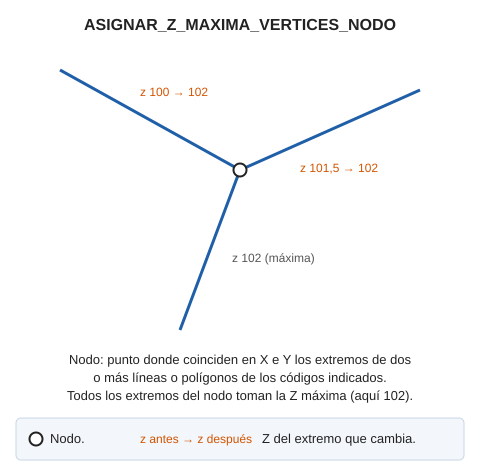

# ASIGNAR\_Z\_MAXIMA\_VERTICES\_NODO

Localiza todos los vértices que llegan a un determinado nodo y modifica la Z de todos para que se ajuste a la Z máxima.

## Parámetros

| Número de parámetro | Descripción | Opcional |
| :--- | :--- | :--- |
| 1 | Código o códigos (uno o más, separados por espacios) | Si |

## Características de la orden

| Tipo de orden | [Orden inmediata](asignar-z-maxima-vertices-nodo.md) |
| :--- | :--- |
| Repite automáticamente | No |
| Opción del menú donde aparece la orden | _Esta orden no tiene asociada ninguna opción de menú_ |
| Barra de herramientas en la que aparece la orden | _Esta orden no tiene asociado ningún botón en ninguna barra de herramientas_ |
| Extensión | DigiNG.OrdenesTopologia.dll |
| Variables relacionadas | No tiene variables relacionadas |
| Nombre interno | {F4EFC6BA-3505-41B2-B200-BD097D710042} |
