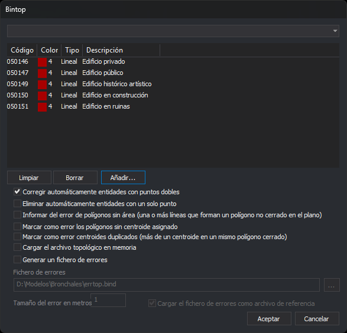

# BINTOP
<!-- id: bintop -->

Forma la topología de recintos del archivo de dibujo activo: une las líneas con los códigos seleccionados en arcos, forma con ellos los recintos y asocia a cada recinto el texto con uno de esos códigos que queda dentro (su centroide). Informa de los errores en el panel de tareas y, si se pide, los guarda en un fichero de errores. La topología se guarda en memoria, no en disco, para que la usen otras órdenes.

## Parámetros

Sin parámetros, la orden muestra un cuadro de diálogo (apartado [Cuadro de diálogo](#cuadro-de-diálogo)). Con parámetros, se ejecuta sin cuadro (apartado [Ejecución con parámetros](#ejecución-con-parámetros)).

## Observaciones

### Qué entidades intervienen

La orden usa las entidades del archivo de dibujo activo que no están borradas, que están en la zona de interés y que son visibles (no ocultas y con algún código encendido). De ellas, solo las que tienen alguno de los códigos seleccionados:

* **Líneas**: cada línea es un arco. Sus dos extremos son nodos.
* **Textos**: cada texto es un centroide candidato. La orden usa su punto de inserción.
* **Puntos**: son un error («Entidad de un solo punto»).

Las entidades de tipo polígono no forman arcos.

Antes de formar los recintos, la orden busca dos errores graves:

* líneas cuyos dos primeros o dos últimos vértices coinciden en X e Y (puntos dobles en el origen o en el final);
* líneas con menos de dos vértices y puntos con alguno de los códigos.

Si encuentra alguno, la orden no forma los recintos: muestra el globo «Encontrados puntos dobles» o «Localizadas entidades de un solo punto» y añade una tarea por cada entidad.

### Recintos y centroides

Con los arcos, la orden recorre los nodos y forma anillos:

* **Recinto**: anillo de área positiva sin vértices repetidos.
* **Isla**: anillo de área negativa (el contorno exterior de un grupo de recintos unidos entre sí). La orden lo usa como hueco del recinto que lo contiene.
* **Polígono sin área**: anillo que pasa dos veces por el mismo vértice o que solo tiene dos vértices distintos, por ejemplo una línea suelta recorrida por sus dos lados.

Cada recinto recibe el centroide cuyo punto de inserción queda dentro de él. Un recinto cuyo centroide es el texto `*` pasa a ser un hueco. Con `#nombre` (ver más abajo), el texto de los huecos y los prefijos de los centroides son los que define esa topología en la tabla de códigos.

### Cuadro de diálogo

La parte superior es el cuadro de selección de códigos:

* El desplegable lista las etiquetas de la tabla de códigos con el prefijo `#`. Al elegir una, la lista se sustituye por los códigos que tienen esa etiqueta.
* **Limpiar** vacía la lista.
* **Borrar** quita el código seleccionado.
* **Añadir...** añade códigos de la tabla.

La lista no puede estar vacía: si pulsas **Aceptar** sin códigos, el cuadro muestra un mensaje y sigue abierto.

| Opción | Descripción | Por defecto |
| :--- | :--- | :--- |
| Corregir automáticamente entidades con puntos dobles | Antes de formar la topología, en cada línea del archivo activo, de cualquier código, cuyos dos primeros o dos últimos vértices coinciden en X e Y, quita todos los vértices consecutivos repetidos en X e Y. La orden borra la línea y añade la corregida. El panel de resultados muestra cuántas ha corregido | Marcada |
| Eliminar automáticamente entidades con un solo punto | Antes de formar la topología, borra los puntos del archivo activo que tienen alguno de los códigos seleccionados. No borra las líneas de un solo vértice | Marcada |
| Informar del error de polígonos sin área | Añade una tarea por cada polígono sin área y, si se genera el fichero de errores, guarda su contorno con el código `NOAREA` | Marcada |
| Marcar como error los polígonos sin centroide asignado | Marcada: añade una tarea por cada recinto sin centroide y guarda su contorno en el fichero de errores. Desmarcada: esos recintos no son válidos, y la orden añade una tarea «Línea que debería formar parte de polígono» por cada línea con los códigos seleccionados que no forma parte de ningún recinto válido | Marcada |
| Marcar como error centroides duplicados | Añade una tarea por cada recinto con más de un centroide y otra por cada grupo de centroides que no están dentro de ningún recinto. En el fichero de errores, una marca `ERRCEN` en cada uno de esos textos | Marcada |
| Cargar el archivo topológico en memoria | Añade la topología a las topologías cargadas. Desmarcada, la orden solo informa de los errores | Marcada |
| Generar un fichero de errores | Habilita los tres campos siguientes | Marcada |
| Fichero de errores | Ruta completa del fichero. El botón **...** abre el cuadro de guardar con los formatos que admiten escritura. El cuadro se abre siempre con `errtop.bind` en la carpeta del archivo activo | `<carpeta>\errtop.bind` |
| Tamaño del error en metros | Mitad del lado de las marcas de error, en las unidades de las coordenadas del archivo: metros con un sistema proyectado, grados con uno geográfico | 1 |
| Cargar el fichero de errores como archivo de referencia | Al terminar, carga el fichero de errores como archivo de referencia | Marcada |

Al pulsar **Aceptar** con **Generar un fichero de errores** marcada, el cuadro comprueba lo siguiente:

* el tamaño es un número mayor que 0, escrito con punto decimal;
* el fichero tiene ruta completa y su carpeta existe;
* el fichero no está cargado ya como archivo de dibujo o de referencia.

Si alguna comprobación falla, el cuadro muestra un mensaje, sitúa el cursor en el campo y sigue abierto.

Las opciones, salvo el nombre del fichero de errores, se guardan en la clave del registro `HKEY_CURRENT_USER\Software\Digi21\Digi3D.NET\DigiNG\Extensiones\DigiNG.OrdenesStandard\DigiNG.OrdenesTopologia\Bintop`, en los valores `CorregirPuntosDobles`, `EliminarArcosUnSoloPunto`, `PoligonosSinArea`, `PoligonosSinCentroide`, `CentroidesDuplicados`, `CargarEnMemoria`, `GenerarFicheroErrores`, `TamanoErrores` y `CargarFicheroErrores`. La lista de códigos empieza vacía cada vez.

Desde el cuadro, la orden trabaja en 2D y solo con el archivo activo, aunque esté activada la variable [CREAR\_TOPOLOGIAS\_ARCHIVOS\_REFERENCIA](/digi3d-ai/referencia/ventana-de-dibujo/variables/c/crear-topologias-archivos-referencia.md). La topología se llama como el archivo activo con la extensión `.top`: con `D:\Modelos\Bronchales\modelo.bind`, se llama `D:\Modelos\Bronchales\modelo.top`. Es un nombre, no un archivo: la orden no escribe nada en disco salvo el fichero de errores.

### Resultados

Si la clave `LimpiarAutomaticamente` de la configuración está activada, la orden vacía primero el panel de tareas. El panel de resultados muestra:

* `Topología: <nombre>`;
* el número de arcos, recintos (`Polígonos`) e islas;
* según las casillas, los polígonos sin área, los polígonos sin centroide, los centroides duplicados y los centroides sin polígono;
* con la casilla de sin centroide desmarcada, las líneas que deberían formar polígono pero no lo forman.

Si no hay ninguna línea con los códigos, la orden escribe «No se han encontrado entidades con las que trabajar» y el número de centroides.

Cada error es una tarea del panel de tareas, agrupada bajo el nombre de la topología. Al hacer doble clic en una tarea, la vista va al error:

* puntos dobles y entidades de un solo punto: a la coordenada del error;
* polígonos sin área, recintos sin centroide y líneas que deberían formar polígono: a una copia temporal del contorno;
* centroides duplicados y centroides fuera de polígono: a los textos, con una subtarea por cada texto.

### Fichero de errores

Si el fichero existe, la orden lo borra y lo crea de nuevo, en el formato que corresponde a su extensión. Contiene:

* **`ERRCEN`**: una marca por cada entidad con puntos dobles (en el vértice repetido), por cada entidad de un solo punto, por cada centroide duplicado y por cada centroide fuera de recinto (en su punto de inserción). La marca es una línea cerrada que va del punto del error a una esquina, recorre el cuadrado de lado 2 × tamaño centrado en el punto y vuelve al punto.
* **`NOAREA`**: el contorno de cada polígono sin área.
* el contorno de cada recinto sin centroide, sin código de error.

Las líneas que deberían formar polígono no se guardan en el fichero. Para revisar el fichero cargado como referencia, usa [ERR+](/digi3d-ai/referencia/ventana-de-dibujo/ordenes/e/err-mas.md), que recorre las entidades del primer archivo de referencia cargado.

### La topología cargada

Si ya hay una topología con el mismo nombre para el mismo archivo, la orden la sustituye. La topología refleja el archivo en el momento de ejecutar la orden: si después editas las líneas o los textos, ejecuta la orden otra vez. Órdenes relacionadas:

* [VER\_TOPOLOGIAS](/digi3d-ai/referencia/ventana-de-dibujo/ordenes/v/ver-topologias.md) muestra u oculta las topologías cargadas.
* [DEJAR\_TOP](/digi3d-ai/referencia/ventana-de-dibujo/ordenes/d/dejar-top.md) descarga una topología.
* [BORRA\_R](/digi3d-ai/referencia/ventana-de-dibujo/ordenes/b/borra-r.md) y las demás órdenes de recintos necesitan al menos una topología cargada.

### Ejecución con parámetros

`BINTOP=[tabla] [polígonos_sin_área] [polígonos_sin_centroide] [topología_3D] [centroides_duplicados] [generar_archivo_errores] [nombre_fichero_de_errores tamaño_de_error cargar_como_referencia] [cargar_en_memoria]`

| Parámetro | Descripción |
| :--- | :--- |
| tabla | Archivo de texto con un código por línea; la orden lee la primera palabra de cada línea. Si no se puede abrir, la orden escribe el error en el panel de resultados y termina. La topología se llama `<carpeta del archivo de dibujo>\<nombre de la tabla sin extensión>.top` |
| polígonos_sin_área | 1 para informar de los polígonos sin área, 0 para no hacerlo |
| polígonos_sin_centroide | Igual que la casilla del cuadro |
| topología_3D | 1 para unir los extremos de los arcos comparando también la Z, 0 para compararlos en 2D. Los puntos dobles se comprueban siempre en 2D |
| centroides_duplicados | 1 para informar de los centroides duplicados y de los que están fuera de cualquier recinto |
| generar_archivo_errores | 1 para generar el fichero de errores. En ese caso siguen tres parámetros: |
| nombre_fichero_de_errores | Si no lleva carpeta, se crea en la carpeta del archivo de dibujo. Si no termina en `bin`, la orden le añade `.bin` |
| tamaño_de_error | Mitad del lado de las marcas, en unidades de las coordenadas |
| cargar_como_referencia | 1 para cargar el fichero de errores como archivo de referencia |
| cargar_en_memoria | 1 para cargar la topología en memoria |

Todos los parámetros son obligatorios. Si falta alguno, la orden emite el sonido de error, muestra «Faltan parámetros» y termina. Si no hay formato de exportación para el fichero de errores, la orden termina sin formar la topología. Con parámetros, la orden no corrige los puntos dobles ni borra los puntos.

`BINTOP=#nombre` usa la topología `nombre` de la tabla de códigos:

* toma sus códigos, su opción de polígonos sin centroide, su opción 3D, el texto de los huecos y los prefijos de sus centroides;
* informa de los polígonos sin área y de los centroides duplicados, no genera fichero de errores y carga la topología en memoria con el nombre `nombre`;
* si la tabla no define esa topología, usa todas las entidades visibles.

Las opciones del submenú **Topología/Crear topologías** ejecutan `BINTOP=#nombre`: **Crear todas las topologías** ejecuta la orden para cada topología de la tabla sin vaciar el panel de tareas entre una y otra, y cada una de las demás opciones ejecuta la orden para su topología.

Si la variable [CREAR\_TOPOLOGIAS\_ARCHIVOS\_REFERENCIA](/digi3d-ai/referencia/ventana-de-dibujo/variables/c/crear-topologias-archivos-referencia.md) está activada, la orden ejecutada con parámetros forma una topología para cada archivo de dibujo cargado, con el mismo nombre y el mismo fichero de errores.

Ejemplos:

* `bintop="c:\tabla1.tab" 1 0 0 0 0 1`: forma la topología con los códigos de `c:\tabla1.tab`, en 2D, informa de los polígonos sin área, no informa de los polígonos sin centroide ni de los centroides duplicados, no genera fichero de errores y carga la topología en memoria.
* `bintop="c:\tabla1.tab" 1 1 0 1 1 "c:\err.bin" 2 1 1`: igual, pero informa de todos los errores, los guarda en `c:\err.bin` con marcas de tamaño 2, carga ese fichero como referencia y carga la topología en memoria.

Si el control de calidad descarta la línea corregida, se conserva la línea original y no cuenta como corregida.

## Características de la orden

| Tipo de orden | [Orden interactiva](/digi3d-ai/referencia/ventana-de-dibujo/ordenes-interactivas.md) sin parámetros; orden inmediata con parámetros |
| :--- | :--- |
| Repite automáticamente | No |
| Opción del menú donde aparece la orden | Topología/Crear topologías (con `#nombre`) |
| Barra de herramientas en la que aparece la orden | _Esta orden no tiene asociado ningún botón en ninguna barra de herramientas_ |
| Extensión | DigiNG.OrdenesTopologia.dll |
| Variables relacionadas | [CREAR\_TOPOLOGIAS\_ARCHIVOS\_REFERENCIA](/digi3d-ai/referencia/ventana-de-dibujo/variables/c/crear-topologias-archivos-referencia.md) |
| Órdenes relacionadas | [BINTRAM](/digi3d-ai/referencia/ventana-de-dibujo/ordenes/b/bintram.md) [BORRA\_R](/digi3d-ai/referencia/ventana-de-dibujo/ordenes/b/borra-r.md) [BUSCAR\_CENTROIDE](/digi3d-ai/referencia/ventana-de-dibujo/ordenes/b/buscar-centroide.md) [CREAR\_TOPOLOGIAS\_CODIGOS\_VISIBLES](/digi3d-ai/referencia/ventana-de-dibujo/ordenes/c/crear-topologias-codigos-visibles.md) [DEJAR\_TOP](/digi3d-ai/referencia/ventana-de-dibujo/ordenes/d/dejar-top.md) [ERR+](/digi3d-ai/referencia/ventana-de-dibujo/ordenes/e/err-mas.md) [EXPORTAR\_TOPOLOGIA](/digi3d-ai/referencia/ventana-de-dibujo/ordenes/e/exportar-topologia.md) [TOPOLOGIA\_A\_POLIGONO](/digi3d-ai/referencia/ventana-de-dibujo/ordenes/t/topologia-a-poligono.md) [VER\_TOPOLOGIAS](/digi3d-ai/referencia/ventana-de-dibujo/ordenes/v/ver-topologias.md) |
| Nombre interno | {4FB24176-ED2B-4626-BB9B-1A80C76D2F7D} |
