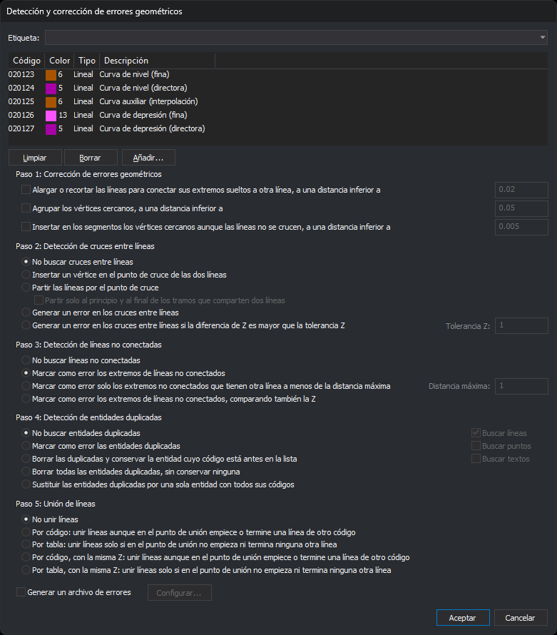
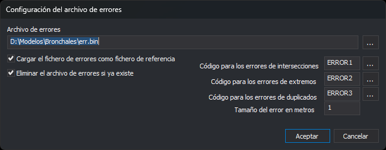

# BINTRAM
<!-- id: bintram -->

Corrige y detecta errores geométricos en las entidades de los códigos indicados: alarga o recorta extremos sueltos, agrupa e inserta vértices, trata los cruces entre líneas, detecta extremos no conectados y entidades duplicadas, y une líneas.

## Parámetros

Sin parámetros, la orden muestra un cuadro de diálogo. Con parámetros, la orden se ejecuta sin cuadro de diálogo; los parámetros se describen en el apartado [Ejecución con parámetros](#ejecución-con-parámetros).

## Observaciones

### Cuadro de diálogo

Esta orden solicita los códigos y las opciones en el cuadro _Detección y corrección de errores geométricos_. La parte superior es el cuadro [Selecciona códigos](/digi3d-ai/referencia/cuadros-de-dialogo/selecciona-codigos.md): el desplegable lista las etiquetas de la tabla de códigos y, al elegir una, sustituye la lista por los códigos que la tienen. Los botones **Añadir...**, **Borrar** y **Limpiar** modifican la lista. Cada vez que ejecutas la orden, la lista empieza vacía.

Debajo de la lista están las opciones de los cinco pasos. Las tolerancias y distancias se escriben en metros; la orden las convierte a las unidades del sistema de referencia del archivo de dibujo. La tolerancia Z se escribe en las unidades de la coordenada Z.

Si pulsas **Aceptar**, el cuadro comprueba:

* que la lista tiene al menos un código;
* que cada tolerancia de una opción activa es un número mayor que 0, y la tolerancia Z, un número mayor o igual que 0;
* si está marcada **Generar un archivo de errores**, que ese archivo no está cargado como archivo de dibujo.

Si algo no se cumple, el cuadro muestra un mensaje, deja el cursor en el campo y sigue abierto. Los campos de las opciones desactivadas no se comprueban. Si pulsas **Cancelar**, la orden termina sin hacer nada.

### Entidades que procesa

La orden trabaja sobre el archivo de dibujo activo y solo con entidades que no están borradas, son visibles, están dentro de la zona de interés y tienen alguno de los códigos de la lista encendido. Los códigos se comparan por su nombre completo: no admiten comodines. Una entidad con varios códigos se procesa si cualquiera de ellos está en la lista y encendido.

Las líneas que se mencionan en cada paso son siempre líneas de esos códigos: las de otros códigos no intervienen.

### Orden de los pasos

La orden ejecuta los pasos en este orden y cada uno trabaja sobre el resultado del anterior: las tres opciones del paso 1 (en el orden en que aparecen), el paso 2, el paso 3, el paso 4 y el paso 5. Por eso, por ejemplo, si eliges partir las líneas en el paso 2, el paso 3 ya no marca como no conectados los extremos que han quedado unidos al partir.

### Paso 1: Corrección de errores geométricos

* **Alargar o recortar las líneas para conectar sus extremos sueltos a otra línea, a una distancia inferior a**: un extremo está suelto si no coincide en X e Y con el extremo de otra línea ni con el otro extremo de la misma línea. Si hay otra línea dentro de un cuadrado de lado el doble de la tolerancia centrado en el extremo, la orden lleva el extremo a su proyección sobre esa línea: alarga la línea si no llegaba y la recorta si se pasaba. El extremo conserva su Z. Además, la orden borra las líneas de dos vértices con algún extremo suelto cuya longitud en planta es menor que la tolerancia. Solo trata líneas, no polígonos.
* **Agrupar los vértices cercanos, a una distancia inferior a**: los vértices de las líneas que están a menos de la tolerancia en planta pasan a la posición media del grupo. Cambia la X y la Y de esos vértices, no su Z. Solo trata líneas.
* **Insertar en los segmentos los vértices cercanos aunque las líneas no se crucen, a una distancia inferior a**: si un vértice de una línea está a menos de la tolerancia de un segmento de otra línea, o de otro segmento de la misma, y su proyección cae dentro del segmento, la orden inserta en el segmento un vértice en la posición de ese vértice, con la Z interpolada en el segmento. Trata líneas, polígonos y sus huecos.

### Paso 2: Detección de cruces entre líneas

Trata líneas, polígonos y sus huecos, también los cruces de una línea consigo misma.

* **No buscar cruces entre líneas**.
* **Insertar un vértice en el punto de cruce de las dos líneas**: añade un vértice en cada línea en el punto de cruce, con la Z interpolada en el segmento de cada una.
* **Partir las líneas por el punto de cruce**: divide cada línea en varias por los puntos de cruce. Cada tramo conserva los códigos y los atributos de la línea original.
  * **Partir solo al principio y al final de los tramos que comparten dos líneas**: si dos líneas tienen un tramo en común, las parte solo al principio y al final de ese tramo y no en cada vértice intermedio. Solo está habilitada con la opción de partir.
* **Generar un error en los cruces entre líneas**: no modifica las líneas. Por cada cruce añade una tarea de error por cada línea que se cruza.
* **Generar un error en los cruces entre líneas si la diferencia de Z es mayor que la tolerancia Z**: igual que la anterior, pero solo en los cruces en los que la diferencia entre la Z de las dos líneas, interpolada en el punto de cruce, es mayor que el valor del campo **Tolerancia Z**. El campo solo está habilitado con esta opción.

### Paso 3: Detección de líneas no conectadas

Trata solo líneas. Un extremo no está conectado si no coincide con el extremo de otra línea ni con el otro extremo de la misma línea. Un extremo que toca otra línea en mitad de un segmento o en un vértice intermedio cuenta como no conectado.

* **No buscar líneas no conectadas**.
* **Marcar como error los extremos de líneas no conectados**: añade una tarea de error por cada extremo no conectado.
* **Marcar como error solo los extremos no conectados que tienen otra línea a menos de la distancia máxima**: solo los extremos que tienen otra línea dentro de un cuadrado de lado el doble del valor de **Distancia máxima**, centrado en el extremo. Sirve para localizar líneas que no llegan a la línea en la que deberían terminar. El campo solo está habilitado con esta opción.
* **Marcar como error los extremos de líneas no conectados, comparando también la Z**: un extremo solo está conectado si coincide con otro extremo en X, Y y Z.

### Paso 4: Detección de entidades duplicadas

Dos entidades están duplicadas si son del mismo tipo, tienen el mismo número de vértices y los mismos vértices en planta, en el mismo orden o en el contrario. No se comparan la Z ni los códigos. En los textos solo se compara el punto de inserción, no el contenido. Las casillas **Buscar líneas**, **Buscar puntos** y **Buscar textos** indican qué tipos se buscan; los polígonos y los demás tipos se buscan siempre. Las casillas están habilitadas con cualquier opción salvo **No buscar entidades duplicadas**.

* **No buscar entidades duplicadas**.
* **Marcar como error las entidades duplicadas**: añade una tarea _Entidades duplicadas_ por cada grupo, con una subtarea por cada entidad del grupo.
* **Borrar las duplicadas y conservar la entidad cuyo código está antes en la lista**: de cada grupo conserva la entidad que tiene el código situado más arriba en la lista de códigos y borra las demás.
* **Borrar todas las entidades duplicadas, sin conservar ninguna**: borra todas las entidades de cada grupo.
* **Sustituir las entidades duplicadas por una sola entidad con todos sus códigos**: borra las entidades del grupo y añade una copia de la que tiene el código situado más arriba en la lista, con los códigos de todas. Si está desactivada la opción de permitir geometrías con códigos repetidos, los códigos no se repiten.

### Paso 5: Unión de líneas

Trata solo líneas. La orden une dos líneas si uno de sus extremos coincide en X e Y y tienen los mismos códigos y los mismos atributos de base de datos. La línea resultante conserva el sentido que tenía la mayoría de los tramos unidos.

* **No unir líneas**.
* **Por código**: une las líneas aunque en el punto de unión empiece o termine una línea de otro código. Si en el punto empiezan o terminan tres o más líneas que se pueden unir, no une ninguna.
* **Por tabla**: une las líneas solo si en el punto de unión no empieza ni termina ninguna otra línea.
* **Por código, con la misma Z** y **Por tabla, con la misma Z**: igual que las dos anteriores, pero los extremos tienen que coincidir también en Z. Con estas dos opciones, cada línea se une como mucho una vez por ejecución: para unir una cadena de más de dos líneas, ejecuta la orden otra vez.

Con las dos primeras opciones, la orden une la cadena completa en una sola ejecución.

### Archivo de errores

Si marcas **Generar un archivo de errores**, la orden crea un símbolo de error por cada error que añade al panel Tareas y los guarda en un archivo de dibujo aparte. Solo las opciones que marcan errores crean símbolos: las dos últimas del paso 2, las tres del paso 3 que marcan extremos y **Marcar como error las entidades duplicadas**. Si no hay ningún error, la orden no crea el archivo.

El botón **Configurar...**, habilitado con la casilla, abre el cuadro _Configuración del archivo de errores_:

| Campo | Descripción | Valor por defecto |
| :--- | :--- | :--- |
| Archivo de errores | Ruta del archivo. El botón **...** abre el cuadro para elegirlo y su formato. Si cancelas ese cuadro, se conserva el nombre anterior. No puede estar vacío | `err.bin` en la carpeta del archivo de dibujo |
| Cargar el fichero de errores como fichero de referencia | Al terminar, carga el archivo de errores como archivo de dibujo | Marcada |
| Eliminar el archivo de errores si ya existe | Borra el archivo antes de escribir los símbolos | Marcada |
| Código para los errores de intersecciones | Código de los símbolos del paso 2 | `ERROR1` |
| Código para los errores de extremos | Código de los símbolos del paso 3 | `ERROR2` |
| Código para los errores de duplicados | Código de los símbolos del paso 4 | `ERROR3` |
| Tamaño del error en metros | Tamaño de los símbolos. Tiene que ser mayor que 0 | 1 |

El símbolo de un cruce o de un extremo está en ese punto. El de una entidad duplicada está en su vértice, si solo tiene uno, o en el punto medio entre sus dos vértices centrales.

### Resultados

Al empezar, la orden muestra los paneles [Resultados](/digi3d-ai/referencia/paneles/resultados.md) y [Tareas](/digi3d-ai/referencia/paneles/tareas.md). Si está activada la opción de limpiar automáticamente el panel de tareas, lo vacía. Mientras trabaja, la orden muestra una barra de progreso.

En el panel Resultados, la orden escribe un mensaje por cada paso que ejecuta y el número de entidades afectadas: las modificadas, las nuevas al partir, las borradas, las agrupadas o las unidas, y el número de errores de cruces, de extremos y de duplicadas.

En el panel Tareas añade los errores:

| Error | Descripción | Información |
| :--- | :--- | :--- |
| Cruce | Intersección de líneas | Se ha localizado una intersección entre líneas |
| Extremo no conectado | La línea no está conectada con otra línea por alguno de sus extremos | La línea no está conectada con otra línea por alguno de sus extremos |
| Duplicadas | Entidades duplicadas, con una subtarea _Línea duplicada_, _Punto duplicado_, _Texto duplicado_ o _Entidad duplicada_ por cada entidad | Entidades duplicadas |

Haz doble clic en una tarea para ir al error.

[UNDO](/digi3d-ai/referencia/ventana-de-dibujo/ordenes/u/undo.md) deshace de una vez los cambios que la orden ha hecho en el archivo de dibujo. No descarga el archivo de errores.

### Valores que recuerda

Al pulsar **Aceptar**, la orden guarda las opciones de los cinco pasos, las tolerancias, la casilla **Generar un archivo de errores** y los valores del cuadro _Configuración del archivo de errores_, salvo el nombre del archivo, en la clave del registro `HKEY_CURRENT_USER\Software\Digi21\Digi3D.NET\DigiNG\Extensiones\DigiNG.OrdenesTopologia\Bintram`. La siguiente vez que ejecutes la orden, el cuadro muestra esos valores. No guarda la lista de códigos. El cuadro recuerda su posición y su tamaño.

### Ejecución con parámetros

`BINTRAM=[tabla] [generar archivo de errores *1] [corregir *2] [agrupar *3] [insertar *4] [cruces *5] [extremos *6] [duplicadas *7] [unión *8]`

Todos los parámetros son obligatorios. Si falta alguno, la orden emite el sonido de error, muestra el aviso _Faltan parámetros_ y termina sin modificar el dibujo. Las distancias van en metros, como en el cuadro. Los valores no se comprueban ni se guardan.

* **tabla**: ruta, entre comillas, de un archivo de texto con los códigos. La orden toma la primera palabra de cada línea. Si no puede abrir el archivo, escribe el error en el panel Resultados y termina.
* **\*1** `1` o `0`. Con `1` siguen siete parámetros: `[archivo de errores] [eliminar si existe 1/0] [tamaño del error] [código de cruces] [código de extremos] [código de duplicadas] [cargar como archivo de dibujo 1/0]`. Si el archivo no lleva ruta, se crea en la carpeta del archivo de dibujo. Si su nombre no termina en `bind`, la orden le añade `.bind`.
* **\*2** `1` o `0`. Con `1` sigue la tolerancia de alargar o recortar.
* **\*3** `1` o `0`. Con `1` sigue la tolerancia de agrupar vértices.
* **\*4** `1` o `0`. Con `1` sigue la tolerancia de insertar vértices.
* **\*5** `0` no buscar, `1` insertar vértice, `2` partir, `3` generar error, `4` generar error por Z, seguido de la tolerancia Z. La opción de partir solo al principio y al final no se puede indicar: la orden parte en cada cruce.
* **\*6** `0` no buscar, `1` marcar todos, `2` marcar con distancia máxima, seguido de la distancia, `3` marcar comparando la Z.
* **\*7** `0` no buscar, `1` marcar, `2` borrar conservando la de mayor prioridad, `3` borrar todas, `4` sustituir por una con todos los códigos. Con `1` o `2` siguen `[buscar líneas] [buscar puntos] [buscar textos]` con `1` o `0`; con `3` o `4` la orden busca los tres tipos.
* **\*8** `0` no unir, `1` por código, `2` por tabla, `3` por código con la misma Z, `4` por tabla con la misma Z.

Ejemplo:

`BINTRAM="C:\ASTE.tab" 1 "C:\err.bind" 1 2 cod1 cod2 cod3 1 1 0.3 0 0 4 0.2 2 0.5 1 1 1 1 1`

Usa los códigos de `C:\ASTE.tab`; genera `C:\err.bind`, borrándolo si existe, con símbolos de 2 m de códigos `cod1`, `cod2` y `cod3`, y lo carga al terminar; alarga o recorta con 0,3 m; no agrupa ni inserta vértices; marca los cruces con diferencia de Z mayor que 0,2; marca los extremos sueltos con otra línea a menos de 0,5 m; marca las líneas, los puntos y los textos duplicados, y une las líneas por código.

## Características de la orden

| Tipo de orden | [Orden interactiva](/digi3d-ai/referencia/ventana-de-dibujo/ordenes-interactivas.md) sin parámetros; orden inmediata con parámetros |
| :--- | :--- |
| Repite automáticamente | No |
| Opción del menú donde aparece la orden | _Esta orden no tiene asociada ninguna opción de menú_ |
| Barra de herramientas en la que aparece la orden | _Esta orden no tiene asociado ningún botón en ninguna barra de herramientas_ |
| Extensión | DigiNG.OrdenesTopologia.dll |
| Variables relacionadas | No tiene variables relacionadas |
| Órdenes relacionadas | [DETECTAR\_CRUCE\_LINEAS](/digi3d-ai/referencia/ventana-de-dibujo/ordenes/d/detectar-cruce-lineas.md) [ERR](/digi3d-ai/referencia/ventana-de-dibujo/ordenes/e/err.md) [ERR-](/digi3d-ai/referencia/ventana-de-dibujo/ordenes/e/err-menos.md) [ERR+](/digi3d-ai/referencia/ventana-de-dibujo/ordenes/e/err-mas.md) [UNDO](/digi3d-ai/referencia/ventana-de-dibujo/ordenes/u/undo.md) |
| Nombre interno | {20673463-9D22-4d74-AA28-5A60AECCA0E5} |
