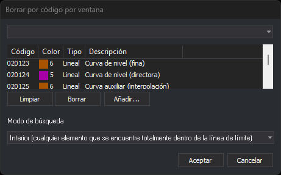

# BORRA\_COD\_V
<!-- id: borra-cod-v -->

Borra las entidades que tienen alguno de los códigos indicados y que están dentro de una línea que actúa de borde (ventana), la solapan o la cortan.

## Parámetros

No admite parámetros.

## Observaciones

La orden muestra el mensaje «Selecciona la línea que actúa de borde.». La línea tiene que existir en el dibujo antes de ejecutar la orden. La orden solo permite seleccionar líneas: un polígono no sirve como borde. Si la entidad seleccionada no es una línea, suena el aviso de error y la orden sigue esperando a que selecciones una línea.

Después de seleccionar la línea, la orden muestra el mensaje «Calculando...» y el cuadro de diálogo [Selecciona códigos](/digi3d-ai/referencia/cuadros-de-dialogo/selecciona-codigos.md) con un campo propio, **Modo de búsqueda**, debajo de la lista de códigos:

Cada vez que se ejecuta la orden, la lista de códigos está vacía y el modo de búsqueda es **Interior**. Si pulsas **Cancelar**, la orden termina sin hacer nada.

| Modo de búsqueda | Texto en el desplegable | Descripción |
| :--- | :--- | :--- |
| Interior | Interior (cualquier elemento que se encuentre totalmente dentro de la línea de límite) | Borra las líneas que tienen todos sus vértices dentro de la ventana o sobre el borde, y los polígonos y complejos que están completamente dentro de la ventana |
| Corte | Corte (corta los elementos por la línea de límite) | Corta las líneas que atraviesan el borde: borra los trozos interiores y conserva los trozos exteriores. Borra las líneas que están enteras dentro de la ventana. No borra ni corta los polígonos ni los complejos |
| Solape | Solape (cualquier elemento que tenga al menos un punto dentro de la línea de límite) | Borra las líneas que tienen al menos un vértice dentro de la ventana o sobre el borde, y los polígonos y complejos que solapan con la ventana |

Los puntos, los complejos puntuales y los textos se borran en los tres modos si su primer vértice está dentro de la ventana o sobre el borde.

La orden solo busca y borra entidades del archivo de dibujo activo. Excluye las entidades borradas, las que están fuera de la zona de interés, la propia línea de borde y las entidades que tienen apagados \([OFF](/digi3d-ai/referencia/ventana-de-dibujo/ordenes/o/off.md)\) todos sus códigos.

Una entidad se borra entera si tiene cualquiera de los códigos elegidos, aunque tenga además otros códigos. Si no hay ninguna entidad que borrar, suena el aviso de error.

En el modo Corte, si el control de calidad descarta alguno de los trozos conservados, se conservan todas las líneas cortadas sin cortar y no se añade ningún trozo. Las entidades que se borran enteras se borran igualmente.

## Características de la orden

| Tipo de orden | [Orden interactiva](borra-cod-v.md) |
| :--- | :--- |
| Repite automáticamente | No |
| Opción del menú donde aparece la orden | Editar/Más/Cortar por polígono y código... |
| Barra de herramientas en la que aparece la orden | Eliminar y recuperar |
| Extensión | DigiNG.OrdenesStandard.dll |
| Variables relacionadas | No tiene variables relacionadas |
| Órdenes relacionadas | [BORRA\_COD](/digi3d-ai/referencia/ventana-de-dibujo/ordenes/b/borra-cod.md) [BORRA\_V](/digi3d-ai/referencia/ventana-de-dibujo/ordenes/b/borra-v.md) |
| Nombre interno | {89AC83BA-9BC7-4c4d-8E5C-5384E892EB0F} |

