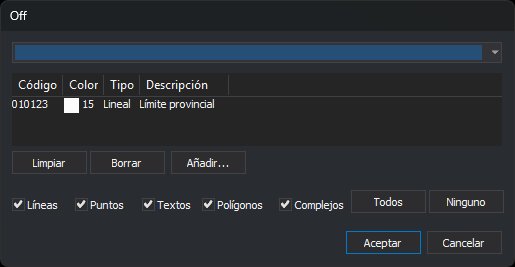

# BORRA\_COD
<!-- id: borra-cod -->

Borra las entidades que tienen el código indicado y son de los tipos de geometría indicados.

## Parámetros

| Número de parámetro | Descripción | Opcional |
| :--- | :--- | :--- |
| 1 … N | Pares «código tipo». El código puede ser `#etiqueta` para indicar todos los códigos con esa etiqueta. El tipo es una cadena de letras de [tipos de geometría](/digi3d-ai/referencia/ventana-de-dibujo/tipos-de-geometria.md) | Si |

En esta orden, `P` incluye los puntos, los complejos puntuales, los puntos orientados y los multipuntos, `B` indica las imágenes y `*` incluye todos los tipos de geometría.

Con al menos dos parámetros, la orden borra sin mostrar el cuadro de diálogo y emite un pitido al terminar. Si el número de parámetros es impar, la orden ignora el último. Sin parámetros, o con uno solo, la orden muestra el cuadro de diálogo.

### Observaciones

La orden actúa solo sobre las entidades del archivo de dibujo activo que no estén borradas, estén visibles y estén dentro de la zona de interés.

Los códigos admiten los comodines `*` y `?`.

Esta orden también permite borrar códigos secundarios. Si la entidad solo tiene el código indicado, se borra la entidad. Si tiene más códigos, la orden sustituye la entidad original por una copia sin el código indicado.

Mientras recorre el archivo de dibujo, la orden muestra una barra de progreso.

### Cuadro de diálogo

Los códigos se eligen en el cuadro de diálogo [Selecciona códigos](/digi3d-ai/referencia/cuadros-de-dialogo/selecciona-codigos.md). Debajo de la lista de códigos, el cuadro muestra las casillas **Líneas**, **Puntos**, **Textos**, **Polígonos** y **Complejos**, y los botones **Todos** y **Ninguno**, que marcan y desmarcan las cinco casillas. Los tipos marcados se aplican a todos los códigos elegidos.

* **Puntos** incluye también los complejos puntuales, los puntos orientados y los multipuntos.
* Con las cinco casillas marcadas, la orden borra entidades de todos los tipos de geometría, también las imágenes.
* Sin ninguna casilla marcada, la orden no borra nada.

Cada vez que se ejecuta la orden, el cuadro se abre con la lista de códigos vacía y las cinco casillas marcadas. No recuerda la selección anterior.

## Características de la orden

| Tipo de orden                                    | [Orden inmediata](borra-cod.md)                                              |
| ------------------------------------------------ | ---------------------------------------------------------------------------- |
| Repite automáticamente                           | No                                                                           |
| Opción del menú donde aparece la orden           | Editar/Eliminar entidades por código...                                      |
| Barra de herramientas en la que aparece la orden | [Eliminar y recuperar](/digi3d-ai/referencia/barras-de-herramientas/eliminar-y-recuperar.md) |
| Extensión                                        | DigiNG.OrdenesStandard.dll                                                   |
| Variables relacionadas                           | No tiene variables relacionadas                                              |
| Órdenes relacionadas                             | [BORRA\_COD\_V](/digi3d-ai/referencia/ventana-de-dibujo/ordenes/b/borra-cod-v.md) [BORRA\_E](/digi3d-ai/referencia/ventana-de-dibujo/ordenes/b/borra-e.md) [RECUPERA\_COD](/digi3d-ai/referencia/ventana-de-dibujo/ordenes/r/recupera-cod.md) |
| Nombre interno | {5ED4CD51-E4DB-4365-8522-F82BBC7813A2} |
