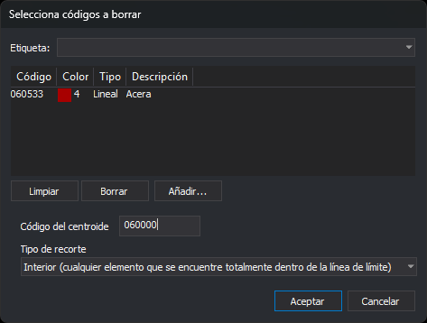

# BORRA\_R
<!-- id: borra-r -->

Borra las entidades del archivo de dibujo activo que tienen alguno de los códigos seleccionados y están dentro de los recintos de las topologías cargadas cuyo centroide tiene un código determinado. Las líneas que cruzan el contorno del recinto se pueden recortar por él.

## Parámetros

No admite parámetros.

## Observaciones

La orden es parecida a [BORRA\_V](/digi3d-ai/referencia/ventana-de-dibujo/ordenes/b/borra-v.md) y tiene los mismos tipos de recorte. Se diferencia en tres cosas: la ventana son los recintos de las topologías cuyo centroide tiene el código indicado, y no una línea cerrada; solo borra las entidades que tienen alguno de los códigos de la lista; y no puede borrar el exterior.

La orden trabaja sobre las topologías cargadas con [BINTOP](/digi3d-ai/referencia/ventana-de-dibujo/ordenes/b/bintop.md). Si no hay ninguna, la orden emite el sonido de error, muestra el aviso _No hay ningún archivo de topología cargado_ y termina.

### Cuadro de diálogo

Al ejecutar la orden se muestra el cuadro _Selecciona códigos a borrar_:

| Campo | Descripción | Valor por defecto |
| :--- | :--- | :--- |
| Lista de códigos | Códigos de las entidades que se borran. Admite comodines (`*`, `?`) | _Vacía_ |
| Código del centroide | Solo se tratan los recintos cuyo centroide tiene este código. Admite comodines | _Vacío_ |
| Tipo de recorte | Qué entidades se consideran dentro del recinto. Ver [Tipos de recorte](#tipos-de-recorte) | Interior |

El botón _Aceptar_ solo se habilita si la lista tiene al menos un código y el campo _Código del centroide_ no está vacío. Al pulsar _Aceptar_, la orden guarda el código del centroide y el tipo de recorte en los valores `Codigo` y `TipoRecorte` de la clave del registro `HKEY_CURRENT_USER\Software\Digi21\Digi3D.NET\DigiNG\Extensiones\DigiNG.OrdenesTopologia\BorraR`. La siguiente vez que ejecutes la orden, el cuadro muestra esos valores. Si pulsas _Cancelar_, la orden termina sin modificar nada.

### Entidades que se tratan

La orden solo trata las entidades del archivo de dibujo activo que:

* tienen alguno de los códigos de la lista;
* son visibles y están en la zona de interés;
* no son arcos ni centroides de ninguna topología cargada. Por eso puedes usar el comodín `*` o los códigos de los arcos sin borrar el contorno del recinto ni el de sus vecinos.

Una entidad con varios códigos se borra entera si alguno de ellos está en la lista. Las líneas que tienen el código de la topología pero no forman parte de ningún recinto, por ejemplo una línea colgante, no son arcos de la topología y sí se tratan.

### Recintos y huecos

La orden recorre los recintos de todas las topologías cargadas y trata los que tienen centroide y cuyo centroide tiene el código indicado. Un recinto se recorta por su contorno exterior y por los contornos de sus huecos: lo que está dentro de una isla no está dentro del recinto. Si la isla es a su vez un recinto cuyo centroide tiene el código indicado, la orden la trata como un recinto más. Una entidad situada exactamente sobre el contorno se considera dentro.

### Tipos de recorte

| Tipo | Líneas | Polígonos y complejos | Puntos y textos |
| :--- | :--- | :--- | :--- |
| Interior | Se borran las que tienen todos sus vértices dentro. Las que cruzan el contorno no se tocan | Se borran los que están completamente dentro | Se borran si su punto de inserción está dentro |
| Corte | Las que cruzan el contorno se cortan por él: se borran los trozos de dentro y se conservan los de fuera. Las que están completamente dentro se borran | No se tocan | Se borran si su punto de inserción está dentro |
| Solape | Se borra entera cualquier línea con al menos un vértice dentro | Se borra cualquiera con al menos un vértice dentro | Se borran si su punto de inserción está dentro |

Los tipos _Interior_ y _Solape_ deciden por los vértices: una línea con todos los vértices dentro del recinto cuenta como interior aunque uno de sus tramos atraviese una isla.

En el tipo _Corte_, los trozos de fuera conservan los códigos y los atributos de la línea original, y sirven para los recintos siguientes: una línea que cruza dos recintos tratados pierde los tramos de los dos.

### Final de la orden

Al terminar, la orden regenera la vista, emite el sonido de fin de orden y muestra un aviso con el número de recintos tratados, de entidades borradas y de líneas recortadas. Si ningún recinto tiene un centroide con el código indicado, emite el sonido de error, muestra el aviso _Ningún recinto de las topologías cargadas tiene un centroide con el código_ seguido del código, y no modifica nada.

La orden no descarga la topología: los arcos y los centroides no cambian.

[UNDO](/digi3d-ai/referencia/ventana-de-dibujo/ordenes/u/undo.md) deshace de una vez todos los borrados y los trozos añadidos.

## Características de la orden

| Tipo de orden | Orden inmediata |
| :--- | :--- |
| Repite automáticamente | No |
| Opción del menú donde aparece la orden | _Esta orden no tiene asociada ninguna opción de menú_ |
| Barra de herramientas en la que aparece la orden | _Esta orden no tiene asociado ningún botón en ninguna barra de herramientas_ |
| Extensión | DigiNG.OrdenesTopologia.dll |
| Variables relacionadas | No tiene variables relacionadas |
| Órdenes relacionadas | [BINTOP](/digi3d-ai/referencia/ventana-de-dibujo/ordenes/b/bintop.md) [BORRA\_COD\_R](/digi3d-ai/referencia/ventana-de-dibujo/ordenes/b/borra-cod-r.md) [BORRA\_V](/digi3d-ai/referencia/ventana-de-dibujo/ordenes/b/borra-v.md) [CAMB\_COD\_R](/digi3d-ai/referencia/ventana-de-dibujo/ordenes/c/camb-cod-r.md) [RENOMCOD\_R](/digi3d-ai/referencia/ventana-de-dibujo/ordenes/r/renomcod-r.md) [UNDO](/digi3d-ai/referencia/ventana-de-dibujo/ordenes/u/undo.md) |
| Nombre interno | {A5DDA5DD-4A6A-422F-88CA-386ED660D395} |
