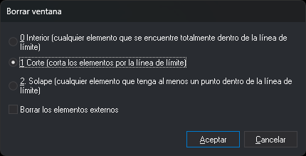

# BORRA\_V
<!-- id: borra-v -->

Borra las entidades que están dentro de una línea cerrada que actúa de ventana, las que la solapan o las que quedan fuera de ella. En el modo **Corte** corta las líneas por el borde de la ventana.

## Parámetros

| Número de parámetro | Descripción | Valores | Opcional |
| :--- | :--- | :--- | :--- |
| 1 | Código de las líneas que actúan de ventana | Código | Sí |
| 2 | Tipo de recorte | 0 = Interior, 1 = Corte, 2 = Solape | Sí |
| 3 | Borrar los elementos externos | 0 = no, 1 = sí | Sí |

Los parámetros se indican los tres o ninguno. Con menos de tres, la orden los ignora y funciona de forma interactiva.

Con los tres parámetros, la orden no muestra el cuadro de diálogo ni pide seleccionar nada. Muestra el mensaje «Calculando...» y usa como ventana, una tras otra, cada línea del archivo activo o de los archivos de referencia visibles que cumple todas estas condiciones: tiene el código indicado, está cerrada, tiene al menos 4 vértices, no está borrada, está visible y está dentro de la zona de interés. Las ventanas no se borran ni se cortan entre sí. Al terminar, la orden finaliza.

Si el tipo de recorte no es 0, 1 ni 2, suena el aviso de error, aparece el globo «Tipo de recorte incorrecto» y la orden termina sin cambiar el dibujo.

## Observaciones

Sin parámetros, la orden muestra el cuadro de diálogo **Borrar ventana**:

Cada vez que se ejecuta la orden, el cuadro aparece con **1 Corte** seleccionado y la casilla **Borrar los elementos externos** desmarcada. Si pulsas **Cancelar**, la orden termina sin hacer nada.

Al pulsar **Aceptar**, la orden muestra el mensaje «Selecciona la línea que actúa de borde.». La línea tiene que existir antes de ejecutar la orden, estar cerrada y tener al menos 4 vértices. Si la entidad seleccionada no es una línea o no cumple esas condiciones, suena el aviso de error y la orden sigue esperando a que selecciones otra. Al seleccionar una línea válida, la orden borra y termina.

Sin la casilla **Borrar los elementos externos**, la orden borra el interior de la ventana:

| Tipo de recorte | Texto en el cuadro | Qué borra |
| :--- | :--- | :--- |
| 0 | Interior (cualquier elemento que se encuentre totalmente dentro de la línea de límite) | Las líneas que tienen todos sus vértices dentro de la ventana o sobre el borde, y los polígonos y complejos que están completamente dentro |
| 1 | Corte (corta los elementos por la línea de límite) | Corta las líneas que atraviesan el borde: borra los trozos interiores y conserva los exteriores. Borra las líneas que están enteras dentro de la ventana. No borra ni corta los polígonos ni los complejos |
| 2 | Solape (cualquier elemento que tenga al menos un punto dentro de la línea de límite) | Las líneas que tienen al menos un vértice dentro de la ventana o sobre el borde, y los polígonos y complejos que tienen algún vértice dentro |

Con la casilla **Borrar los elementos externos** marcada, la orden borra el exterior de la ventana:

| Tipo de recorte | Qué borra |
| :--- | :--- |
| 0 | Las líneas que no tienen ningún vértice dentro de la ventana ni sobre el borde, y los polígonos y complejos que están completamente fuera |
| 1 | Corta las líneas que atraviesan el borde: borra los trozos exteriores y conserva los interiores. Borra las líneas que están enteras fuera de la ventana. No borra ni corta los polígonos ni los complejos |
| 2 | Las líneas que tienen al menos un vértice fuera de la ventana, también las que cruzan el borde, y los polígonos y complejos que tienen algún vértice fuera |

Los puntos, los complejos puntuales y los textos se clasifican en los tres modos por su primer vértice: dentro de la ventana o sobre el borde, o fuera. Los multipuntos y las imágenes se clasifican por sus vértices: en los modos Interior y Corte se borran si todos sus vértices quedan en la zona que se borra; en el modo Solape, si alguno queda en ella.

En el modo Corte, cada línea cortada se borra y sus trozos conservados se añaden como líneas nuevas con los códigos de la original. Una línea cerrada que se corta queda en trozos abiertos.

La orden solo borra entidades del archivo de dibujo activo. Excluye las entidades borradas, las que están fuera de la zona de interés, la propia ventana y las entidades que tienen apagados \([OFF](/digi3d-ai/referencia/ventana-de-dibujo/ordenes/o/off.md)\) todos sus códigos.

Para usar como ventana los recintos de una topología, y borrar solo las entidades de unos códigos, usa [BORRA\_R](/digi3d-ai/referencia/ventana-de-dibujo/ordenes/b/borra-r.md).

Lo que borra y añade la orden se deshace con [UNDO](/digi3d-ai/referencia/ventana-de-dibujo/ordenes/u/undo.md).

### Ejemplo

`BORRA_V=LIMITE 1 0`

Usa como ventana cada línea cerrada con el código `LIMITE`. Corta las líneas que cruzan el borde, borra los trozos interiores y las entidades interiores, y conserva las líneas `LIMITE`.

## Características de la orden

| Tipo de orden | [Orden interactiva](/digi3d-ai/referencia/ventana-de-dibujo/ordenes-interactivas.md) sin parámetros; orden inmediata con parámetros |
| :--- | :--- |
| Repite automáticamente | No |
| Opción del menú donde aparece la orden | Editar/Borrar ventana |
| Barra de herramientas en la que aparece la orden | Eliminar y recuperar |
| Extensión | DigiNG.OrdenesStandard.dll |
| Variables relacionadas | No tiene variables relacionadas |
| Órdenes relacionadas | [BORRA\_COD\_V](/digi3d-ai/referencia/ventana-de-dibujo/ordenes/b/borra-cod-v.md) [BORRA\_E](/digi3d-ai/referencia/ventana-de-dibujo/ordenes/b/borra-e.md) [BORRA\_R](/digi3d-ai/referencia/ventana-de-dibujo/ordenes/b/borra-r.md) |
| Nombre interno | {290F947C-CAAD-4945-8524-9E71C9713108} |
