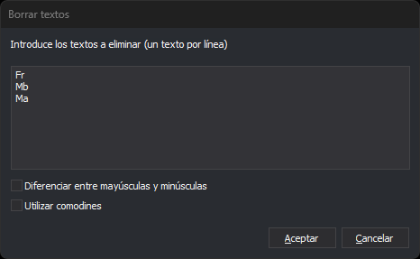

# BORRAR\_TEXTO
<!-- id: borrar-texto -->

Borra los textos del archivo de dibujo activo cuyo contenido coincide con alguno de los textos indicados.

## Parámetros

| Número de parámetro | Descripción | Opcional |
| :--- | :--- | :--- |
| 1 … N | Texto a borrar. Admite los comodines `*` y `?`. Un texto con espacios se escribe entre comillas dobles o simples | Sí |

## Observaciones

La orden recorre los textos del archivo de dibujo activo. No tiene en cuenta los demás archivos de dibujo cargados ni la zona de interés, y borra también los textos que no están visibles.

Un texto se borra si su contenido **completo** coincide con alguno de los textos indicados. Para borrar los textos que contienen `PK` en cualquier posición, escribe `*PK*`.

Los comodines son dos:

- `*` sustituye a cualquier secuencia de caracteres, incluida la secuencia vacía.
- `?` sustituye a un carácter exactamente.

Con los comodines activos no se puede buscar un `*` o un `?` literal.

### Con parámetros

Cada parámetro es un texto a borrar. Los parámetros se separan con espacios, tabuladores o el signo `=`; la coma no separa parámetros. Para borrar un texto que contiene espacios, escríbelo entre comillas: `BORRAR_TEXTO "PUNTO KILOMETRICO"`.

La orden no muestra ningún cuadro de diálogo. La comparación usa comodines y distingue entre mayúsculas y minúsculas. Al terminar suena un pitido, aunque la orden no haya borrado ningún texto.

### Sin parámetros

La orden muestra el cuadro de diálogo **Borrar textos**:

Escribe en el cuadro **Introduce los textos a eliminar (un texto por línea)** un texto por línea. Cada línea es un texto completo, aunque contenga espacios, comas o comillas. La orden quita los espacios y tabuladores del principio y del final de cada línea, e ignora las líneas vacías.

- **Diferenciar entre mayúsculas y minúsculas**: si está marcada, `Rio` no coincide con `RIO`. Si está desmarcada, coinciden, también con letras acentuadas y con la ñ (`camión` coincide con `CAMIÓN`).
- **Utilizar comodines**: si está marcada, `*` y `?` funcionan como comodines. Si está desmarcada, la orden los compara como caracteres normales.

El cuadro de diálogo se abre siempre vacío y con las dos casillas desmarcadas: no recuerda los valores de la ejecución anterior. **Cancelar** cierra el cuadro de diálogo sin borrar nada.

### Deshacer y archivos de solo lectura

La orden [UNDO](/digi3d-ai/referencia/ventana-de-dibujo/ordenes/u/undo.md) recupera de una vez todos los textos borrados por una ejecución de la orden.

Si el archivo de dibujo activo es de solo lectura, la orden no borra ningún texto, suena el aviso de error y aparece el mensaje **Está intentando almacenar una entidad en un archivo de solo lectura**.

## Características de la orden

| Tipo de orden | Orden inmediata |
| :--- | :--- |
| Repite automáticamente | No |
| Opción del menú donde aparece la orden | _Esta orden no tiene asociada ninguna opción de menú_ |
| Barra de herramientas en la que aparece la orden | _Esta orden no tiene asociado ningún botón en ninguna barra de herramientas_ |
| Extensión | DigiNG.OrdenesStandard.dll |
| Variables relacionadas | No tiene variables relacionadas |
| Órdenes relacionadas | [CAMB\_TEXTO](/digi3d-ai/referencia/ventana-de-dibujo/ordenes/c/camb-texto.md) [REEMPLAZAR\_TEXTO](/digi3d-ai/referencia/ventana-de-dibujo/ordenes/r/reemplazar-texto.md) |
| Nombre interno | {7AAC4699-1AB0-415D-88BA-2B3846F3AEC9} |
