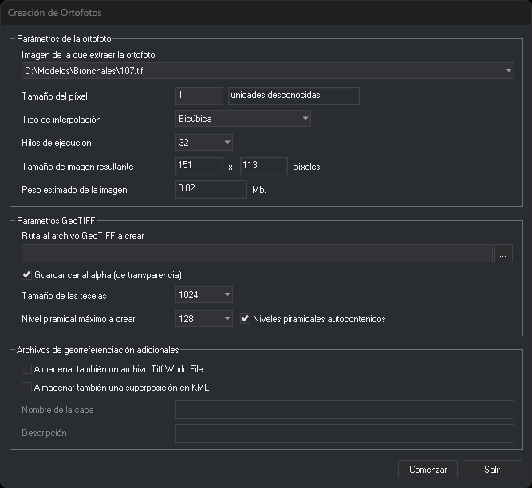

# CAL\_ORTO
<!-- id: cal-orto -->

Efectúa el cálculo para generar ortofotografías.

## Parámetros

| Número de parámetro | Descripción | Opcional |
| :--- | :--- | :--- |
| 1 | Tipo de interpolación: 0 vecino más próximo, 1 bilineal, 2 bicúbica | Si |
| 2 | Nombre del archivo TIFF de salida | Si |
| 3 | Código de la línea que delimita la ortofoto | Si |
| 4 | Almacenar transparencia (0/1). Por defecto, 1 | Si |

Los tres primeros parámetros se indican juntos. Sin ellos, la orden solicita que selecciones la línea que delimita la ortofoto y muestra un cuadro de diálogo con las opciones del cálculo.

## Cuadro de diálogo Creación de Ortofotos

**Parámetros de la ortofoto**

* **Imagen de la que extraer la ortofoto**: imagen del modelo estereoscópico que se proyecta.
* **Tamaño del píxel**: en las unidades del sistema de referencia del dibujo, que se muestran a la derecha.
* **Tipo de interpolación**: vecino más próximo, bilineal o bicúbica.
* **Hilos de ejecución**: número de hilos que calculan la ortofoto en paralelo.
* **Tamaño de imagen resultante** y **Peso estimado de la imagen**: se calculan a partir de la línea seleccionada y del tamaño del píxel.

**Parámetros GeoTIFF**

* **Ruta al archivo GeoTIFF a crear**: el botón **...** permite elegirla.
* **Guardar canal alpha (de transparencia)**: añade al TIFF un canal de transparencia.
* **Tamaño de las teselas**: tamaño en píxeles de los mosaicos del TIFF.
* **Nivel piramidal máximo a crear** y **Niveles piramidales autocontenidos**: niveles de resolución reducida que se guardan dentro del TIFF. La segunda opción se habilita si el nivel máximo no es 0.

**Archivos de georreferenciación adicionales**

* **Almacenar también un archivo Tiff World File**: genera el archivo `.tfw`.
* **Almacenar también una superposición en KML**: genera un archivo KML. **Nombre de la capa** y **Descripción** se habilitan con esta opción.

## Observaciones

La orden requiere un modelo estereoscópico cargado y al menos un archivo de dibujo que permita proyectar (por ejemplo, un modelo digital del terreno) para obtener la Z de cada píxel.

Con parámetros, la orden busca la primera línea con el código indicado y calcula la ortofoto sin pedir datos. El tamaño del píxel es el valor de la variable [DA](/digi3d-ai/referencia/ventana-de-dibujo/variables/d/da.md), en unidades del sistema de referencia del dibujo. La imagen de origen es la izquierda. Junto al TIFF se genera el archivo de georreferenciación `.tfw`. Si el tipo de interpolación es mayor que 2 o no hay ninguna línea con ese código (también cuando el dibujo está vacío), la orden muestra un mensaje de error.

Si el tamaño del píxel no es mayor que 0, la orden muestra un mensaje de error y no calcula la ortofoto.

## Características de la orden

| Tipo de orden | [Orden interactiva](cal-orto.md) sin parámetros; [orden inmediata](cal-orto.md) con parámetros |
| :--- | :--- |
| Repite automáticamente | No |
| Opción del menú donde aparece la orden | Ortofoto/Crear ortofoto... |
| Barra de herramientas en la que aparece la orden | _Esta orden no tiene asociado ningún botón en ninguna barra de herramientas_ |
| Extensión | DigiNG.OrdenesRaster.dll |
| Variables relacionadas | [DA](/digi3d-ai/referencia/ventana-de-dibujo/variables/d/da.md) — distancia activa |
| Órdenes relacionadas | No tiene órdenes relacionadas |
| Nombre interno | {47972709-ACC5-4F6E-8B04-DEB6F73554B0} |
