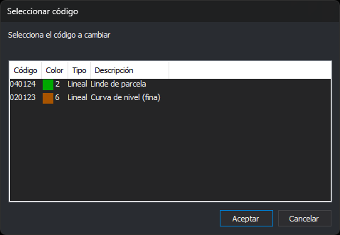

# CAMB\_COD
<!-- id: camb-cod -->

Cambia el código asignado a un elemento gráfico.

## Parámetros

No admite parámetros.

## Observaciones

Esta orden admite los comodines "\*" y "?". Antes de ejecutar la orden hay que establecer como código activo el nuevo código con la orden [COD+](/digi3d-ai/referencia/ventana-de-dibujo/ordenes/c/cod-mas.md).

Si la entidad tiene un solo código, la orden le asigna los códigos activos; si el primer código activo tiene comodines, se combina antes con el código de la entidad. Si tiene varios códigos, la orden muestra el cuadro de diálogo **Seleccionar código** para elegir el código que se sustituye por el primer código activo.

Selecciona en la lista el código a cambiar y pulsa **Aceptar**. **Cancelar** deja la entidad sin cambios.

Esta orden admite selección múltiple. Al terminar, la ventana de resultados muestra el número de entidades seleccionadas y el número de entidades procesadas.

## Características de la orden

| Tipo de orden | [Orden interactiva](camb-cod.md) |
| :--- | :--- |
| Repite automáticamente | Si |
| Opción del menú donde aparece la orden | Editar/Cambiar los códigos de una entidad por los activos |
| Barra de herramientas en la que aparece la orden | Editar códigos |
| Extensión | DigiNG.OrdenesStandard.dll |
| Variables relacionadas | [REPITE](/digi3d-ai/referencia/ventana-de-dibujo/variables/r/repite.md) — repite la última orden ejecutada |
| Órdenes relacionadas | [ANADIR\_CODIGOS](/digi3d-ai/referencia/ventana-de-dibujo/ordenes/a/anadir-codigos.md) [COD+](/digi3d-ai/referencia/ventana-de-dibujo/ordenes/c/cod-mas.md) [EDITAR\_COD](/digi3d-ai/referencia/ventana-de-dibujo/ordenes/e/editar-cod.md) [SUSTITUYE\_COD](/digi3d-ai/referencia/ventana-de-dibujo/ordenes/s/sustituye-cod.md) |
| Nombre interno | {AFDBCF7C-FC23-4f74-8C13-3CFB8E8145B1} |

