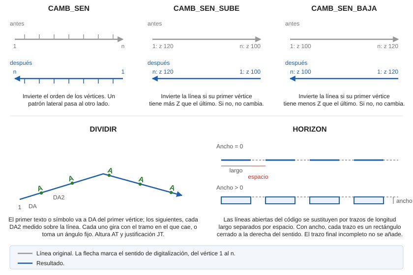

# CAMB\_SEN\_BAJA

Modifica el sentido en que se han registrado los puntos después de haber digitalizado un elemento gráfico. La línea queda digitalizada desde el extremo más alto hacia el más bajo.

## Parámetros

| Número de parámetro | Descripción | Opcional |
| :--- | :--- | :--- |
| 1 | Código o códigos (uno o más, separados por espacios) | Si |

Sin parámetros, la orden pide que selecciones la línea o las líneas. Con códigos, procesa todas las líneas visibles de esos códigos y termina:

`CAMB_SEN_BAJA=<código>`

## Observaciones

La orden solo compara la Z del primer y del último vértice. Si la Z del primero es menor, invierte el orden de todos los vértices; si no, la línea no cambia. Los vértices intermedios no se reordenan.

## Características de la orden

| Tipo de orden | [Orden interactiva](camb-sen-baja.md) |
| :--- | :--- |
| Repite automáticamente | Si |
| Opción del menú donde aparece la orden | Editar/Polilíneas/Ordenando sus coordenadas Z descendentemente |
| Barra de herramientas en la que aparece la orden | Sentido de la polilínea |
| Extensión | DigiNG.OrdenesStandard.dll |
| Variables relacionadas | [REPITE](/digi3d-ai/referencia/ventana-de-dibujo/variables/r/repite.md) — repite la última orden ejecutada |
| Nombre interno | {D010A20E-6879-4837-A8B8-F454089755D4} |

