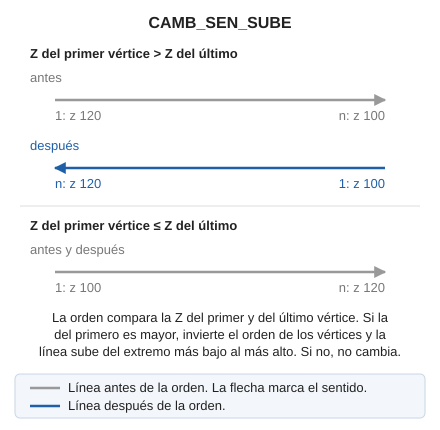

# CAMB\_SEN\_SUBE
<!-- id: camb-sen-sube -->

Modifica el sentido en que se han registrado los puntos después de haber digitalizado un elemento gráfico. La línea queda digitalizada desde el extremo más bajo hacia el más alto.

## Parámetros

| Número de parámetro | Descripción | Opcional |
| :--- | :--- | :--- |
| 1 | Código o códigos (uno o más, separados por espacios) | Si |

Sin parámetros, la orden pide que selecciones la línea o las líneas. Con códigos, procesa todas las líneas visibles de esos códigos y termina:

`CAMB_SEN_SUBE=<código>`

## Observaciones

La orden solo compara la Z del primer y del último vértice. Si la Z del primero es mayor, invierte el orden de todos los vértices; si no, la línea no cambia. Los vértices intermedios no se reordenan.

Si el control de calidad descarta la entidad modificada, la entidad original se conserva sin cambios. Con varias entidades, cada una se trata de forma independiente: solo se conserva el original de cada entidad descartada y las demás se modifican.

## Características de la orden

| Tipo de orden | [Orden interactiva](camb-sen-sube.md) |
| :--- | :--- |
| Repite automáticamente | Si |
| Opción del menú donde aparece la orden | Editar/Polilíneas/Ordenando sus coordenadas Z ascendentemente |
| Barra de herramientas en la que aparece la orden | Sentido de la polilínea |
| Extensión | DigiNG.OrdenesStandard.dll |
| Variables relacionadas | [REPITE](/digi3d-ai/referencia/ventana-de-dibujo/variables/r/repite.md) — repite la última orden ejecutada |
| Órdenes relacionadas | [CAMB\_SEN](/digi3d-ai/referencia/ventana-de-dibujo/ordenes/c/camb-sen.md) [CAMB\_SEN\_BAJA](/digi3d-ai/referencia/ventana-de-dibujo/ordenes/c/camb-sen-baja.md) |
| Nombre interno | {D83AFA04-4452-42a2-BF5E-B1A4F69DCA21} |

