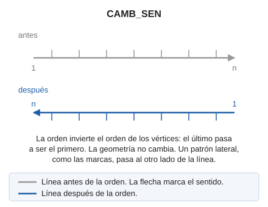

# CAMB\_SEN

Modifica el sentido en que se han registrado los puntos después de haber digitalizado un elemento gráfico.

## Parámetros

| Número de parámetro | Descripción | Opcional |
| :--- | :--- | :--- |
| 1 | Código o códigos (uno o más, separados por espacios) | Si |

Sin parámetros, la orden pide que selecciones la línea o las líneas. Con códigos, cambia el sentido de todas las líneas visibles de esos códigos y termina:

`CAMB_SEN=<código>`

## Observaciones

En caso de líneas con patrón, como puede ser el código para masa de árboles, al cambiar el sentido cambiará el lado hacia el que está dirigido el patrón.

## Características de la orden

| Tipo de orden | [Orden interactiva](camb-sen.md) |
| :--- | :--- |
| Repite automáticamente | Si |
| Opción del menú donde aparece la orden | Editar/Polilíneas/Cambiar el sentido de una línea |
| Barra de herramientas en la que aparece la orden | Sentido de la polilínea |
| Extensión | DigiNG.OrdenesStandard.dll |
| Variables relacionadas | [REPITE](/digi3d-ai/referencia/ventana-de-dibujo/variables/r/repite.md) — repite la última orden ejecutada |
| Nombre interno | {B3B49658-61EF-4884-82F7-AD8FE6A7512E} |

