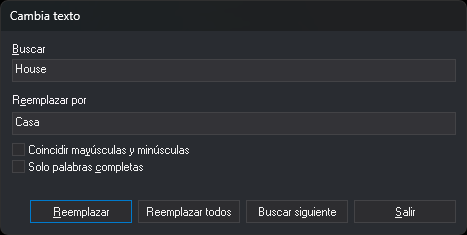

# CAMB\_TEXTO
<!-- id: camb-texto -->

Sustituye el contenido de los textos del archivo de dibujo activo que coinciden con un texto dado.

## Parámetros

| Número de parámetro | Descripción | Valores | Opcional |
| :--- | :--- | :--- | :--- |
| 1 | Texto a reemplazar | Texto | Si |
| 2 | Texto nuevo | Texto | Si |

Los dos parámetros se indican juntos. Con uno solo, la orden lo ignora y muestra el cuadro de diálogo. Si un texto contiene espacios o el signo `=`, escríbelo entre comillas dobles o simples. Para borrar los textos, indica `""` como texto nuevo.

## Observaciones

La orden trabaja solo con los textos del archivo de dibujo activo que son visibles y están dentro de la zona de interés.

### Con parámetros

La orden sustituye sin pedir datos el contenido de los textos no borrados cuyo contenido completo es igual al texto a reemplazar. La comparación distingue mayúsculas y minúsculas. Si el texto nuevo es `""`, la orden borra esos textos.

### Sin parámetros

La orden muestra el cuadro de diálogo **Cambia texto**:

* **Buscar**: texto que se busca. Mientras está vacío, los botones Reemplazar, Reemplazar todos y Buscar siguiente están desactivados.
* **Reemplazar por**: texto que sustituye a lo encontrado.
* **Coincidir mayúsculas y minúsculas**: la búsqueda distingue mayúsculas y minúsculas.
* **Solo palabras completas**: solo coinciden los textos cuyo contenido completo es igual a Buscar. La casilla no separa el texto en palabras. Sin ella, basta con que el texto contenga Buscar.
* **Buscar siguiente**: desplaza la vista hasta el centro del siguiente texto que coincide y lo selecciona. Al llegar al final del archivo, muestra el aviso *Digi NG terminó de buscar en: documento. No se encontró el elemento buscado.*, y la siguiente pulsación vuelve a empezar desde el principio.
* **Reemplazar**: sustituye el texto seleccionado, si sigue coincidiendo con Buscar y las casillas, y busca el siguiente. Si no hay ningún texto seleccionado, solo busca.
* **Reemplazar todos**: sustituye todos los textos que coinciden. Si ya hay un texto encontrado con Buscar siguiente, empieza en ese texto y llega hasta el final del archivo. Si no sustituye ninguno, muestra el mismo aviso.
* **Salir**: cierra el cuadro.

Con **Solo palabras completas**, el reemplazo sustituye el contenido completo del texto. Sin ella, sustituye solo las partes que coinciden con Buscar; por ejemplo, buscar `Río` y reemplazar por `Arroyo` convierte `Río Tajo` en `Arroyo Tajo`. Si un texto queda vacío tras el reemplazo, la orden lo borra.

Los textos creados por un reemplazo no se vuelven a reemplazar mientras no cambies Buscar, Reemplazar por o alguna casilla.

Si la variable [BORRADOS](/digi3d-ai/referencia/ventana-de-dibujo/variables/b/borrados.md) está activada, el cuadro también busca entre los textos borrados.

El cuadro recuerda Buscar, Reemplazar por y las dos casillas para la siguiente vez. La primera vez, **Coincidir mayúsculas y minúsculas** aparece desmarcada y **Solo palabras completas** marcada.

### Cómo se guarda el cambio

Cada reemplazo crea un texto nuevo con los mismos atributos que el original y borra el original. Si el control de calidad o una extensión rechazan el texto nuevo, el original se conserva.

Todos los reemplazos de una ejecución de la orden forman una sola operación de deshacer: al deshacer se recuperan a la vez todos los textos cambiados desde que se abrió el cuadro.

## Características de la orden

| Tipo de orden | [Orden interactiva](/digi3d-ai/referencia/ventana-de-dibujo/ordenes-interactivas.md) sin parámetros; orden inmediata con parámetros |
| :--- | :--- |
| Repite automáticamente | No |
| Opción del menú donde aparece la orden | _Esta orden no tiene asociada ninguna opción de menú_ |
| Barra de herramientas en la que aparece la orden | _Esta orden no tiene asociado ningún botón en ninguna barra de herramientas_ |
| Extensión | DigiNG.OrdenesStandard.dll |
| Variables relacionadas | [BORRADOS](/digi3d-ai/referencia/ventana-de-dibujo/variables/b/borrados.md) — muestra las entidades borradas |
| Órdenes relacionadas | [BORRAR\_TEXTO](/digi3d-ai/referencia/ventana-de-dibujo/ordenes/b/borrar-texto.md) [CAMB\_CARÁCTER](/digi3d-ai/referencia/ventana-de-dibujo/ordenes/c/camb-caracter.md) [EDITAR\_TEXTO](/digi3d-ai/referencia/ventana-de-dibujo/ordenes/e/editar-texto.md) [REEMPLAZAR\_TEXTO](/digi3d-ai/referencia/ventana-de-dibujo/ordenes/r/reemplazar-texto.md) |
| Nombre interno | {62E042B4-F679-4a73-83E3-1B8C989C2DB8} |
