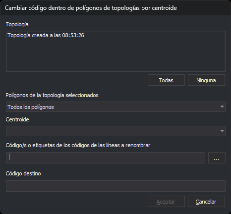

# CAMBIA\_CODIGO\_LINEAS\_DENTRO\_POLIGONOS\_TOPOLOGIA
<!-- id: cambia-codigo-lineas-dentro-poligonos-topologia -->

Cambia el código de las entidades del archivo de dibujo activo que están dentro de los recintos de una o varias topologías. Las líneas que cruzan el contorno de un recinto se cortan por el contorno y solo cambia el código de los tramos de dentro.

## Parámetros

| Número de parámetro | Descripción | Opcional |
| :--- | :--- | :--- |
| 1 | Recintos a tratar: 0 todos; 1 los que tienen centroide; 2 los que tienen un centroide con el texto del parámetro 2. Un valor no numérico equivale a 0 y cualquier otro valor distinto de 0 y de 2 equivale a 1 | No |
| 2 | Texto del centroide. Solo se indica si el parámetro 1 es 2. Si el texto contiene espacios, escríbelo entre comillas dobles | Sí |
| 3 | Código o códigos origen. Admite comodines y `#etiqueta`, que equivale a todos los códigos de la tabla con esa etiqueta. Para indicar varios, escríbelos entre comillas dobles separados por espacios | No |
| 4 | Código destino. Admite los comodines `?` y `*` | No |

Si el parámetro 1 no es 2, el parámetro 2 no se indica y los códigos origen y el código destino pasan a ser los parámetros 2 y 3. Si faltan parámetros \(menos de tres, o menos de cuatro con el parámetro 1 igual a 2\), la orden no tiene en cuenta ninguno y muestra el cuadro de diálogo. Con parámetros, la orden trata todas las topologías cargadas.

## Observaciones

La orden necesita al menos una topología cargada. Si no hay ninguna, muestra el mensaje _No hay ninguna topología cargada_ y termina. La opción del menú está desactivada mientras no haya topologías cargadas.

### Cuadro de diálogo

El cuadro _Cambiar código dentro de polígonos de topologías por centroide_ tiene estos controles:

| Control | Descripción |
| :--- | :--- |
| Topología | Lista de las topologías cargadas. Admite selección múltiple. Al abrir el cuadro no hay ninguna marcada |
| Todas / Ninguna | Marcan o desmarcan todas las topologías de la lista |
| Polígonos de la topología seleccionados | _Todos los polígonos_, _Los polígonos que tengan cualquier centroide_ o _Los polígonos que tengan un centroide específico_ |
| Centroide | Solo está activo con _Los polígonos que tengan un centroide específico_. Lista, sin repetir y ordenados, los textos de los centroides de los recintos del archivo de dibujo activo en las topologías marcadas. Está vacío mientras no marques ninguna topología. Si cambias las topologías marcadas, conserva el texto elegido mientras siga en la lista |
| Códigos o etiquetas de códigos de las entidades a recodificar | Códigos origen separados por espacios. Admite comodines y `#etiqueta`. El botón **...** abre el cuadro de selección de códigos y añade al campo los códigos elegidos que no estaban ya |
| Código destino | Código que sustituye a cada código origen. Admite los comodines `?` y `*` |

El botón _Aceptar_ se habilita cuando hay al menos una topología marcada, los dos campos de códigos tienen algún carácter distinto de espacio y, si eliges _Los polígonos que tengan un centroide específico_, hay un centroide elegido. El cuadro no guarda ningún valor: cada vez se abre con la configuración por defecto. Si pulsas _Cancelar_, la orden termina sin modificar nada.

### Funcionamiento

La orden solo trabaja con el archivo de dibujo activo y con los recintos que cada topología tiene en ese archivo. Si una topología no se ha calculado sobre el archivo activo, la orden no hace nada con ella.

1. La orden toma las entidades no borradas del archivo activo que tienen alguno de los códigos origen. No tiene en cuenta si son visibles ni si están en la zona de interés. Nunca toma los arcos ni los centroides de ninguna topología cargada, aunque tengan un código origen.
2. Recorre los recintos de cada topología que cumplen el tipo elegido. Con un centroide específico, compara el texto del centroide con el indicado distinguiendo mayúsculas y minúsculas.
3. Cada recinto se trata con su contorno exterior y sus huecos. Lo que está dentro de un hueco queda fuera del recinto. Si dentro del hueco hay otro recinto, ese recinto se trata por separado.
4. Para cada recinto:
   * Una línea que cruza el contorno se corta por él. La orden borra la línea original y añade los tramos. Los tramos de dentro cambian de código y los de fuera conservan el original. Los tramos de fuera pueden cortarse de nuevo con los recintos siguientes.
   * Una línea que no cruza el contorno se considera dentro si el punto medio de su tramo central está dentro del recinto o sobre el contorno. Por eso también cambia de código una línea que discurre por el contorno sin ser un arco de la topología.
   * Un punto, un texto o un complejo puntual cambia de código si está dentro o sobre el contorno. Un multipunto cambia de código si todos sus vértices lo están.
   * Los polígonos y los complejos no se tratan.

La orden cambia de código una entidad creando una copia con el código nuevo y borrando la original.

### Cambio de código

En cada entidad tratada, la orden sustituye cada código que casa con alguno de los códigos origen y conserva los demás códigos de la entidad. El código nuevo se forma a partir del código sustituido y del código destino:

* Cada carácter del destino que no es comodín sustituye al carácter de la misma posición.
* Un `?` conserva el carácter original de esa posición.
* Un `*` conserva el resto del código original a partir de esa posición.
* Sin `*`, el código nuevo tiene la longitud del destino.

Por ejemplo, con el destino `9??` el código `0123` pasa a `912`, y con `9*` pasa a `9123`.

La orden no comprueba que el código destino exista en la tabla de códigos. El código sustituido no conserva sus atributos de base de datos. Las entidades nuevas se añaden sin ejecutar los controles de calidad, y al terminar no se insertan vértices automáticamente en las intersecciones.

### Resultado

Al terminar, la orden regenera la vista y emite un pitido. No muestra ningún mensaje ni cuenta las entidades modificadas. Si los códigos origen no corresponden a ningún código \(por ejemplo, una etiqueta sin códigos\), la orden no modifica nada.

Los cambios forman una única operación de [UNDO](/digi3d-ai/referencia/ventana-de-dibujo/ordenes/u/undo.md).

## Características de la orden

| Tipo de orden | Orden inmediata |
| :--- | :--- |
| Repite automáticamente | No |
| Opción del menú donde aparece la orden | Topología/Cambiar códigos de líneas que pasan por dentro de polígonos topológicos... |
| Barra de herramientas en la que aparece la orden | _Esta orden no tiene asociado ningún botón en ninguna barra de herramientas_ |
| Extensión | DigiNG.OrdenesTopologia.dll |
| Variables relacionadas | No tiene variables relacionadas |
| Órdenes relacionadas | [ANADIR\_CODIGOS\_BORDES\_POLIGONOS\_TOPOLOGIA](/digi3d-ai/referencia/ventana-de-dibujo/ordenes/a/anadir-codigos-bordes-poligonos-topologia.md) [BORRA\_R](/digi3d-ai/referencia/ventana-de-dibujo/ordenes/b/borra-r.md) [RENOMCOD\_R](/digi3d-ai/referencia/ventana-de-dibujo/ordenes/r/renomcod-r.md) [UNDO](/digi3d-ai/referencia/ventana-de-dibujo/ordenes/u/undo.md) |
| Nombre interno | {5319DE3E-3FDD-4C31-8CD4-7272778CACC5} |
