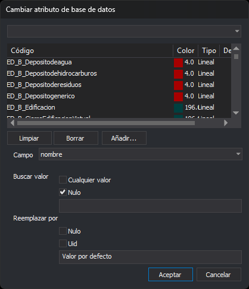

# CAMBIAR\_VALORES\_BBDD
<!-- id: cambiar-valores-bbdd -->

Cambia valores en la BBDD asociada con el archivo de dibujo.

## Parámetros

No admite parámetros.

## Cuadro de diálogo Cambiar atributo de base de datos

Esta orden solicita los códigos y el cambio a realizar en este cuadro de diálogo.

* **Lista de códigos**: los códigos cuyas geometrías se van a cambiar. Se manejan igual que en el cuadro de diálogo [Seleccione códigos](../../../cuadros-de-dialogo/seleccione-codigos.md): **Añadir…** añade códigos, **Borrar** quita el seleccionado y **Limpiar** vacía la lista.
* **Campo**: el campo de la base de datos que se cambia. El desplegable muestra solo los campos que tienen las tablas de todos los códigos de la lista.
* **Buscar valor**: el valor que debe tener el campo para que se cambie.
  * **Cualquier valor**: cambia el campo sea cual sea su valor.
  * **Nulo**: cambia solo los campos vacíos.
  * Si no se marca ninguna de las dos, cambia los campos cuyo valor es igual al texto del cuadro.
* **Reemplazar por**: el valor nuevo.
  * **Nulo**: deja el campo vacío.
  * **Uid**: asigna a cada geometría un identificador único (GUID) nuevo.
  * Si no se marca ninguna de las dos, asigna el texto del cuadro.

## Observaciones

La orden recorre las entidades visibles, no borradas y dentro de la zona de interés del archivo de dibujo activo. En cada código de esas entidades que coincide con uno de los seleccionados, aplica el cambio descrito en el cuadro de diálogo.

## Características de la orden

| Tipo de orden | [Orden inmediata](cambiar-valores-bbdd.md) |
| :--- | :--- |
| Repite automáticamente | No |
| Opción del menú donde aparece la orden | Base de Datos/Cambiar valores BBDD... |
| Barra de herramientas en la que aparece la orden | _Esta orden no tiene asociado ningún botón en ninguna barra de herramientas_ |
| Extensión | DigiNG.OrdenesBaseDatos.dll |
| Variables relacionadas | No tiene variables relacionadas |
| Órdenes relacionadas | [ASIGNA\_ATRIBUTO\_BBDD\_ENTIDAD](/digi3d-ai/referencia/ventana-de-dibujo/ordenes/a/asigna-atributo-bbdd-entidad.md) |
| Nombre interno | {3E045845-BD0D-45AB-8050-91448BF532A3} |
