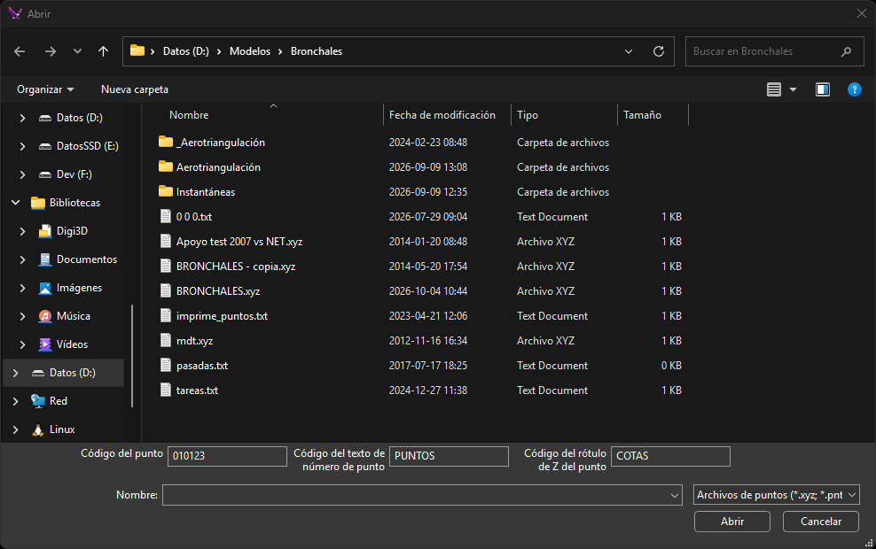

# CARGA\_P
<!-- id: carga-p -->

Lee el contenido de un fichero ASCII de coordenadas, incorporando al archivo de trabajo un punto por cada conjunto de coordenadas \(X Y Z\) leídas.

## Parámetros

| Número de parámetro | Descripción | Valores | Opcional |
| :--- | :--- | :--- | :--- |
| 1 | Nombre del fichero ASCII de coordenadas | Ruta de archivo | Si |

Sin parámetros, la orden muestra un cuadro de diálogo para elegir el fichero y los códigos del punto, del texto con el número de punto y del texto con la cota:

* **Código del punto**: por defecto, el primer código activo.
* **Código del texto de número de punto**: por defecto, `PUNTOS`.
* **Código del rótulo de Z del punto**: por defecto, `COTAS`.

## Observaciones

Cada línea del fichero contiene cuatro valores separados por espacios, tabuladores o comas:

| Posición | Descripción | Valores |
| :--- | :--- | :--- |
| 1 | Número de punto. La orden lo usa solo como texto | Texto |
| 2 | Coordenada X | Número real |
| 3 | Coordenada Y | Número real |
| 4 | Coordenada Z | Número real |

La orden ignora las líneas con menos de cuatro valores o cuyas coordenadas no son números.

Por cada línea, la orden crea:

* Un punto en las coordenadas leídas, con el código del punto. Si el código es lineal, la orden no crea el punto.
* Un texto con el número de punto, desplazado una altura de texto ([AT](/digi3d-ai/referencia/ventana-de-dibujo/variables/a/at.md)) en X y en Y.
* Un texto con la Z, desplazado una altura de texto en X y dos alturas de texto hacia abajo en Y.

Con el parámetro, el código del punto es el primer código activo, el código del texto del número de punto es `PUNTOS` y el código del texto de la cota es `COTAS`.

## Características de la orden

| Tipo de orden | [Orden interactiva](carga-p.md) sin parámetros; [orden inmediata](carga-p.md) con parámetros |
| :--- | :--- |
| Repite automáticamente | No |
| Opción del menú donde aparece la orden | _Esta orden no tiene asociada ninguna opción de menú_ |
| Barra de herramientas en la que aparece la orden | _Esta orden no tiene asociado ningún botón en ninguna barra de herramientas_ |
| Extensión | DigiNG.OrdenesStandard.dll |
| Variables relacionadas | [AA](/digi3d-ai/referencia/ventana-de-dibujo/variables/a/aa.md) — ángulo activo [AT](/digi3d-ai/referencia/ventana-de-dibujo/variables/a/at.md) — altura de los textos [JT](/digi3d-ai/referencia/ventana-de-dibujo/variables/j/jt.md) — justificación del texto |
| Órdenes relacionadas | [CARGA\_T](/digi3d-ai/referencia/ventana-de-dibujo/ordenes/c/carga-t.md) |
| Nombre interno | {EF1460ED-3186-4c35-9815-1010C515C2EC} |

