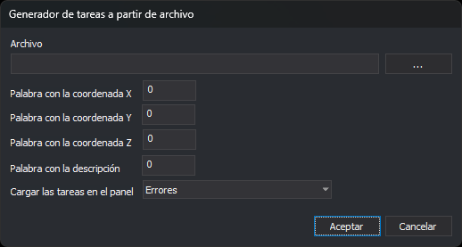

# CARGAR\_TAREAS\_FICHERO\_FORMATO
<!-- id: cargar-tareas-fichero-formato -->

Lee un archivo de texto con coordenadas de puntos y crea en el panel [Tareas](/digi3d-ai/referencia/paneles/tareas.md) una tarea por cada línea.

## Parámetros

No admite parámetros.

## Observaciones

La orden muestra el cuadro de diálogo **Generador de tareas a partir de archivo**:

| Dato | Descripción | Valores |
| :--- | :--- | :--- |
| Archivo | Ruta del archivo de texto. El botón **...** abre un cuadro para elegirlo. | Ruta de archivo |
| Palabra con la coordenada X | Posición de la palabra que contiene la coordenada X | Número entero mayor o igual que 0; la primera palabra es la 0 |
| Palabra con la coordenada Y | Posición de la palabra que contiene la coordenada Y | Número entero mayor o igual que 0 |
| Palabra con la coordenada Z | Posición de la palabra que contiene la coordenada Z | Número entero mayor o igual que 0 |
| Palabra con la descripción | Posición de la palabra que se muestra como descripción de la tarea | Número entero mayor o igual que 0 |
| Cargar las tareas en el panel | Tipo de las tareas creadas | **Mensajes**, **Advertencias** o **Errores**. Por defecto, **Errores** |

Los campos de posición solo admiten dígitos. El cuadro guarda todos los valores al pulsar **Aceptar** y los muestra la próxima vez que se ejecuta la orden.

### Formato del archivo

* Cada línea se divide en palabras. Las palabras se separan por espacios, tabuladores, comas o el signo `=`. Varios separadores seguidos cuentan como uno.
* Un texto entre comillas dobles o simples es una sola palabra, aunque contenga espacios. Así se escribe una descripción de varias palabras: `100.5 200.25 35.0 "Poste roto"`.
* El separador decimal de las coordenadas es el punto.
* La orden se salta una línea en estos casos:
  * La línea tiene menos palabras que la posición mayor indicada en el cuadro.
  * La palabra de X, de Y o de Z no empieza por un número; por ejemplo, una línea de cabecera.
* El archivo puede estar codificado en UTF-8, con o sin BOM, o en ANSI. No se admite UTF-16.

### Tareas creadas

Cada línea válida crea una tarea en el panel Tareas:

* La columna **Descripción** muestra la palabra indicada en **Palabra con la descripción**.
* La columna **Archivo** muestra la ruta del archivo de texto.
* La columna **Módulo** muestra `DigiNG.OrdenesStandard`.

En la ventana de dibujo se dibuja un triángulo rojo en las coordenadas de cada tarea. Al hacer doble clic sobre una tarea, la ventana de dibujo se desplaza hasta sus coordenadas.

Si la opción [Vaciar automáticamente](/digi3d-ai/referencia/cuadros-de-dialogo/configuracion/panel-de-tareas/vaciar-automaticamente.md) está activada, la orden elimina las tareas del panel antes de añadir las nuevas. Si la opción [Agrupar tareas por coordenadas](/digi3d-ai/referencia/cuadros-de-dialogo/configuracion/panel-de-tareas/agrupar-tareas-por-coordenadas.md) está activada, las tareas con las mismas coordenadas X e Y se agrupan.

### Errores

* Si el archivo no se puede abrir, la orden muestra el aviso **Error al abrir el archivo** y no modifica el panel.
* Si alguna posición es negativa, la orden emite un sonido de error y termina sin leer el archivo.

## Características de la orden

| Tipo de orden | [Orden interactiva](/digi3d-ai/referencia/ventana-de-dibujo/ordenes-interactivas.md) |
| :--- | :--- |
| Repite automáticamente | No |
| Opción del menú donde aparece la orden | Ventana/Tareas/Cargar archivo de tareas (ascii) |
| Barra de herramientas en la que aparece la orden | _Esta orden no tiene asociado ningún botón en ninguna barra de herramientas_ |
| Extensión | DigiNG.OrdenesStandard.dll |
| Variables relacionadas | No tiene variables relacionadas |
| Órdenes relacionadas | [BORRAR\_TAREAS](/digi3d-ai/referencia/ventana-de-dibujo/ordenes/b/borrar-tareas.md) [CARGAR\_TAREAS](/digi3d-ai/referencia/ventana-de-dibujo/ordenes/c/cargar-tareas.md) [GUARDAR\_TAREAS](/digi3d-ai/referencia/ventana-de-dibujo/ordenes/g/guardar-tareas.md) [TAREA+](/digi3d-ai/referencia/ventana-de-dibujo/ordenes/t/tarea-mas.md) [TAREA-](/digi3d-ai/referencia/ventana-de-dibujo/ordenes/t/tarea-menos.md) |
| Nombre interno | {6E345000-A069-4a06-94BF-5E7D0ACBB0D1} |
