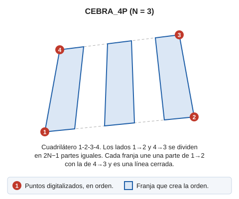

# CEBRA\_4P

Facilita el dibujo de pasos de cebra, introduciendo sólo el número de las franjas blancas y 4 puntos que definan la forma y posición de los pasos de cebra.

## Parámetros

No admite parámetros

## Características de la orden

| Tipo de orden | [Orden interactiva](cebra-4p.md) |
| :--- | :--- |
| Repite automáticamente | No |
| Opción del menú donde aparece la orden | Dibujar/Mas/Paso de cebra con 4 puntos |
| Barra de herramientas en la que aparece la orden | Señalización horizontal |
| Extensión | DigiNG.OrdenesStandard.dll |
| Variables relacionadas | [REPITE](/digi3d-ai/referencia/ventana-de-dibujo/variables/r/repite.md) — repite la última orden ejecutada |
| Órdenes relacionadas | [CEBRA](/digi3d-ai/referencia/ventana-de-dibujo/ordenes/c/cebra.md) |
| Nombre interno | {26B97B1C-8C5D-4b21-A6F3-C07C12AAE4EA} |

