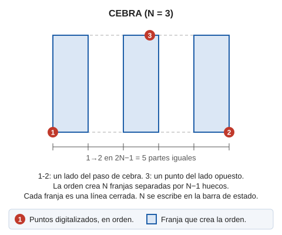

# CEBRA
<!-- id: cebra -->

Facilita el dibujo de pasos de cebra.

## Parámetros

No admite parámetros.

## Observaciones

Únicamente tendremos que introducir el número de franjas blancas y 3 puntos que definal la forma y posición de los pasos de cebra.

## Características de la orden

| Tipo de orden | [Orden interactiva](cebra.md) |
| :--- | :--- |
| Repite automáticamente | No |
| Opción del menú donde aparece la orden | Dibujar/Mas/Paso de cebra con 3 puntos |
| Barra de herramientas en la que aparece la orden | Señalización horizontal |
| Extensión | DigiNG.OrdenesStandard.dll |
| Variables relacionadas | [REPITE](/digi3d-ai/referencia/ventana-de-dibujo/variables/r/repite.md) — repite la última orden ejecutada |
| Órdenes relacionadas | [CEBRA\_4P](/digi3d-ai/referencia/ventana-de-dibujo/ordenes/c/cebra-4p.md) |
| Nombre interno | {E805C5AC-338A-4943-8F5D-6BAA7BD6A591} |

