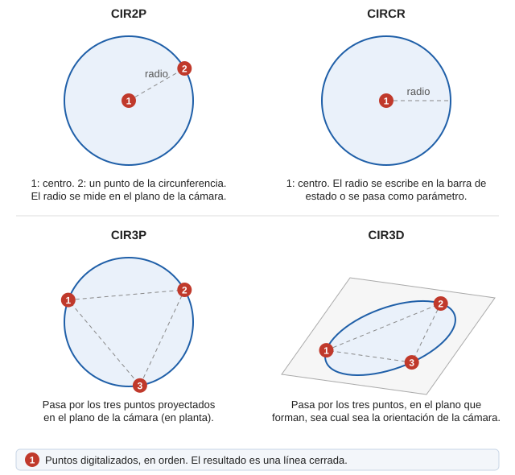

# CIR2P

Dibuja una circunferencia mediante el centro y un punto de la misma.

## Parámetros

| Número de parámetro | Descripción | Valores | Opcional |
| :--- | :--- | :--- | :--- |
| 1 | Centro de la circunferencia | Coordenadas XYZ | Si |
| 2 | Punto en el espacio de trabajo | Radio de la circunferencia | Si |

## Características de la orden

| Tipo de orden | [Orden interactiva](cir2p.md) |
| :--- | :--- |
| Repite automáticamente | No |
| Opción del menú donde aparece la orden | Dibujar/Mas/Circunferencia con 2 puntos |
| Barra de herramientas en la que aparece la orden | Circunferencias |
| Extensión | DigiNG.OrdenesStandard.dll |
| Variables relacionadas | [REPITE](/digi3d-ai/referencia/ventana-de-dibujo/variables/r/repite.md) — repite la última orden ejecutada |
| Nombre interno | {C9CE4CF2-6029-48e7-9FC1-141708C22393} |

