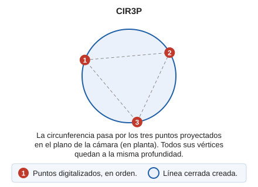

# CIR3P

Dibuja una circunferencia a partir de tres puntos dados.

## Parámetros

| Número de parámetro | Descripción | Valores | Opcional |
| :--- | :--- | :--- | :--- |
| 1 | Punto en el espacio de trabajo | Coordenadas XYZ | Si |
| 2 | Punto en el espacio de trabajo | Coordenadas XYZ | Si |
| 3 | Punto en el espacio de trabajo | Coordenadas XYZ | Si |

## Observaciones

El círculo se construye de tal forma, que el triángulo definido por esos tres puntos queda inscrito en su interior.

La circunferencia se construye en el plano de la cámara: todos sus vértices quedan a la misma profundidad. Para que pase exactamente por tres puntos que no estén en ese plano —con la cámara libre de los sensores de nube de puntos y de ortofoto estereoscópica—, use [CIR3D](cir3d.md).

## Características de la orden

| Tipo de orden | [Orden interactiva](cir3p.md) |
| :--- | :--- |
| Repite automáticamente | No |
| Opción del menú donde aparece la orden | Dibujar/Mas/Circunferencia con 3 puntos |
| Barra de herramientas en la que aparece la orden | Circunferencias |
| Extensión | DigiNG.OrdenesStandard.dll |
| Variables relacionadas | [REPITE](/digi3d-ai/referencia/ventana-de-dibujo/variables/r/repite.md) — repite la última orden ejecutada |
| Órdenes relacionadas | [CIR2P](/digi3d-ai/referencia/ventana-de-dibujo/ordenes/c/cir2p.md) [CIR3D](/digi3d-ai/referencia/ventana-de-dibujo/ordenes/c/cir3d.md) [CIRCR](/digi3d-ai/referencia/ventana-de-dibujo/ordenes/c/circr.md) |
| Nombre interno | {6ED5F7BA-42D1-419c-982C-3088BDEFF125} |

