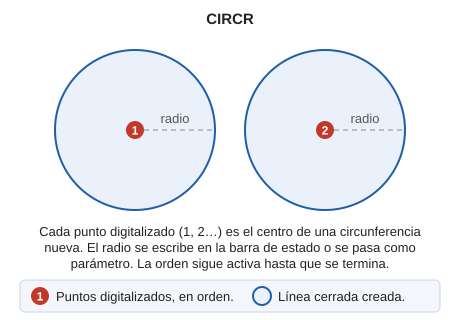

# CIRCR
<!-- id: circr -->

Dibuja una circunferencia mediante la definición de su centro y el radio introducido numéricamente.

## Parámetros

| Número de parámetro | Descripción | Valores | Opcional |
| :--- | :--- | :--- | :--- |
| 1 | Radio de la circunferencia | Número | Si |

## Observaciones

La orden muestra en la barra de estado un campo con el radio, que puedes cambiar en cualquier momento. Cada punto que digitalizas es el centro de una circunferencia nueva con ese radio; la orden sigue activa hasta que la terminas.

## Características de la orden

| Tipo de orden | [Orden interactiva](circr.md) |
| :--- | :--- |
| Repite automáticamente | Si |
| Opción del menú donde aparece la orden | Dibujar/Mas/Circunferencia con centro y radio |
| Barra de herramientas en la que aparece la orden | Circunferencias |
| Extensión | DigiNG.OrdenesStandard.dll |
| Variables relacionadas | No tiene variables relacionadas |
| Órdenes relacionadas | [CIR2P](/digi3d-ai/referencia/ventana-de-dibujo/ordenes/c/cir2p.md) [CIR3D](/digi3d-ai/referencia/ventana-de-dibujo/ordenes/c/cir3d.md) [CIR3P](/digi3d-ai/referencia/ventana-de-dibujo/ordenes/c/cir3p.md) |
| Nombre interno | {958A46FD-8051-4660-82A2-F5A14F314854} |

