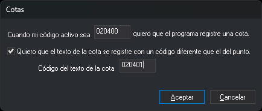

# COD\_COTAS
<!-- id: cod-cotas -->

Indica el código con el que el programa registra automáticamente cotas altimétricas y, opcionalmente, el código del texto de la cota.

## Parámetros

| Número de parámetro | Descripción | Valores | Opcional |
| :--- | :--- | :--- | :--- |
| 1 | Código activo que hace que el programa registre una cota altimétrica al pulsar el botón de datos. | Un código como 020401. Admite los comodines **\*** (cualquier secuencia de caracteres hasta el final) y **?** (un carácter cualquiera), por ejemplo 0204\* | Sí. Si no se indica ningún parámetro, la orden muestra el cuadro de diálogo **Cotas** |
| 2 | Código del texto de la cota. | Un código como 020402 | Sí. Si no se indica, el texto se registra con el mismo código que el punto |

Los parámetros a partir del tercero se ignoran.

### Ejemplos

`COD_COTAS=020401`

`COD_COTAS=020401 020402`

`COD_COTAS=0204*`

## Observaciones

Si se ejecuta sin parámetros, la orden muestra el cuadro de diálogo **Cotas** con los códigos configurados:

* **Cuando mi código activo sea [código] quiero que el programa registre una cota.**: código del punto (parámetro 1). Si se deja vacío y se pulsa **Aceptar**, el programa deja de registrar cotas automáticamente.
* **Quiero que el texto de la cota se registre con un código diferente que el del punto.**: activa el campo **Código del texto de la cota**. Mientras la casilla está desmarcada, el campo está deshabilitado y el texto se registra con el código del punto.
* **Código del texto de la cota**: código del texto (parámetro 2).

Si se pulsa **Cancelar**, la configuración no cambia.

Los códigos se guardan en una variable de la aplicación, común a todas las ventanas de dibujo. La variable dura hasta que se cierra el programa y no se guarda: en cada arranque vale `020400 020400`.

Al pulsar el botón de datos sin ninguna orden en ejecución, el programa compara el primer código activo con el código del punto. Si coinciden, ejecuta la orden [COTA](/digi3d-ai/referencia/ventana-de-dibujo/ordenes/c/cota.md) en lugar de [PUNTO](/digi3d-ai/referencia/ventana-de-dibujo/ordenes/p/punto.md) o [LINEA](/digi3d-ai/referencia/ventana-de-dibujo/ordenes/l/linea.md). Para que esto ocurra se tienen que cumplir tres condiciones:

* La variable [AUTOMATICO](/digi3d-ai/referencia/ventana-de-dibujo/variables/a/automatico.md) está activa.
* El código activo admite el modo automático.
* El código activo no tiene órdenes asociadas al pulsar dato. Si las tiene, el programa ejecuta esas órdenes y no registra la cota.

La misma comprobación se hace al introducir un punto con un tentativo o con una intersección (si AUTOMATICO está activa) y al introducir puntos por número desde un archivo de puntos. No afecta a las órdenes PUNTO, LINEA o COTA ejecutadas expresamente.

Al registrar la cota, el programa añade al archivo de dibujo dos entidades:

* Un punto con el código activo, en las coordenadas del cursor.
* Un texto con la coordenada Z del punto, escrita con tantos decimales como indica [NDEC](/digi3d-ai/referencia/ventana-de-dibujo/variables/n/ndec.md) (3 por defecto). El texto se coloca desplazado respecto al punto la mitad del valor de [AT](/digi3d-ai/referencia/ventana-de-dibujo/variables/a/at.md) en X y la misma cantidad en Y. Tiene la altura indicada en AT, la rotación indicada en [AA](/digi3d-ai/referencia/ventana-de-dibujo/variables/a/aa.md) y la justificación indicada en [JT](/digi3d-ai/referencia/ventana-de-dibujo/variables/j/jt.md). Su código es el del parámetro 2 o, si no se indicó, el código activo.

Si el código del punto tiene comodines, el punto se registra con el código activo, no con el patrón. Si un código no existe en la tabla de códigos, el punto o el texto se registran con ese código sin definir.

Para no tener que ejecutar la orden en cada sesión, añádela a las órdenes de inicio de la tabla de códigos.

## Características de la orden

| Tipo de orden | Orden inmediata |
| :--- | :--- |
| Repite automáticamente | No |
| Opción del menú donde aparece la orden | Inmediato/Códigos especiales/Código de cotas... |
| Barra de herramientas en la que aparece la orden | _Esta orden no tiene asociado ningún botón en ninguna barra de herramientas_ |
| Extensión | DigiNG.OrdenesStandard.dll |
| Variables relacionadas | [AUTOMATICO](/digi3d-ai/referencia/ventana-de-dibujo/variables/a/automatico.md) — digitalización automática según el código activo [AT](/digi3d-ai/referencia/ventana-de-dibujo/variables/a/at.md) — altura de los textos [AA](/digi3d-ai/referencia/ventana-de-dibujo/variables/a/aa.md) — ángulo activo [JT](/digi3d-ai/referencia/ventana-de-dibujo/variables/j/jt.md) — justificación del texto [NDEC](/digi3d-ai/referencia/ventana-de-dibujo/variables/n/ndec.md) — número de decimales |
| Órdenes relacionadas | [COTA](/digi3d-ai/referencia/ventana-de-dibujo/ordenes/c/cota.md) |
| Nombre interno | {2A57AF5B-FDF2-4251-A736-362FF025D5E1} |

## Tutorial

Sigue estas instrucciones para registrar automáticamente cotas altimétricas cuando el código activo sea 020401:

1. Activa el [modo preparado](/digi3d-ai/referencia/ordenes/formas-de-ejecutar-una-orden/de-manera-automatica/modo-preparado.md): pulsa la tecla **Esc** las veces necesarias para cancelar las órdenes en ejecución.
2. Comprueba que la variable **AUTOMATICO** está activa.
3. Ejecuta la orden **COD\_COTAS=020401**.
4. Selecciona como código activo un código lineal, por ejemplo _010123_, con la orden **COD=010123**.
5. Digitaliza dos puntos. Como el código _010123_ es lineal, el programa registra una línea.
6. Selecciona como código activo el código _020401_ con la orden **COD=020401**.
7. Digitaliza un punto. El programa registra una cota altimétrica, porque el código activo _020401_ coincide con el primer parámetro de **COD\_COTAS**.

Para que el texto de la cota se registre con el código 020402, ejecuta en el paso 3 la orden **COD\_COTAS=020401 020402**. En el paso 7, el punto se registra con el código _020401_ y el texto con el código _020402_.
