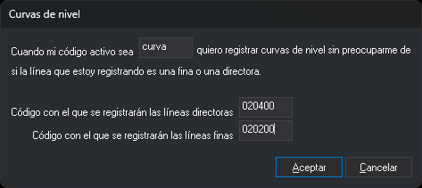

# COD\_CURVAS
<!-- id: cod-curvas -->

Define el código con el que se activa el registro de curvas de nivel y los códigos con los que se registran las curvas directoras y las finas.

## Parámetros

| Número de parámetro | Descripción | Opcional |
| :--- | :--- | :--- |
| 1 | Código activo que hace que las líneas se registren como curvas de nivel. Admite los comodines `*` y `?` y distingue mayúsculas de minúsculas | Si |
| 2 | Código con el que se registran las curvas de nivel directoras | Si |
| 3 | Código con el que se registran las curvas de nivel finas | Si |

Los parámetros van separados por espacios. Si se indican los tres, la orden los asigna sin mostrar ningún cuadro de diálogo y no tiene en cuenta los que sobren. Si se indican menos de tres, la orden no tiene en cuenta los que se hayan indicado y muestra el cuadro de diálogo **Curvas de nivel** con los códigos que hay configurados en ese momento.

## Observaciones

Permite registrar curvas de nivel sin cambiar de código para cada línea: el programa asigna a cada línea el código de directora o de fina según su Z.

Cuando el primer código activo coincide con el código del primer parámetro, las órdenes [LINEA](/digi3d-ai/referencia/ventana-de-dibujo/ordenes/l/linea.md) y POLIGONO registran la línea con un solo código, que se elige así:

* **Directora**: la Z del primer vértice de la línea es múltiplo de 5 veces la [EQUIDISTANCIA](/digi3d-ai/referencia/ventana-de-dibujo/variables/e/equidistancia.md). La comparación usa como tolerancia la precisión del programa (0,001 por defecto).
* **Fina**: cualquier otra Z, incluida una Z que no sea múltiplo de la equidistancia.

Por ejemplo, con una equidistancia de 5, las líneas registradas a Z 100, 125 y 150 son directoras, y las registradas a Z 105, 110, 115, 120 y 102,5 son finas. Si las curvas se registran a Z múltiplos de la equidistancia, entre cada dos directoras hay 4 finas.

* El código se decide con la Z del **primer vértice**. Si la Z cambia mientras se registra la línea, el código no cambia.
* Si hay varios códigos activos, solo se compara el primero, y la línea se registra únicamente con el código de directora o el de fina.
* Si el código de directoras o el de finas está vacío, las líneas de ese tipo se registran con los códigos activos.
* Si la EQUIDISTANCIA vale 0, todas las líneas se registran con el código de finas.
* La orden no afecta a otras órdenes de dibujo ni a las entidades importadas o modificadas.

Si la variable [AUTOMATICO](/digi3d-ai/referencia/ventana-de-dibujo/variables/a/automatico.md) está activa, al pulsar el botón de datos sin ninguna orden en ejecución el programa ejecuta LINEA. Para ello, el código del primer parámetro tiene que ser lineal en la tabla de códigos y admitir el modo automático. Si ese código coincide con el del punto de [COD\_COTAS](/digi3d-ai/referencia/ventana-de-dibujo/ordenes/c/cod-cotas.md), el programa ejecuta COTA en lugar de LINEA.

Los códigos se guardan en memoria y valen para todas las ventanas de dibujo. No se guardan en el registro: al cerrar el programa se pierden y, al abrirlo, están vacíos. Para que se configuren en cada sesión, añade la orden con sus tres parámetros a las órdenes de inicio.

Para desactivar el registro de curvas de nivel, ejecuta la orden sin parámetros, borra el primer código del cuadro de diálogo y pulsa **Aceptar**.

La orden no muestra mensajes y no comprueba que los códigos existan en la tabla de códigos.

## Características de la orden

| Tipo de orden | Orden inmediata |
| :--- | :--- |
| Repite automáticamente | No |
| Opción del menú donde aparece la orden | Inmediato/Códigos especiales/Códigos de curvas de nivel... Inmediato/Códigos especiales/Seleccionar códigos automáticamente en función de equidistancia |
| Barra de herramientas en la que aparece la orden | Órdenes automáticas |
| Extensión | DigiNG.OrdenesStandard.dll |
| Variables relacionadas | [EQUIDISTANCIA](/digi3d-ai/referencia/ventana-de-dibujo/variables/e/equidistancia.md) — separa las directoras de las finas [AUTOMATICO](/digi3d-ai/referencia/ventana-de-dibujo/variables/a/automatico.md) — ejecuta LINEA al pulsar el botón de datos |
| Órdenes relacionadas | [LINEA](/digi3d-ai/referencia/ventana-de-dibujo/ordenes/l/linea.md) [COD\_COTAS](/digi3d-ai/referencia/ventana-de-dibujo/ordenes/c/cod-cotas.md) [COTAS\_CURVAS](/digi3d-ai/referencia/ventana-de-dibujo/ordenes/c/cotas-curvas.md) [ROTULA\_CURVAS](/digi3d-ai/referencia/ventana-de-dibujo/ordenes/r/rotula-curvas.md) |
| Nombre interno | {ACAEC197-BA66-40cd-B5D0-DD4C349F4BD1} |
