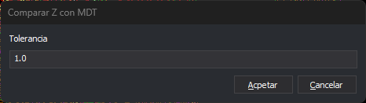

# COMPARAR\_Z\_MDT
<!-- id: comparar-z-mdt -->

Compara la coordenada Z de los vértices de las entidades con la Z del modelo digital del terreno cargado y añade al panel de tareas las entidades en las que la diferencia supera una tolerancia.

## Parámetros

| Número de parámetro | Descripción | Opcional |
| :--- | :--- | :--- |
| 1...n | Códigos de las entidades a comparar. Un parámetro que empieza por `#` se sustituye por todos los códigos que tienen esa etiqueta en la tabla de códigos. | Si. Si no se especifica ningún parámetro, la orden pide que selecciones las entidades a comparar |

## Cuadro de diálogo Comparar Z con MDT

Esta orden solicita la tolerancia en este cuadro de diálogo.

* **Tolerancia**: diferencia máxima admitida entre la Z de un vértice y la Z del modelo digital del terreno, en las unidades del sistema de referencia. El valor por defecto es 1.0.
* **Aceptar**: compara las entidades con esa tolerancia.
* **Cancelar**: termina la orden sin comparar. Dejar el campo vacío y pulsar **Aceptar** tiene el mismo efecto.

## Observaciones

1. Si no hay ningún archivo cargado que pueda proyectar una Z \(un modelo digital del terreno\), la orden emite un sonido de error y termina.
2. Para cada entidad, la orden recorre sus vértices. Un vértice que no se puede proyectar sobre ningún modelo se ignora. En la primera diferencia entre la Z del vértice y la Z del modelo mayor que la tolerancia, la orden añade una tarea de error al panel de tareas que lleva a ese vértice.
3. Con parámetros, la orden analiza todas las entidades visibles y no borradas del archivo de dibujo que tienen alguno de los códigos indicados y termina sin pedir selección.
4. Si está activa la opción de limpiar automáticamente el panel de tareas, la orden lo vacía antes de comparar.

## Características de la orden

| Tipo de orden | [Orden interactiva](comparar-z-mdt.md) |
| :--- | :--- |
| Repite automáticamente | No |
| Opción del menú donde aparece la orden | _Esta orden no tiene asociada ninguna opción de menú_ |
| Barra de herramientas en la que aparece la orden | _Esta orden no tiene asociado ningún botón en ninguna barra de herramientas_ |
| Extensión | DigiNG.OrdenesMDT.dll |
| Variables relacionadas | No tiene variables relacionadas |
| Órdenes relacionadas | [PROYECTA\_POR\_CONDICION](/digi3d-ai/referencia/ventana-de-dibujo/ordenes/p/proyecta-por-condicion.md) |
| Nombre interno | {08589CEE-2BEA-42BC-AD4E-5F65709CDA35} |
