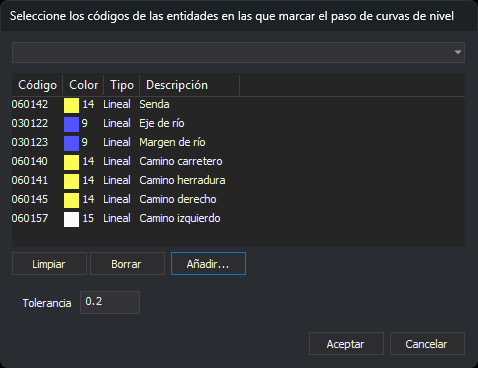

# CONFIGURAR\_MOSTRAR\_PASO\_CURVAS
<!-- id: configurar-mostrar-paso-curvas -->

Configura la tolerancia y los códigos que usa la visualización del paso de curvas de nivel \(variable [MOSTRAR\_PASO\_CURVAS](/digi3d-ai/referencia/ventana-de-dibujo/variables/m/mostrar_paso_curvas.md)\).

## Parámetros

| Número de parámetro | Descripción | Opcional |
| :--- | :--- | :--- |
| 1 | Tolerancia en Z, en las mismas unidades que la coordenada Z de los archivos de dibujo. Se escribe con punto decimal. | Si |
| 2...n | Códigos de las líneas que se analizan. Admiten el comodín `*`. Un parámetro que empieza por `#` se sustituye por todos los códigos que tienen esa etiqueta en la tabla de códigos. | Si |

La orden solo usa los parámetros si recibe al menos dos \(la tolerancia y un código\). Con menos de dos muestra el cuadro de diálogo.

## Observaciones

1. El cuadro de diálogo es [Selecciona códigos](/digi3d-ai/referencia/cuadros-de-dialogo/selecciona-codigos.md) con la casilla **Tolerancia** debajo de la lista. La primera vez la lista está vacía y la tolerancia vale 0.2. Las siguientes veces muestra los códigos y la tolerancia configurados. Si se cancela el cuadro, se conserva la configuración anterior.

   

2. La configuración dura hasta que se cierra Digi3D.AI: no se guarda y es la misma para todos los archivos de dibujo.
3. Al terminar, la orden recalcula los tramos marcados con la configuración nueva.
4. Con la variable activa y la Z bloqueada, el programa marca los tramos de las entidades de tipo línea no borradas, de todos los archivos de dibujo cargados, que tienen alguno de los códigos y cuyo rango de Z contiene la Z activa. De cada línea se marcan las partes cuya Z está entre la Z activa menos la tolerancia y la Z activa más la tolerancia.
5. Los tramos se recalculan cada vez que [Z](/digi3d-ai/referencia/ventana-de-dibujo/variables/z/z.md), [FIJAZ](/digi3d-ai/referencia/ventana-de-dibujo/variables/f/fijaz.md), [SUBE\_Z](/digi3d-ai/referencia/ventana-de-dibujo/ordenes/s/sube-z.md) o [BAJA\_Z](/digi3d-ai/referencia/ventana-de-dibujo/ordenes/b/baja-z.md) cambian la Z o el bloqueo de la Z. [BLOQUEA\_Z](/digi3d-ai/referencia/ventana-fotogrametrica/ordenes/b/bloquea-z.md) no los recalcula.
6. Los tramos se dibujan con una línea discontinua animada roja y blanca y con una marca en cada vértice, en la ventana de dibujo y en las ventanas fotogramétricas. No forman parte de ningún archivo de dibujo ni de la selección: no se pueden editar.

## Características de la orden

| Tipo de orden | Orden inmediata |
| :--- | :--- |
| Repite automáticamente | No |
| Opción del menú donde aparece la orden | Inmediato/Tentativos/Configurar paso de curvas... |
| Barra de herramientas en la que aparece la orden | Tentativo \(desplegable del botón Mostrar paso de curvas\) |
| Extensión | DigiNG.OrdenesStandard.dll |
| Variables relacionadas | [MOSTRAR\_PASO\_CURVAS](/digi3d-ai/referencia/ventana-de-dibujo/variables/m/mostrar_paso_curvas.md) — activa o desactiva la visualización del paso de curvas |
| Órdenes relacionadas | [FIJAZ](/digi3d-ai/referencia/ventana-de-dibujo/variables/f/fijaz.md), [Z](/digi3d-ai/referencia/ventana-de-dibujo/variables/z/z.md) |
| Nombre interno | {FEB6782B-86C0-43C4-A5B4-2AE8B5D13F26} |
