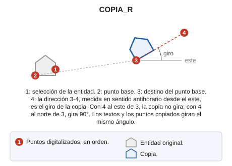

# COPIA\_R

Realiza una copia de una entidad de dibujo permitiendo rotarla con un segundo dato.

## Parámetros

| Número de parámetro | Descripción | Opcional |
| :--- | :--- | :--- |
| 1...n | [Tipos de geometría](/digi3d-ai/referencia/ventana-de-dibujo/tipos-de-geometria.md) que se pueden seleccionar, una letra por parámetro. En esta orden, `C` indica líneas y puntos, no complejos, y `*` indica líneas, puntos, textos e imágenes | Si |

## Observaciones

1. Selecciona la entidad que se va a copiar.
2. Digitaliza el punto base.
3. Digitaliza el destino del punto base.
4. Digitaliza un cuarto punto. La copia gira el ángulo de la dirección que va del tercer punto al cuarto, medido en sentido antihorario desde el este. Si el cuarto punto está al este del tercero, la copia no gira; si está al norte, gira 90°. Los textos y los puntos copiados giran el mismo ángulo.

Si la variable [REPITE](/digi3d-ai/referencia/ventana-de-dibujo/variables/r/repite.md) está activa, la orden conserva la entidad y el punto base y vuelve a pedir el destino y el giro de una nueva copia.

## Características de la orden

| Tipo de orden | [Orden interactiva](copia-r.md) |
| :--- | :--- |
| Repite automáticamente | No |
| Opción del menú donde aparece la orden | _Esta orden no tiene asociada ninguna opción de menú_ |
| Barra de herramientas en la que aparece la orden | _Esta orden no tiene asociado ningún botón en ninguna barra de herramientas_ |
| Extensión | DigiNG.OrdenesStandard.dll |
| Variables relacionadas | [AA](/digi3d-ai/referencia/ventana-de-dibujo/variables/a/aa.md) — ángulo activo [FORZAR\_AA\_ACTIVA](/digi3d-ai/referencia/ventana-de-dibujo/variables/f/forzar-aa-activa.md) — fuerza el ángulo activo (AA) en las entidades generadas [FORZAR\_AT\_ACTIVA](/digi3d-ai/referencia/ventana-de-dibujo/variables/f/forzar-at-activa.md) — fuerza la altura activa (AT) en las entidades generadas [FORZAR\_CODIGO\_ACTIVO](/digi3d-ai/referencia/ventana-de-dibujo/variables/f/forzar-codigo-activo.md) — fuerza el código activo en las entidades generadas [FORZAR\_JT\_ACTIVA](/digi3d-ai/referencia/ventana-de-dibujo/variables/f/forzar-jt-activa.md) — fuerza la justificación activa (JT) en las entidades generadas [JT](/digi3d-ai/referencia/ventana-de-dibujo/variables/j/jt.md) — justificación del texto [REPITE](/digi3d-ai/referencia/ventana-de-dibujo/variables/r/repite.md) — repite la última orden ejecutada |
| Órdenes relacionadas | [COPIA2P](/digi3d-ai/referencia/ventana-de-dibujo/ordenes/c/copia-2p.md) [COPIAR](/digi3d-ai/referencia/ventana-de-dibujo/ordenes/c/copiar.md) [DUP](/digi3d-ai/referencia/ventana-de-dibujo/ordenes/d/dup.md) [DUPLICA](/digi3d-ai/referencia/ventana-de-dibujo/ordenes/d/duplica.md) |
| Nombre interno | {BC545BCF-6444-4D86-BBA7-DDF1238E337C} |
