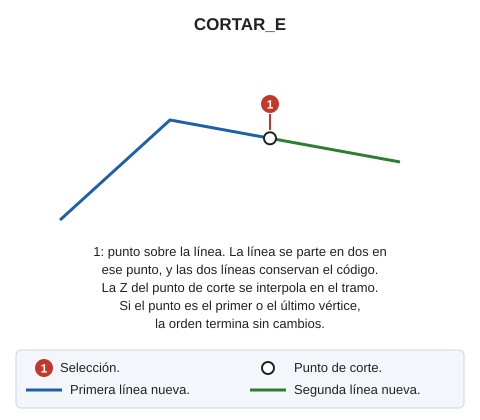

# CORTAR\_E

Corta o descompone un elemento en otros dos.

## Parámetros

No admite parámetros.

## Características de la orden

| Tipo de orden | [Orden interactiva](cortar-e.md) |
| :--- | :--- |
| Repite automáticamente | Si |
| Opción del menú donde aparece la orden | Editar/Polilíneas/Partir una polilínea |
| Barra de herramientas en la que aparece la orden | Partir |
| Extensión | DigiNG.OrdenesStandard.dll |
| Variables relacionadas | [REPITE](/digi3d-ai/referencia/ventana-de-dibujo/variables/r/repite.md) — repite la última orden ejecutada |
| Nombre interno | {4FE96D61-BD2E-437c-8B2E-AD77CC97E4E3} |

