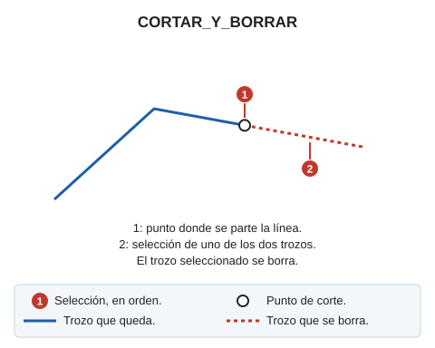

# CORTAR\_Y\_BORRAR
<!-- id: cortar-y-borrar -->

Corta o descompone un elemento en otros dos y luego elimina uno de los dos elementos creados.

## Parámetros

No admite parámetros.

## Características de la orden

| Tipo de orden | [Orden interactiva](cortar-y-borrar.md) |
| :--- | :--- |
| Repite automáticamente | Si |
| Opción del menú donde aparece la orden | Editar/Polilíneas/Partir una polilínea y eliminar uno de los dos extremos |
| Barra de herramientas en la que aparece la orden | Partir |
| Extensión | DigiNG.OrdenesStandard.dll |
| Variables relacionadas | [REPITE](/digi3d-ai/referencia/ventana-de-dibujo/variables/r/repite.md) — repite la última orden ejecutada |
| Órdenes relacionadas | [CORTA\_2P](/digi3d-ai/referencia/ventana-de-dibujo/ordenes/c/corta-2p.md) [CORTAR\_E](/digi3d-ai/referencia/ventana-de-dibujo/ordenes/c/cortar-e.md) |
| Nombre interno | {2D4EAA24-227B-40E4-9E9A-2D189706CD40} |

