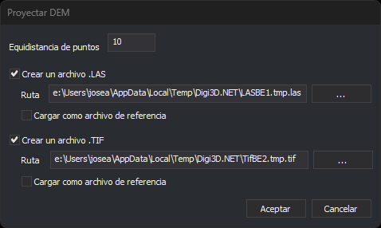

# CREA\_DEM
<!-- id: crea-dem -->

Genera una nueva triangulación a partir de cartografía existente dentro del límite seleccionado y proyecta sobre esa triangulación una malla regular de puntos, que guarda en un archivo LAS, en un archivo GeoTIFF o en los dos.

## Parámetros

No admite parámetros.

## Observaciones

1. Indica en el cuadro de diálogo el paso de malla \(en las unidades del sistema de referencia\), si se crea el archivo LAS, si se crea el archivo TIFF, sus rutas y si se cargan como archivos de referencia al terminar. Las rutas propuestas son archivos temporales. Si el paso de malla es menor o igual que 0, la orden muestra un mensaje y termina.

   

2. Selecciona la línea que actúa como límite.

El archivo LAS contiene los puntos de la malla situados dentro del límite que se pueden proyectar sobre la triangulación. El archivo TIFF es un ráster de 32 bits en coma flotante que cubre el rectángulo envolvente del límite, con valor sin datos -32767.

## Características de la orden

| Tipo de orden | [Orden interactiva](crea-dem.md) |
| :--- | :--- |
| Repite automáticamente | No |
| Opción del menú donde aparece la orden | MDT/Crear DEM... |
| Barra de herramientas en la que aparece la orden | Triangulación |
| Extensión | DigiNG.OrdenesMDT.dll |
| Variables relacionadas | No tiene variables relacionadas |
| Órdenes relacionadas | [TRIANGULAR](/digi3d-ai/referencia/ventana-de-dibujo/ordenes/t/triangular.md) |
| Nombre interno | {3B6F710E-0DFD-46E0-A5B6-407DB853C480} |
