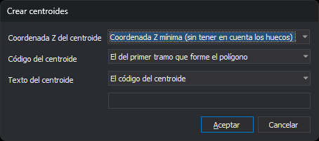

# CREAR\_CENTROIDES
<!-- id: crear-centroides -->

Crea un centroide en cada recinto sin centroide de las topologías cargadas, en la parte de la topología que corresponde al archivo de dibujo activo.

## Parámetros

| Número de parámetro | Descripción | Valores | Opcional |
| :--- | :--- | :--- | :--- |
| 1...n | Nombres de las topologías a procesar. Por cada nombre que no corresponde a ninguna topología cargada, la orden emite el sonido de error y muestra el aviso «No se ha localizado la topología: _nombre_». Un nombre repetido, aunque cambien las mayúsculas, se procesa una sola vez | Nombres de topología | Sí. Si no se indica ninguno, la orden procesa todas las topologías cargadas |

## Observaciones

La orden necesita al menos una topología cargada. Si no hay ninguna, emite el sonido de error, muestra el aviso «No hay ningún archivo de topología cargado» y termina. Si ninguno de los nombres indicados corresponde a una topología cargada, la orden termina sin mostrar el cuadro de diálogo.

### Cuadro de diálogo

Esta orden solicita los datos en el cuadro _Crear centroides_:

| Campo | Descripción | Valor por defecto |
| :--- | :--- | :--- |
| Coordenada Z del centroide | Z que recibe el centroide: _Coordenada Z mínima (sin tener en cuenta los huecos)_ o _Coordenada Z máxima (sin tener en cuenta los huecos)_, calculadas con los vértices de las líneas del contorno exterior; _Coordenada Z mínima (teniendo en cuenta los huecos)_ o _Coordenada Z máxima (teniendo en cuenta los huecos)_, calculadas con los vértices del contorno exterior y de los huecos; _Altura del polígono_, que es la diferencia entre la Z máxima y la Z mínima de los vértices del contorno exterior y de los huecos; o _Coordenada 0.0_ | Coordenada Z mínima (sin tener en cuenta los huecos) |
| Código del centroide | Código que recibe el centroide: _El del primer tramo que forme el polígono_ (el primer código de la primera línea del contorno exterior); _El código cuyo perímetro sea mayor_ (se suma la longitud 2D de las líneas del contorno exterior agrupadas por su primer código y gana la suma mayor; en caso de empate, el código alfabéticamente menor); o _El código activo_ (el primero de los códigos activos) | El del primer tramo que forme el polígono |
| Texto del centroide | Texto que recibe el centroide: _El código del centroide_; _Altura del polígono_, _Z mínima del polígono_ o _Z máxima del polígono_, calculadas con los vértices del contorno exterior y de los huecos y escritas con el número de decimales de [NDEC](/digi3d-ai/referencia/ventana-de-dibujo/variables/n/ndec.md); o _Texto personalizado_ | El código del centroide |
| Texto personalizado | Texto que reciben todos los centroides. Solo está activo con la opción _Texto personalizado_ | Vacío |

Con _Texto personalizado_ y el campo vacío, el botón _Aceptar_ está desactivado.

La orden no recuerda los valores: cada vez que se ejecuta, el cuadro muestra los valores por defecto.

Si pulsas _Cancelar_, la orden termina sin modificar nada.

### Funcionamiento

La orden solo procesa la parte de cada topología que corresponde al archivo de dibujo activo. Crea un texto en cada recinto que no tiene centroide. Un recinto cuyo centroide está borrado, por ejemplo con [UNDO](/digi3d-ai/referencia/ventana-de-dibujo/ordenes/u/undo.md), cuenta como recinto sin centroide. Un hueco no recibe centroide como parte del recinto que lo contiene; si el interior del hueco forma otro recinto, ese recinto recibe su propio centroide. Si una misma zona es recinto de dos topologías procesadas, recibe un centroide por cada topología.

El centroide se coloca dentro del recinto y fuera de sus huecos, también en recintos cóncavos. Para calcularlo, la orden prueba horizontales entre las coordenadas Y de los vértices del contorno y de los huecos, toma en cada una el centro del tramo interior más ancho y se queda con el punto más alejado del borde. Si no encuentra ningún punto válido, el recinto se queda sin centroide.

El centroide toma el ángulo de [AA](/digi3d-ai/referencia/ventana-de-dibujo/variables/a/aa.md), la altura de [AT](/digi3d-ai/referencia/ventana-de-dibujo/variables/a/at.md) y la justificación de [JT](/digi3d-ai/referencia/ventana-de-dibujo/variables/j/jt.md).

La topología cargada pasa a tener los centroides creados, sin volver a formarse. Por eso una nueva ejecución de la orden no los duplica, y las demás órdenes de topología tratan los centroides nuevos como centroides de sus recintos.

[UNDO](/digi3d-ai/referencia/ventana-de-dibujo/ordenes/u/undo.md) deshace de una vez todos los centroides creados por la orden.

## Características de la orden

| Tipo de orden | Orden inmediata |
| :--- | :--- |
| Repite automáticamente | No |
| Opción del menú donde aparece la orden | Topología/Crear centroides automáticamente.../Todas las topologías, que ejecuta la orden sin parámetros. En el mismo submenú aparece una opción por cada topología cargada, que ejecuta la orden con el nombre de esa topología como parámetro. Las opciones están desactivadas si no hay ninguna topología cargada |
| Barra de herramientas en la que aparece la orden | _Esta orden no tiene asociado ningún botón en ninguna barra de herramientas_ |
| Extensión | DigiNG.OrdenesTopologia.dll |
| Variables relacionadas | [AA](/digi3d-ai/referencia/ventana-de-dibujo/variables/a/aa.md) — establece el valor del ángulo activo [AT](/digi3d-ai/referencia/ventana-de-dibujo/variables/a/at.md) — establece la altura de los textos [JT](/digi3d-ai/referencia/ventana-de-dibujo/variables/j/jt.md) — cambia la justificación del texto al insertarlo [NDEC](/digi3d-ai/referencia/ventana-de-dibujo/variables/n/ndec.md) — número de decimales |
| Órdenes relacionadas | [DETECTAR\_POLIGONOS\_SIN\_CENTROIDE\_TOPOLOGIAS\_CARGADAS](/digi3d-ai/referencia/ventana-de-dibujo/ordenes/d/detectar-poligonos-sin-centroide-topologias-cargadas.md) [UNDO](/digi3d-ai/referencia/ventana-de-dibujo/ordenes/u/undo.md) |
| Nombre interno | {E6B3BAA5-7326-4976-A759-51C8660DDFAF} |
