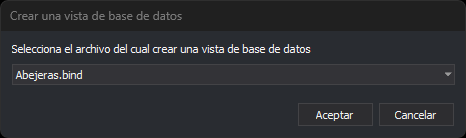

# CREAR\_VISTA\_BBDD
<!-- id: crear-vista-bbdd -->

Crea un archivo de dibujo virtual que muestra, sobre las geometrías de un archivo de dibujo con base de datos, el valor de uno de sus campos.

## Parámetros

No admite parámetros.

## Cuadro de diálogo Crear una vista de base de datos

Esta orden solicita en este cuadro de diálogo el archivo de dibujo del que crear la vista. El desplegable muestra solo los archivos de dibujo cargados que tienen una base de datos asociada. El botón **Aceptar** está deshabilitado hasta que se elige un archivo.

Si no hay cargado ningún archivo con base de datos, aparece el mensaje «No hay cargado ningún archivo con base de datos asociada» y la orden termina.

## Observaciones

Al pulsar **Aceptar**, la orden añade un archivo de referencia llamado «Vista de base de datos de: *archivo*» y muestra el panel [Archivos de dibujo](../../../paneles/archivos-de-dibujo.md). Esta vista escribe el valor de un campo de la base de datos dentro de un rectángulo con fondo, o *NULL* si el campo está vacío. El texto empieza en el centro de la geometría. Solo lo escribe para las geometrías no borradas cuyo centro está en pantalla y para los códigos cuya tabla es la elegida.

La vista no muestra nada hasta que se eligen la tabla y el campo.

En el panel Archivos de dibujo, las propiedades de la vista permiten elegir:

* **Tabla**: la tabla de la base de datos de la que se toma el valor. Al cambiar la tabla, **Campo** se vacía.
* **Campo**: el campo de esa tabla que se muestra.
* **Color de fondo**: el color del rectángulo que rodea al texto. Por defecto, azul.
* **Color del texto**: el color del texto. Por defecto, blanco.
* **Altura**: el tamaño del texto, en píxeles. Por defecto, 20.

## Características de la orden

| Tipo de orden | [Orden inmediata](crear-vista-bbdd.md) |
| :--- | :--- |
| Repite automáticamente | No |
| Opción del menú donde aparece la orden | Base de Datos/Crear vista de base de datos... |
| Barra de herramientas en la que aparece la orden | _Esta orden no tiene asociado ningún botón en ninguna barra de herramientas_ |
| Extensión | DigiNG.OrdenesBaseDatos.dll |
| Variables relacionadas | No tiene variables relacionadas |
| Órdenes relacionadas | No tiene órdenes relacionadas |
| Nombre interno | {14169A10-395F-4E9F-BC43-638F2BD80EEE} |
