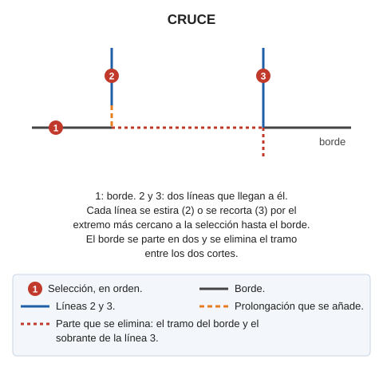

# CRUCE

Dibuja el cruce de una entidad con otras dos, de forma que el tramo de la primera comprendido entre los puntos de intersección con las dos últimas, se elimina del dibujo.

## Parámetros

Esta orden no admite parámetros.

## Observaciones

Esta orden suele utilizarse para dibujar cruces de caminos, carreteras, etc....

## Características de la orden

| Tipo de orden | [Orden interactiva](cruce.md) |
| :--- | :--- |
| Repite automáticamente | Si |
| Opción del menú donde aparece la orden | Editar/Polilíneas/Crear un cruce de caminos |
| Barra de herramientas en la que aparece la orden | Extender/Recortar |
| Extensión | DigiNG.OrdenesStandard.dll |
| Variables relacionadas | [REPITE](/digi3d-ai/referencia/ventana-de-dibujo/variables/r/repite.md) — repite la última orden ejecutada |
| Órdenes relacionadas | No tiene órdenes relacionadas |
| Nombre interno | {E46C5B7B-41E3-45fd-9ACC-9D6958ADDB97} |

