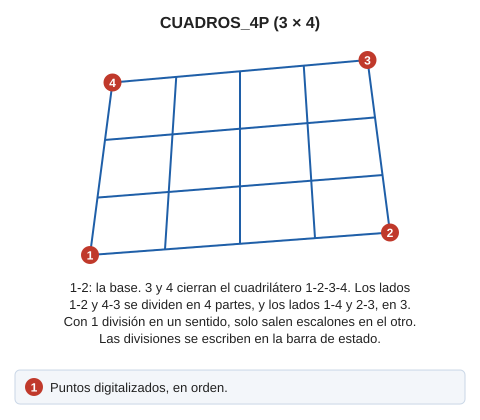

# CUADROS\_4P
<!-- id: cuadros-4p -->

Dibuja escaleras o matrices de polígonos de cuatro lados.

## Parámetros

No admite parámetros.

## Observaciones

Se piden los puntos primero y segundo que definen la base, y luego los tercero y cuarto que forman el cuadrilátero.

El resultado gráfico final, puede ser cualquiera de los siguientes:

* Dibujo de cuadros.
* Dibujo de escalones sólo en la dirección paralela a la base.
* Dibujo de escalones sólo en la dirección perpendicular a la base.

## Características de la orden

| Tipo de orden | [Orden interactiva](cuadros-4p.md) |
| :--- | :--- |
| Repite automáticamente | Si |
| Opción del menú donde aparece la orden | Dibujar/Mas/Rejilla con 4 puntos |
| Barra de herramientas en la que aparece la orden | Rejillas |
| Extensión | DigiNG.OrdenesStandard.dll |
| Variables relacionadas | [REPITE](/digi3d-ai/referencia/ventana-de-dibujo/variables/r/repite.md) — repite la última orden ejecutada |
| Órdenes relacionadas | [CUADROS](/digi3d-ai/referencia/ventana-de-dibujo/ordenes/c/cuadros.md) |
| Nombre interno | {CD9C598F-CF2F-4478-A09C-63E28F86260A} |

