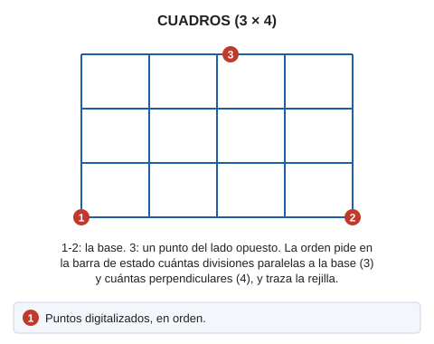

# CUADROS
<!-- id: cuadros -->

Traza segmentos tanto paralelos como perpendiculares a la base.

## Parámetros

No admite parámetros

## Observaciones

El efecto visual sería equiparable al de una matriz de cuadrados o rectángulos. El funcionamiento de esta orden es similar al de la orden [ESCALERA](/digi3d-ai/referencia/ventana-de-dibujo/ordenes/e/escalera.md).

## Características de la orden

| Tipo de orden | [Orden interactiva](cuadros.md) |
| :--- | :--- |
| Repite automáticamente | Si |
| Opción del menú donde aparece la orden | Dibujar/Mas/Rejilla con 3 puntos |
| Barra de herramientas en la que aparece la orden | Rejillas |
| Extensión | DigiNG.OrdenesStandard.dll |
| Variables relacionadas | [REPITE](/digi3d-ai/referencia/ventana-de-dibujo/variables/r/repite.md) — repite la última orden ejecutada |
| Órdenes relacionadas | [CUADROS\_4P](/digi3d-ai/referencia/ventana-de-dibujo/ordenes/c/cuadros-4p.md) [ESCALERA](/digi3d-ai/referencia/ventana-de-dibujo/ordenes/e/escalera.md) |
| Nombre interno | {D8557157-D1DA-475b-8988-67474F895E53} |

