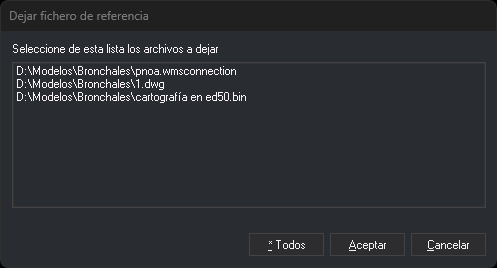

# DEJAR
<!-- id: dejar -->

Descarga los ficheros de referencia que se encuentren unidos al fichero de trabajo.

## Parámetros

| Número de parámetro | Descripción | Opcional |
| :--- | :--- | :--- |
| 1 | Ruta del archivo de referencia a descargar | Si |

## Observaciones

Si no hay ningún archivo de referencia cargado, la orden muestra un mensaje de error y termina.

Si indicas el parámetro, la orden descarga ese archivo de referencia sin mostrar ningún cuadro de diálogo. Si la ruta contiene espacios, escríbela entre comillas dobles.

Si la ruta no corresponde a ningún archivo de referencia cargado, suena el aviso de error y no se descarga ningún archivo.

Sin parámetro, si solo hay un archivo de referencia cargado, la orden lo descarga directamente. Si hay varios, la orden muestra el cuadro de diálogo **Dejar fichero de referencia**.

Al descargar un archivo de referencia:

* La orden descarga también todas las topologías cargadas. Lo hace también cuando la ruta del parámetro no corresponde a ningún archivo cargado.
* La orden quita el archivo de la lista de archivos de referencia asociados al archivo de dibujo. Al volver a abrir el archivo de dibujo, ese archivo de referencia ya no se carga.
* Si el archivo tiene entidades marcadas como borradas y su formato guarda esa marca dentro del propio archivo, Digi3D.AI pregunta si quieres comprimirlo: «Quedan entidades marcadas como borradas que todavía no se han eliminado: (…) ¿Desea comprimir ahora?». **Sí** comprime el archivo y lo descarga. **No** lo descarga sin comprimir. **Cancelar** anula la descarga de ese archivo.

## Cuadro de diálogo Dejar fichero de referencia

* **Lista de archivos**: los archivos de referencia cargados. Cada clic sobre un archivo lo selecciona o lo deselecciona, sin necesidad de pulsar Ctrl ni Mayúsculas.
* **\* Todos**: descarga todos los archivos de referencia de la lista.
* **Aceptar**: descarga los archivos seleccionados. Sin ningún archivo seleccionado, no hace nada y el cuadro de diálogo sigue abierto.
* **Cancelar**: cierra el cuadro de diálogo sin descargar ningún archivo.

## Características de la orden

| Tipo de orden | [Orden inmediata](dejar.md) |
| :--- | :--- |
| Repite automáticamente | No |
| Opción del menú donde aparece la orden | Archivo/Descargar archivo de referencia... |
| Barra de herramientas en la que aparece la orden | _Esta orden no tiene asociado ningún botón en ninguna barra de herramientas_ |
| Extensión | DigiNG.OrdenesStandard.dll |
| Variables relacionadas | No tiene variables relacionadas |
| Órdenes relacionadas | [CARGA\_F](/digi3d-ai/referencia/ventana-de-dibujo/ordenes/c/carga-f.md) |
| Nombre interno | {99D6E304-1AE6-4eec-B6E5-D1A438009F11} |

