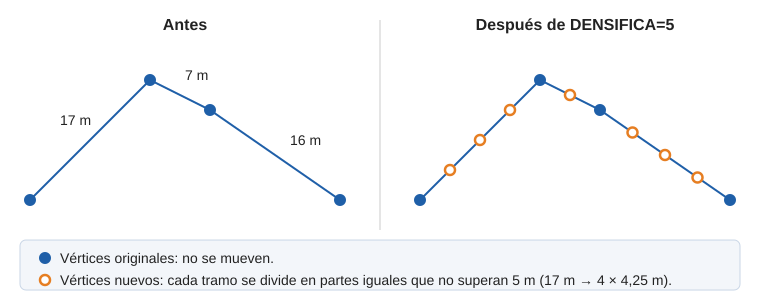
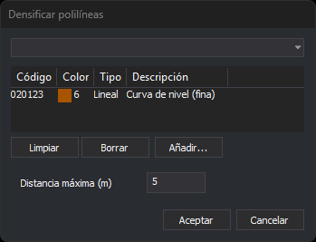

# DENSIFICA
<!-- id: densifica -->

Inserta vértices en las líneas y polígonos de los códigos indicados para que ningún tramo supere una distancia.

Cada tramo más largo que la distancia se divide en partes iguales. Los vértices originales no se mueven, así que la forma de la entidad no cambia.

## Parámetros

| Número de parámetro | Descripción | Opcional |
| :--- | :--- | :--- |
| 1 | Distancia máxima entre vértices, en metros. | Sí |
| 2 y siguientes | Códigos de las entidades. Admite comodines (`*`, `?`) y etiquetas de la tabla de códigos con `#` (por ejemplo, `#vcurvas`). | Sí |

### Ejemplos

`DENSIFICA`

Abre un cuadro de diálogo para elegir los códigos y la distancia.

`DENSIFICA=5 020100 020200`

Inserta vértices en las entidades con los códigos `020100` y `020200` para que ningún tramo supere 5 m.

`DENSIFICA=2 #vcurvas`

Inserta vértices cada 2 m como máximo en las entidades de todos los códigos que tienen la etiqueta `vcurvas`.

## Cuadro de diálogo

Si ejecutas la orden sin parámetros, o solo con la distancia, aparece el cuadro de diálogo [Selecciona códigos](/digi3d-ai/referencia/cuadros-de-dialogo/selecciona-codigos.md) para elegir los códigos o una etiqueta de la tabla de códigos, con un campo propio para escribir la **Distancia máxima (m)**. El cuadro propone la última distancia aceptada en él (5 la primera vez). Si la distancia se indica como parámetro, el cuadro muestra esa distancia; la que se indica por parámetro no se guarda.

También se puede ejecutar desde **Dibujar/Densificar polilíneas...**.

## Observaciones

- La orden actúa sobre las líneas, los polígonos (su contorno y sus huecos) y las entidades complejas (cada una de las entidades que las forman). El resto de entidades no cambia.
- La longitud de cada tramo se mide en planta: la Z no interviene. Si el archivo de dibujo está en coordenadas geográficas, la distancia se mide igualmente en metros.
- La Z de los vértices nuevos se interpola linealmente entre la de los dos vértices del tramo.
- Un tramo cuya longitud es igual a la distancia, o menor, no se divide.
- Solo se modifican las entidades del archivo de dibujo activo que están visibles, no borradas y dentro de la región de interés.
- Cada entidad densificada se sustituye por una copia con los vértices nuevos.
- La distancia tiene que ser mayor que 0. Si no lo es, la orden muestra «La distancia máxima entre vértices tiene que ser mayor que 0.» y no modifica nada.
- Si una línea pasaría de 10.000.000 de vértices, o si un tramo no se puede medir, la orden muestra un mensaje de error y no modifica ninguna entidad.
- Sin códigos, la orden termina sin hacer nada.

## Véase también

- [GEN](/digi3d-ai/referencia/ventana-de-dibujo/ordenes/g/gen.md) y [GEN\_2D](/digi3d-ai/referencia/ventana-de-dibujo/ordenes/g/gen-2d.md): hacen la operación contraria, eliminar vértices.
- [INSERTA\_VERTICE](/digi3d-ai/referencia/ventana-de-dibujo/ordenes/i/inserta-vertice.md): inserta un único vértice en el punto que indicas.

Cada entidad se trata de forma independiente: si Digi3D.AI descarta una entidad densificada, solo se conserva su original y las demás se densifican.

## Características de la orden

| Tipo de orden | [Orden interactiva](densifica.md) |
| :--- | :--- |
| Repite automáticamente | No |
| Opción del menú donde aparece la orden | Dibujar/Densificar polilíneas... |
| Barra de herramientas en la que aparece la orden | _Esta orden no tiene asociado ningún botón en ninguna barra de herramientas_ |
| Extensión | DigiNG.OrdenesStandard.dll |
| Variables relacionadas | No tiene variables relacionadas |
| Órdenes relacionadas | [GEN](/digi3d-ai/referencia/ventana-de-dibujo/ordenes/g/gen.md) [GEN\_2D](/digi3d-ai/referencia/ventana-de-dibujo/ordenes/g/gen-2d.md) [INSERTA\_VÉRTICE](/digi3d-ai/referencia/ventana-de-dibujo/ordenes/i/inserta-vertice.md) |
| Nombre interno | {33AB2DA1-4007-4BA9-B637-7F5CDAEA33E3} |
