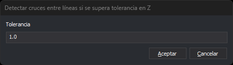

# DETECTAR\_CRUCE\_LINEAS\_Z
<!-- id: detectar-cruce-lineas-z -->

Detecta cruces entre líneas y marca como error aquellas cuya diferencia en Z supere una tolerancia

## Parámetros

| Número de parámetro | Descripción | Opcional |
| :--- | :--- | :--- |
| 1 | Código o códigos (uno o más, separados por espacios) | Si |

## Cuadro de diálogo Detectar cruces entre líneas si se supera tolerancia en Z

Esta orden solicita la tolerancia en este cuadro de diálogo.

* **Tolerancia**: diferencia máxima admitida entre las Z de las dos líneas en el punto de cruce, en las unidades del sistema de referencia. El valor por defecto es 1.0.
* **Aceptar**: busca los cruces con esa tolerancia.
* **Cancelar**: termina la orden sin buscar cruces. Dejar el campo vacío y pulsar **Aceptar** tiene el mismo efecto.

## Observaciones

En cada cruce en el que la diferencia de Z entre las dos líneas, interpolada en el punto de cruce, sea mayor que la tolerancia, la orden crea dos tareas de error en el panel de tareas: una para cada línea. Las tareas tienen el mismo texto que las de [DETECTAR\_CRUCE\_LINEAS](detectar-cruce-lineas.md): «Se ha localizado una intersección entre líneas». La orden detecta también los cruces de una línea consigo misma.

La orden analiza las líneas y polígonos \(incluidos sus huecos\) visibles, dentro de la zona de interés, que tengan alguno de los códigos indicados. Los códigos admiten los comodines \* y ?. Para incluir todos los códigos que tengan una etiqueta, antepón una almohadilla \(\#\) al nombre de la etiqueta.

Si no indicas ningún código, la orden espera a que selecciones un conjunto de entidades mediante una selección múltiple, analiza las entidades seleccionadas y termina.

Si está activada la opción [Vaciar automáticamente](../../../cuadros-de-dialogo/configuracion/panel-de-tareas/vaciar-automaticamente.md) del panel de tareas, la orden vacía el panel al aceptar la tolerancia. La opción está activada por defecto.

Escribe los decimales de la tolerancia con punto: con coma, la orden ignora la parte decimal (`1,5` se lee como 1).

## Opciones de menú

* **Análisis geométricos/Detectar cruces entre líneas si se supera tolerancia en Z/Líneas visibles**: ejecuta la orden con el parámetro `*`, que analiza todas las líneas visibles.
* Debajo, el submenú muestra una opción por cada etiqueta de la tabla de códigos. Cada opción analiza las líneas con códigos de esa etiqueta.

## Características de la orden

| Tipo de orden | [Orden interactiva](detectar-cruce-lineas-z.md) |
| :--- | :--- |
| Repite automáticamente | No |
| Opción del menú donde aparece la orden | Análisis geométricos/Detectar cruces entre líneas si se supera tolerancia en Z/Líneas visibles |
| Barra de herramientas en la que aparece la orden | _Esta orden no tiene asociado ningún botón en ninguna barra de herramientas_ |
| Extensión | DigiNG.OrdenesTopologia.dll |
| Variables relacionadas | No tiene variables relacionadas |
| Órdenes relacionadas | [DETECTAR\_CRUCE\_LINEAS](/digi3d-ai/referencia/ventana-de-dibujo/ordenes/d/detectar-cruce-lineas.md) [DETECTAR\_CRUCE\_LINEAS\_VISIBLES](/digi3d-ai/referencia/ventana-de-dibujo/ordenes/d/detectar-cruce-lineas-visibles.md) |
| Nombre interno | {DACB177A-0871-415C-BDE5-801586CB9171} |
