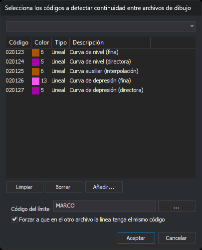

# DETECTAR\_ERRORES\_CONTINUIDAD\_LINEAS\_CASES
<!-- id: detectar-errores-continuidad-lineas-cases -->

Detecta las líneas que terminan en el límite entre dos archivos de dibujo contiguos (cases) y no continúan en el otro archivo. Opcionalmente, detecta también las líneas que continúan con un código distinto. Los errores se añaden al [panel de tareas](/digi3d-ai/referencia/paneles/tareas.md).

## Parámetros

| Número de parámetro | Descripción | Opcional |
| :--- | :--- | :--- |
| 1 | Código de las líneas que forman el límite entre archivos de dibujo | No |
| 2 | 1 para exigir que la línea tenga los mismos códigos en los dos archivos; 0 para no exigirlo. Cualquier valor distinto de 0 equivale a 1 | No |
| 3 | Código o códigos de las líneas a analizar \(uno o más\). Admite comodines y `#etiqueta`, que equivale a todos los códigos de la tabla con esa etiqueta | No |

Si indicas menos de tres parámetros, la orden no tiene en cuenta ninguno y muestra el cuadro de diálogo. Si los códigos del parámetro 3 se quedan en ninguno \(por ejemplo, una etiqueta sin códigos\), la orden emite el sonido de error y termina.

## Observaciones

La orden necesita al menos dos archivos de dibujo cargados, contando el activo y los de referencia. Con menos, muestra el mensaje _Se necesitan al menos dos archivos de dibujo para detectar errores de continuidad_ y termina.

### Cuadro de diálogo

El cuadro _Detectar errores de continuidad de líneas entre archivos de dibujo_ tiene estos controles:

| Control | Descripción |
| :--- | :--- |
| Desplegable superior | Lista las etiquetas de la tabla de códigos con el prefijo `#`. Al elegir una, la lista de códigos pasa a contener los códigos con esa etiqueta y el desplegable vuelve a quedar vacío |
| Lista de códigos | Códigos de las líneas a analizar, con su color, tipo y descripción. Si la lista está vacía, la orden analiza las líneas de todos los códigos |
| Limpiar | Vacía la lista de códigos |
| Borrar | Quita de la lista el código seleccionado |
| Añadir... | Abre el cuadro de selección de códigos y añade a la lista los códigos elegidos |
| Código del límite | Código de las líneas que forman el límite entre archivos, normalmente el marco de cada hoja. El botón **...** abre el cuadro de selección de códigos. Si cancelas ese cuadro, el campo conserva su valor |
| Forzar a que en el otro archivo la línea tenga el mismo código | Si está marcada, también es error que la línea continúe en el otro archivo con códigos distintos |

El cuadro guarda _Código del límite_ y la casilla en los valores `CodigoLimite` y `ForzarMismoCodigo` de la clave del registro `HKEY_CURRENT_USER\Software\Digi21\Digi3D.NET\DigiNG\Extensiones\DigiNG.OrdenesTopololgia\DialogoDetectarErroresContinuidadCases`. Los guarda en cuanto los cambias, aunque después pulses _Cancelar_. La siguiente vez que ejecutes la orden, el cuadro muestra esos valores. La lista de códigos no se guarda: cada vez empieza vacía.

Si pulsas _Cancelar_, la orden termina sin analizar nada.

### Análisis

1. Si el código del límite está vacío, la orden emite el sonido de error, muestra _Indica el código de las líneas del límite_ y termina.
2. Si está activada la opción [Vaciar automáticamente](/digi3d-ai/referencia/cuadros-de-dialogo/configuracion/panel-de-tareas/vaciar-automaticamente.md) del panel de tareas, la orden vacía el panel.
3. La orden toma las líneas no borradas con el código del límite de todos los archivos de dibujo cargados. Las parte unas contra otras por sus cruces y vértices comunes, y se queda con los tramos que coinciden en dos o más líneas: el límite común entre archivos contiguos. Si no queda ningún tramo, la orden emite el sonido de error, muestra _Ninguna línea con el código del límite … tiene tramos que coincidan en dos o más archivos de dibujo_ y termina.
4. Los vértices de esos tramos son los puntos del límite. Para cada línea no borrada con alguno de los códigos a analizar, la orden comprueba su primer y su último vértice. Si alguno coincide con un punto del límite, anota el archivo y los códigos de la línea, salvo el código del límite.
5. Por cada punto del límite al que llegan líneas:
   * Si las líneas son de un solo archivo, la orden crea la tarea _Error de continuidad entre modelos_ con la descripción _Esta línea termina en el borde de un modelo y no continúa por el siguiente modelo_.
   * Si las líneas son de dos o más archivos y la opción de forzar el mismo código está activada, la orden compara cada archivo con cada uno de los demás. Por cada código que tiene un archivo y no tiene el otro, crea la tarea _Error de continuidad entre modelos: código_. Una misma diferencia puede generar una tarea en cada sentido.
   * Si las líneas son de dos o más archivos y la opción está desactivada, no hay error.

Dos puntos coinciden si la diferencia en X y en Y es menor que el valor _Sigma_ de la pestaña [Archivo de dibujo](/digi3d-ai/referencia/cuadros-de-dialogo/nuevo-proyecto/archivo-de-dibujo.md) del proyecto \(0,001 por defecto\). La orden no tiene una tolerancia propia y no compara la coordenada Z.

La orden solo analiza los extremos de las líneas que caen en un **vértice** del límite. Una línea que termina en mitad de un tramo del límite, lejos de cualquier vértice, no se analiza. Para insertar en el límite un vértice en cada punto al que llega una línea, ejecuta antes [AJUSTA\_LIMITES\_ARCHIVOS\_DIBUJO](/digi3d-ai/referencia/ventana-de-dibujo/ordenes/a/ajusta-limites-archivos-dibujo.md).

Cada tarea sitúa el cursor en el punto del error. La columna de archivo de todas las tareas muestra el archivo de dibujo activo, aunque la línea esté en un archivo de referencia.

### Resultado

* Sin errores, la orden muestra el mensaje _No se han encontrado errores de continuidad_.
* Con errores, la orden añade las tareas al panel de tareas, emite el sonido de error, muestra _Se han localizado N errores_ y abre el panel de tareas.

## Características de la orden

| Tipo de orden | Orden inmediata |
| :--- | :--- |
| Repite automáticamente | No |
| Opción del menú donde aparece la orden | Análisis geométricos/Detectar errores de conectividad de líneas entre archivos... |
| Barra de herramientas en la que aparece la orden | _Esta orden no tiene asociado ningún botón en ninguna barra de herramientas_ |
| Extensión | DigiNG.OrdenesTopologia.dll |
| Variables relacionadas | No tiene variables relacionadas |
| Órdenes relacionadas | [AJUSTA\_LIMITES\_ARCHIVOS\_DIBUJO](/digi3d-ai/referencia/ventana-de-dibujo/ordenes/a/ajusta-limites-archivos-dibujo.md) [CONTROL\_TOPOLOGICO\_CASES](/digi3d-ai/referencia/ventana-de-dibujo/ordenes/c/control-topologico-cases.md) [DETECTAR\_ERRORES\_ATRIBUTOS\_BBDD\_CASES](/digi3d-ai/referencia/ventana-de-dibujo/ordenes/d/detectar-errores-atributos-bbdd-cases.md) |
| Nombre interno | {991B1568-5815-48B2-9829-7D4E504A8951} |
