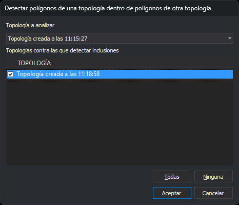

# DETECTAR\_POLIGONOS\_UNA\_TOPOLOGIA\_DENTRO\_POLIGONOS\_OTRA\_TOPOLOGIA
<!-- id: detectar-poligonos-una-topologia-dentro-poligonos-otra-topologia -->

Detecta los recintos de una topología que están dentro de recintos de otras topologías cargadas y añade un error por cada pareja al [panel de tareas](/digi3d-ai/referencia/paneles/tareas.md).

## Parámetros

| Número de parámetro | Descripción | Opcional |
| :--- | :--- | :--- |
| 1 | Topología cuyos recintos se comprueban | Sí |
| 2 y siguientes | Topologías cuyos recintos pueden contener a los de la primera | Sí |

## Observaciones

La orden necesita al menos dos topologías cargadas. Si no hay ninguna, muestra el aviso «No hay ninguna topología cargada»; si hay solo una, muestra «Se necesitan al menos dos topologías cargadas». En los dos casos emite el sonido de error y termina. Con menos de dos topologías, la opción del menú está desactivada.

Si indicas dos o más parámetros, la orden compara la topología del primer parámetro con las de los siguientes, sin mostrar el cuadro de diálogo. Los nombres no distinguen mayúsculas de minúsculas y los repetidos se comparan una sola vez. La orden muestra un aviso, emite el sonido de error y termina sin comprobar nada en estos casos:

* Alguna de las topologías no está cargada: «La topología X no está cargada».
* La topología del primer parámetro aparece también entre las siguientes: «La topología a analizar no puede estar también entre las topologías con las que se compara».

Si indicas un solo parámetro, o ninguno, la orden ignora el parámetro y muestra el cuadro de diálogo.

### Cuadro de diálogo

Esta orden solicita los datos en el cuadro _Detectar polígonos de una topología dentro de polígonos de otra topología_:

| Campo | Descripción | Valor por defecto |
| :--- | :--- | :--- |
| Topología a analizar | Topología cuyos recintos se comprueban. La lista contiene las topologías cargadas, por nombre y en orden alfabético | La primera de la lista |
| Topologías contra las que detectar inclusiones | Topologías cuyos recintos pueden contener a los de la topología a analizar. Contiene las demás topologías cargadas; se marcan con la casilla de cada fila | Ninguna marcada |

Los botones _Todas_ y _Ninguna_ marcan o desmarcan todas las topologías de la lista. Al cambiar la topología a analizar, la lista se vuelve a llenar sin ella y las topologías que estaban marcadas siguen marcadas. El botón _Aceptar_ solo está activo si hay al menos una topología marcada.

La orden no recuerda los valores: cada vez que se ejecuta, el cuadro muestra los valores por defecto.

Si pulsas _Cancelar_, la orden termina sin comprobar nada.

### Funcionamiento

La orden compara cada recinto de la topología a analizar con cada recinto de las topologías marcadas. Cada topología aporta sus recintos de todos los archivos de dibujo en los que está cargada: el archivo activo y los de referencia.

Un recinto es la superficie de su contorno exterior menos la de sus huecos. La orden no tiene en cuenta, en ninguna de las topologías:

* Los recintos sin centroide de una topología que no forma polígonos sin centroide.
* Los recintos cuyo centroide los declara hueco (el texto de [centroide para huecos](/digi3d-ai/referencia/editor-de-tablas-de-codigos/pestanas/topologias/anadir-topologia.md) de la topología).

Un recinto A está dentro de un recinto B si toda la superficie de A pertenece a la de B:

* El borde de A puede coincidir en parte o del todo con el de B; un recinto igual a otro está dentro de él.
* A no está dentro de B si alguna parte de A queda fuera de B, en un hueco de B o en la escotadura de un recinto cóncavo, aunque todos los vértices de A estén dentro de B.
* Dos coordenadas a menos de media unidad de la precisión del modelo se consideran el mismo punto.

Por cada pareja en la que el recinto de la topología a analizar está dentro del recinto de otra topología, la orden añade un error al panel de tareas con el texto «Polígono de topología: A dentro de polígono de topología: B». La coordenada de la tarea es el primer vértice del contorno exterior del recinto incluido, y el archivo de la tarea es el archivo de dibujo activo.

Al terminar, la orden muestra el aviso «Polígonos dentro de polígonos de otra topología: N» y, si hay alguno, emite el sonido de error.

Durante la comprobación, la orden muestra el cursor de espera y el porcentaje completado. Solo se comparan los recintos cuyos rectángulos envolventes se tocan. El tiempo depende sobre todo del número de vértices de esas parejas.

La orden no modifica el dibujo.

## Características de la orden

| Tipo de orden | Orden inmediata |
| :--- | :--- |
| Repite automáticamente | No |
| Opción del menú donde aparece la orden | Topología/Detectar recintos topológicos de una topología dentro de recintos topológicos de otra topología/De una topología contra las seleccionadas... |
| Barra de herramientas en la que aparece la orden | _Esta orden no tiene asociado ningún botón en ninguna barra de herramientas_ |
| Extensión | DigiNG.OrdenesTopologia.dll |
| Variables relacionadas | No tiene variables relacionadas |
| Órdenes relacionadas | [DETECTAR\_SOLAPES\_TOPOLOGIAS](/digi3d-ai/referencia/ventana-de-dibujo/ordenes/d/detectar-solapes-topologias.md) |
| Nombre interno | {42C16C41-2492-4B10-AE22-D080310A73D3} |
