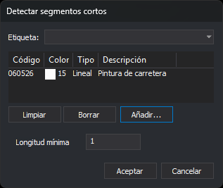

# DETECTAR\_SEGMENTOS\_CORTOS
<!-- id: detectar-segmentos-cortos -->

Busca en las líneas y los polígonos de los códigos indicados los tramos más cortos que una longitud mínima y añade una tarea de error al panel de tareas por cada entidad que tenga alguno. La orden no modifica el dibujo: para eliminar esos tramos, usa [ELIMINAR\_SEGMENTOS\_CORTOS](/digi3d-ai/referencia/ventana-de-dibujo/ordenes/e/eliminar-segmentos-cortos.md).

## Parámetros

| Número de parámetro | Descripción | Opcional |
| :--- | :--- | :--- |
| 1 | Longitud mínima de un tramo. Tiene que ser un número mayor que 0. | Sí |
| 2 y siguientes | Códigos de las entidades. Admite comodines (`*`, `?`) y etiquetas de la tabla de códigos con `#` (por ejemplo, `#vias_de_comunicacion`). | Sí |

### Ejemplos

`DETECTAR_SEGMENTOS_CORTOS`

Abre un cuadro de diálogo para elegir los códigos y la longitud mínima.

`DETECTAR_SEGMENTOS_CORTOS=0.5 060526 0605*`

Busca tramos de menos de 0,5 unidades en las entidades con el código `060526` y con los códigos que empiezan por `0605`.

`DETECTAR_SEGMENTOS_CORTOS=1 #vias_de_comunicacion`

Busca tramos de menos de 1 unidad en las entidades de todos los códigos que tienen la etiqueta `vias_de_comunicacion`.

## Cuadro de diálogo

Si ejecutas la orden sin parámetros, o solo con la longitud, aparece el cuadro de diálogo [Selecciona códigos](/digi3d-ai/referencia/cuadros-de-dialogo/selecciona-codigos.md) con el título _Detectar segmentos cortos_. Si solo indicas la longitud, la orden no la usa: el cuadro muestra la que tiene guardada.

Debajo de la lista de códigos, el cuadro tiene un campo propio:

| Campo | Descripción | Valor por defecto |
| :--- | :--- | :--- |
| Longitud mínima | Longitud mínima de un tramo, medida en planta. Tiene que ser un número mayor que 0 | La última longitud aceptada; 1 la primera vez |

El botón _Aceptar_ solo está habilitado si la lista contiene al menos un código y la longitud mínima es un número mayor que 0. Al pulsar _Aceptar_, la orden guarda la longitud en el valor `LongitudMinima` de la clave del registro `HKEY_CURRENT_USER\Software\Digi21\Digi3D.NET\DigiNG\Extensiones\DigiNG.OrdenesTopologia\DetectarSegmentosCortos`. ELIMINAR\_SEGMENTOS\_CORTOS usa el mismo valor. La lista de códigos no se guarda: cada vez que ejecutas la orden, la lista empieza vacía.

Si pulsas _Cancelar_, la orden termina sin analizar nada.

## Observaciones

- La orden analiza las líneas y los polígonos del archivo de dibujo activo que no están borrados, están visibles y están dentro de la zona de interés, y que tienen alguno de los códigos indicados. En un polígono analiza el contorno exterior y cada hueco por separado. El resto de entidades, incluidas las complejas, no se analiza.
- Un tramo es el segmento entre dos vértices consecutivos. Su longitud se mide en planta: la Z no interviene. Un tramo es corto si su longitud es menor que la longitud mínima; un tramo de longitud igual a la mínima no es corto. Una línea o un hueco con menos de dos vértices no tiene tramos y la orden lo ignora.
- Si el sistema de referencia de coordenadas de la ventana de dibujo es proyectado \(UTM, Lambert, etc.\) o local, la longitud está en las unidades de las coordenadas. Si es geográfico, la orden proyecta cada contorno y cada hueco en una proyección estereográfica oblicua con origen en su primer vértice, y la longitud está en metros.
- Por cada entidad con al menos un tramo corto, la orden añade al panel de tareas una tarea de error _Detectado segmento corto_ que hace zoom a la entidad. La tarea tiene una subtarea por cada tramo corto, _Segmento de N unidades de longitud_, que centra la vista en el punto medio del tramo.
- Si está activada la opción [Vaciar automáticamente](/digi3d-ai/referencia/cuadros-de-dialogo/configuracion/panel-de-tareas/vaciar-automaticamente.md) del panel de tareas, la orden vacía el panel antes de analizar, tanto si la ejecutas con parámetros como si aceptas el cuadro de diálogo. La orden vacía el panel después de comprobar la longitud mínima: si la longitud no es válida, o si pulsas _Cancelar_, no lo vacía.
- Si la longitud indicada como parámetro no es un número mayor que 0, la orden muestra «La longitud mínima de los segmentos tiene que ser un número mayor que 0.», emite el sonido de error y no analiza nada.
- La orden no modifica ninguna entidad y no añade nada al historial de [UNDO](/digi3d-ai/referencia/ventana-de-dibujo/ordenes/u/undo.md).

## Características de la orden

| Tipo de orden | [Orden interactiva](/digi3d-ai/referencia/ventana-de-dibujo/ordenes-interactivas.md) sin parámetros; orden inmediata con parámetros |
| :--- | :--- |
| Repite automáticamente | No |
| Opción del menú donde aparece la orden | Análisis geométricos/Detectar segmentos cortos... |
| Barra de herramientas en la que aparece la orden | _Esta orden no tiene asociado ningún botón en ninguna barra de herramientas_ |
| Extensión | DigiNG.OrdenesTopologia.dll |
| Variables relacionadas | No tiene variables relacionadas |
| Órdenes relacionadas | [ELIMINAR\_SEGMENTOS\_CORTOS](/digi3d-ai/referencia/ventana-de-dibujo/ordenes/e/eliminar-segmentos-cortos.md) |
| Nombre interno | {C91882C6-2398-4E30-8C3B-39E1BC404237} |
