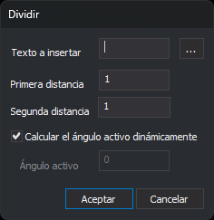

# DIVIDIR
<!-- id: dividir -->

Inserta un texto o un símbolo repetido a lo largo de una entidad lineal.

## Parámetros

| Número de parámetro | Descripción | Opcional |
| :--- | :--- | :--- |
| 1 | Código de las líneas | Si |
| 2 | Texto a insertar, o símbolo escrito como `@<nombre del símbolo>` | Si |
| 3 | Un número: ángulo fijo de los textos, en grados sexagesimales, con el mismo origen y sentido que el [ángulo activo](/digi3d-ai/referencia/ventana-de-dibujo/variables/a/aa.md). `P`: ángulo calculado en cada tramo, con el texto perpendicular al tramo. `A`: ángulo calculado en cada tramo, con el texto alineado con el tramo. Las letras no distinguen mayúsculas | Si |

`DIVIDIR=<código> <texto o símbolo> [ángulo | P | A]`

Con los parámetros 1 y 2, la orden procesa todas las líneas del archivo de dibujo actual que tienen ese código, están visibles, están dentro de la zona de interés y no están borradas. Después termina. Las distancias son la distancia activa principal y la secundaria de [DA](/digi3d-ai/referencia/ventana-de-dibujo/variables/d/da.md). Si falta el parámetro 3, el ángulo de cada texto se calcula con el tramo en el que cae y el texto queda perpendicular al tramo, igual que con `P`.

Con un solo parámetro, la orden termina sin hacer nada.

## Cuadro de diálogo

Sin parámetros, la orden muestra el cuadro de diálogo **Dividir**:

* **Texto a insertar**: el texto que se repite a lo largo de la línea. Para insertar un símbolo, escribe `@` seguido del nombre del símbolo.
* **...**: abre el cuadro **Símbolo**, con la lista de los símbolos de la tabla de códigos. La lista no incluye los caracteres de las fuentes, que tienen nombres numéricos. Al aceptar, el campo **Texto a insertar** toma el valor `@<nombre del símbolo>`.
* **Primera distancia**: distancia desde el primer vértice de la línea hasta el primer texto. Empieza con el valor de la distancia activa principal.
* **Segunda distancia**: distancia entre dos textos consecutivos. Empieza con el valor de la distancia activa secundaria.
* **Calcular el ángulo activo dinámicamente**: el ángulo de cada texto se calcula con el tramo en el que cae. La casilla aparece marcada cada vez que se abre el cuadro.
* **Texto perpendicular a la línea**: solo está disponible si está marcada la casilla anterior. Si está marcada, cada texto queda perpendicular al tramo de la línea en el que se inserta. Si no está marcada, cada texto queda alineado con el tramo y orientado para leerse de izquierda a derecha; en los tramos verticales se lee de abajo arriba. Digi3D.AI recuerda el valor de esta casilla entre ejecuciones.
* **Ángulo activo**: ángulo fijo de todos los textos, en grados sexagesimales. Empieza con el valor del [ángulo activo](/digi3d-ai/referencia/ventana-de-dibujo/variables/a/aa.md). Solo está disponible con la casilla anterior desmarcada.

Los valores del cuadro solo se usan en esa ejecución: no cambian DA ni AA. El campo **Texto a insertar** aparece vacío cada vez que se abre el cuadro.

Si cancelas el cuadro o aceptas con **Texto a insertar** vacío, la orden termina sin insertar nada.

Al aceptar, la orden muestra el mensaje «Selecciona la línea a dividir». Si la entidad seleccionada no es una línea o no pertenece al archivo de dibujo actual, suena el aviso de error y la orden sigue esperando una línea.

## Observaciones

* El primer texto se sitúa a la primera distancia del primer vértice, medida sobre la línea. Los siguientes se sitúan cada segunda distancia, hasta el final de la línea.
* Las distancias se miden en planta (X e Y), en las mismas unidades que DA. Cada texto toma la Z interpolada del tramo en el que cae.
* Si una distancia vale 0 o es negativa, se usa 1. Si la segunda distancia es tan pequeña que la posición del texto siguiente no avanza, la orden deja de insertar textos en esa línea.
* Con el ángulo calculado dinámicamente y el texto perpendicular, cada texto queda girado 90° en sentido horario respecto a la dirección del tramo: la línea base del texto queda perpendicular a la línea y apunta hacia la derecha del sentido de la línea. Con el texto alineado, la línea base sigue la dirección del tramo.
* Los textos toman la altura de [AT](/digi3d-ai/referencia/ventana-de-dibujo/variables/a/at.md), la justificación de [JT](/digi3d-ai/referencia/ventana-de-dibujo/variables/j/jt.md), los códigos activos y los atributos activos. La línea no cambia.
* Cada ejecución se deshace en un solo paso. Con parámetros, ese paso incluye los textos de todas las líneas procesadas.

## Características de la orden

| Tipo de orden | [Orden interactiva](/digi3d-ai/referencia/ventana-de-dibujo/ordenes-interactivas.md) sin parámetros; orden inmediata con parámetros |
| :--- | :--- |
| Repite automáticamente | Sí, cuando se ejecuta sin parámetros |
| Opción del menú donde aparece la orden | Editar/Avanzado/Insertar un texto repetidamente sobre una línea |
| Barra de herramientas en la que aparece la orden | _Esta orden no tiene asociado ningún botón en ninguna barra de herramientas_ |
| Extensión | DigiNG.OrdenesStandard.dll |
| Variables relacionadas | [AA](/digi3d-ai/referencia/ventana-de-dibujo/variables/a/aa.md) — ángulo activo [AT](/digi3d-ai/referencia/ventana-de-dibujo/variables/a/at.md) — altura de los textos [DA](/digi3d-ai/referencia/ventana-de-dibujo/variables/d/da.md) — distancia activa [JT](/digi3d-ai/referencia/ventana-de-dibujo/variables/j/jt.md) — justificación del texto [REPITE](/digi3d-ai/referencia/ventana-de-dibujo/variables/r/repite.md) — repite la última orden ejecutada |
| Órdenes relacionadas | No tiene órdenes relacionadas |
| Nombre interno | {550ACFF8-2C01-4f41-8C8F-082658415BC0} |
