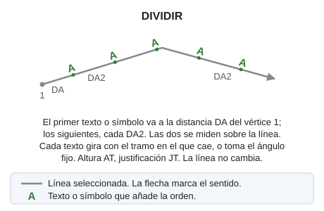

# DIVIDIR
<!-- id: dividir -->

Inserta textos o símbolos a lo largo de una entidad lineal.

## Parámetros

| Número de parámetro | Descripción | Opcional |
| :--- | :--- | :--- |
| 1 | Código de las líneas | Si |
| 2 | Texto, o símbolo escrito como `@<número>` | Si |
| 3 | Ángulo fijo de los textos, en grados sexagesimales como el [ángulo activo](/digi3d-ai/referencia/ventana-de-dibujo/variables/a/aa.md) | Si |

Con los parámetros 1 y 2, la orden procesa todas las líneas visibles de ese código y termina. Si falta el parámetro 3, cada texto gira con el tramo en el que cae.

`DIVIDIR=<código> <texto o símbolo> [ángulo]`

## Observaciones

Sin parámetros, la orden muestra un cuadro de diálogo con el texto o el símbolo, las dos distancias y el ángulo, y después pide que selecciones la línea.

* El primer texto se sitúa a la primera distancia del primer vértice, medida sobre la línea. Con parámetros, es la distancia activa principal de [DA](/digi3d-ai/referencia/ventana-de-dibujo/variables/d/da.md).
* Los siguientes se sitúan cada segunda distancia. Con parámetros, es la distancia activa secundaria.
* Si una distancia vale 0, se usa 1.
* Los textos toman la altura de [AT](/digi3d-ai/referencia/ventana-de-dibujo/variables/a/at.md), la justificación de [JT](/digi3d-ai/referencia/ventana-de-dibujo/variables/j/jt.md) y la Z interpolada de la línea. La línea no cambia.

## Características de la orden

| Tipo de orden | [Orden interactiva](dividir.md) |
| :--- | :--- |
| Repite automáticamente | Si |
| Opción del menú donde aparece la orden | _Esta orden no tiene asociada ninguna opción de menú_ |
| Barra de herramientas en la que aparece la orden | _Esta orden no tiene asociado ningún botón en ninguna barra de herramientas_ |
| Extensión | DigiNG.OrdenesStandard.dll |
| Variables relacionadas | [AT](/digi3d-ai/referencia/ventana-de-dibujo/variables/a/at.md) — altura de los textos [DA](/digi3d-ai/referencia/ventana-de-dibujo/variables/d/da.md) — distancia activa [JT](/digi3d-ai/referencia/ventana-de-dibujo/variables/j/jt.md) — justificación del texto [REPITE](/digi3d-ai/referencia/ventana-de-dibujo/variables/r/repite.md) — repite la última orden ejecutada |
| Órdenes relacionadas | No tiene órdenes relacionadas |
| Nombre interno | {550ACFF8-2C01-4f41-8C8F-082658415BC0} |

