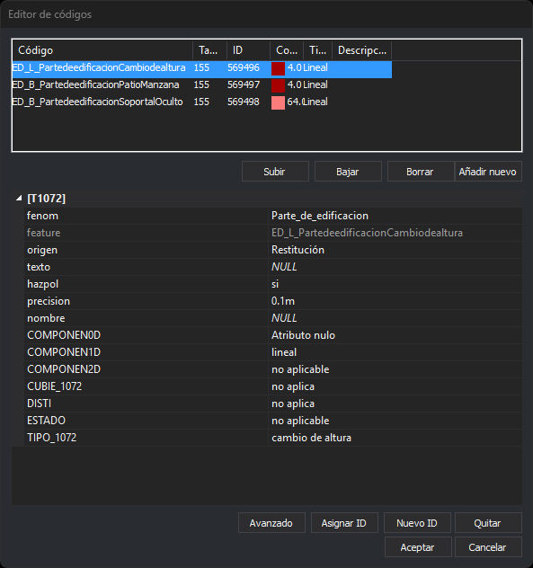
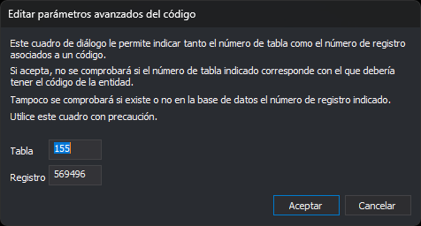
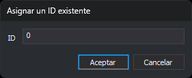

# EDITAR\_COD
<!-- id: editar-cod -->

Edita los códigos de la entidad seleccionada.

## Parámetros

No admite parámetros.

## Observaciones

La orden solicita que selecciones una entidad y muestra el cuadro de diálogo de edición de códigos con los códigos de esa entidad. Al aceptar el cuadro de diálogo:

* Si han cambiado los códigos, su orden, su tabla o su ID, la orden sustituye la entidad por una copia con los códigos editados. La copia sustituye también a la entidad en las topologías cargadas.
* Si solo han cambiado los atributos de la base de datos, la orden modifica la misma entidad.
* Si eliminas todos los códigos, la orden borra la entidad.

## Cuadro de diálogo Editor de códigos

Esta orden muestra este cuadro de diálogo con los códigos de la entidad seleccionada.

* **Lista de códigos**: cada código de la entidad, con su **Tabla** y su **ID** en la base de datos, su color, su tipo y su descripción.
* **Subir** y **Bajar**: cambian el orden del código seleccionado. Solo están habilitados si hay un código seleccionado.
* **Borrar**: quita el código seleccionado de la entidad. Solo está habilitado si hay un código seleccionado. La tecla Supr en la lista hace lo mismo.
* **Añadir nuevo**: abre el cuadro de diálogo [Seleccione códigos](../../../cuadros-de-dialogo/seleccione-codigos.md) para añadir códigos a la entidad. La tecla Insert en la lista hace lo mismo. Los códigos que la entidad ya tiene no se añaden otra vez, salvo que esté activada la opción [Permitir códigos repetidos](../../../cuadros-de-dialogo/configuracion/diging/permitir-codigos-repetidos.md).
* **Atributos**: los campos del registro de la base de datos enlazado con el código seleccionado. El título de la categoría es el nombre de la tabla. No se muestran la clave primaria ni los campos marcados como no visibles. Los campos que no se pueden editar aparecen atenuados.
* **Avanzado**: abre el cuadro de diálogo **Editar parámetros avanzados del código**, que cambia la tabla y el ID del registro enlazado. Si el ID del código no es numérico, el botón no hace nada.
* **Asignar ID**: abre el cuadro de diálogo **Asignar un ID existente**.
* **Nuevo ID**: al aceptar, se creará un registro nuevo en la base de datos para el código seleccionado.
* **Quitar**: desenlaza el código seleccionado de la base de datos y borra sus atributos.
* **Aceptar**: aplica los cambios a la entidad. En la base de datos, crea los registros de los códigos sin ID y actualiza los registros de los códigos que ya tienen ID. Si la escritura en la base de datos falla, Digi3D.AI muestra el error y el cuadro de diálogo se cierra igualmente. Si está activada la variable [FORZAR\_ALMACENAR\_GEOMETRIAS\_SIN\_ENLACE\_BBDD](../../variables/f/forzar-almacenar-geometrias-sin-enlace-bbdd.md), **Aceptar** quita a todos los códigos la tabla, el ID y los atributos, y no escribe en la base de datos.
* **Cancelar**: cierra el cuadro de diálogo sin cambiar la entidad.

**Asignar ID**, **Nuevo ID** y **Quitar** solo están habilitados si el código seleccionado tiene una tabla asociada en la tabla de códigos. **Nuevo ID** está deshabilitado además si el archivo de dibujo no está conectado a una base de datos.

### Apertura desde el error al almacenar en la base de datos

Si Digi3D.AI no consigue almacenar los atributos de un código en la base de datos, muestra el cuadro «El modelo de datos no ha conseguido almacenar la información en la base de datos». La opción **Editar los atributos de base de datos.** abre este cuadro de diálogo con ese único código. En este caso los botones **Subir**, **Bajar**, **Borrar** y **Añadir nuevo** están deshabilitados. Al cerrar el cuadro, Digi3D.AI vuelve a intentar almacenar el código.

## Cuadro de diálogo Editar parámetros avanzados del código

Lo abre el botón **Avanzado** del editor de códigos. Cambia a mano la tabla y el registro de la base de datos enlazados con el código seleccionado.

* **Tabla**: número de la tabla de la base de datos.
* **Registro**: número del registro de esa tabla.
* **Aceptar**: enlaza el código con esa tabla y ese registro. Digi3D.AI no comprueba que la tabla corresponda al código ni que el registro exista en la base de datos.
* **Cancelar**: cierra el cuadro de diálogo sin cambiar el enlace.

## Cuadro de diálogo Asignar un ID existente

Lo abre el botón **Asignar ID** del editor de códigos. Enlaza el código seleccionado con el registro de la base de datos que tiene ese ID, en lugar de crear un registro nuevo.

* **ID**: identificador del registro de la base de datos con el que se enlaza el código.
* **Aceptar**: enlaza el código con ese registro. Digi3D.AI no comprueba que exista un registro con ese ID.
* **Cancelar**: cierra el cuadro de diálogo sin cambiar el enlace.

Si el control de calidad descarta la copia con los códigos editados, la entidad original se conserva sin cambios.

## Características de la orden

| Tipo de orden                                    | [Orden interactiva](editar-cod.md)                                                                                                                              |
| ------------------------------------------------ | --------------------------------------------------------------------------------------------------------------------------------------------------------------- |
| Repite automáticamente                           | Si                                                                                                                                                              |
| Opción del menú donde aparece la orden           | Editar/Editar los códigos de una entidad...                                                                                                                     |
| Barra de herramientas en la que aparece la orden | Editar códigos                                                                                                                                                  |
| Extensión                                        | DigiNG.OrdenesStandard.dll                                                                                                                                      |
| Variables relacionadas                           | [REPITE](/digi3d-ai/referencia/ventana-de-dibujo/variables/r/repite.md) — repite la última orden ejecutada [FORZAR\_ALMACENAR\_GEOMETRIAS\_SIN\_ENLACE\_BBDD](/digi3d-ai/referencia/ventana-de-dibujo/variables/f/forzar-almacenar-geometrias-sin-enlace-bbdd.md) — al aceptar, quita a los códigos el enlace con la base de datos |
| Órdenes relacionadas                             | [ANADIR\_CODIGOS](/digi3d-ai/referencia/ventana-de-dibujo/ordenes/a/anadir-codigos.md) [CAMB\_COD](/digi3d-ai/referencia/ventana-de-dibujo/ordenes/c/camb-cod.md) [EDITAR\_ATRIBUTOS](/digi3d-ai/referencia/ventana-de-dibujo/ordenes/e/editar_atributos.md) [SUSTITUYE\_COD](/digi3d-ai/referencia/ventana-de-dibujo/ordenes/s/sustituye-cod.md) |
| Nombre interno | {973DB18A-7628-4254-9CB7-BABA38426AC4} |
