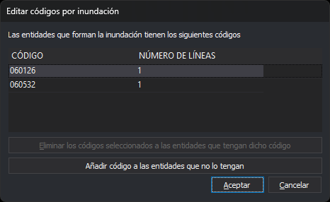

# EDITAR\_CODIGOS\_R
<!-- id: editar-codigos-r -->

Añade códigos a las líneas que forman los recintos seleccionados de la topología para inundaciones, o elimina códigos de esas líneas.

## Parámetros

No admite parámetros.

## Observaciones

Esta es una orden de inundación: trabaja sobre la topología para inundaciones, que hay que generar antes con [GENERAR\_TOPOLOGIA\_INUNDACION](/digi3d-ai/referencia/ventana-de-dibujo/ordenes/g/generar-topologia-inundacion.md) o con [GENERAR\_TOPOLOGIA\_INUNDACION\_SIN\_ISLAS](/digi3d-ai/referencia/ventana-de-dibujo/ordenes/g/generar-topologia-inundacion-sin-islas.md). Si no hay topología para inundaciones, la opción del menú está desactivada. Si tecleas la orden, muestra el aviso «No hay ninguna topología temporal creada», emite el sonido de error y termina.

La topología para inundaciones no se actualiza cuando modificas el dibujo con otras órdenes: no incluye las líneas que dibujes después de generarla, y las líneas que borres dejan de tenerse en cuenta. Genera de nuevo la topología después de modificar el dibujo. Los cambios que hace esta orden sí se trasladan a la topología.

### Selección de recintos

La orden muestra el mensaje «Selecciona el área» y resalta el recinto que está bajo el cursor.

* Pulsa el botón de datos dentro de un recinto para seleccionarlo. La selección anterior se descarta.
* Mantén pulsada la tecla Ctrl al pulsar el botón de datos para añadir el recinto a la selección o quitarlo de ella.
* Pulsa el botón de tentativo para pasar al siguiente recinto que contiene el punto.
* Pulsa el botón de reset para vaciar la selección.
* Pulsa la barra espaciadora para aceptar la selección. Si no hay ningún recinto seleccionado, la orden emite el sonido de error.
* Pulsa Esc para terminar la orden.

Las líneas que procesa la orden son las del contorno exterior y las de los huecos de los recintos seleccionados. Una línea que comparten dos recintos seleccionados no se procesa, porque queda dentro de la zona seleccionada.

### Cuadro de diálogo

Al aceptar la selección, la orden muestra el cuadro _Editar códigos por inundación_. La lista contiene, en orden alfabético, los códigos de las líneas que procesa la orden:

| Columna | Descripción |
| :--- | :--- |
| Código | Nombre del código |
| Número de líneas | Número de líneas que tienen el código. Una línea que tiene el código repetido cuenta una vez |

* _Eliminar los códigos seleccionados a las entidades que tengan dicho código_: quita de la lista los códigos de las filas seleccionadas. Solo está activo si hay alguna fila seleccionada.
* _Añadir código a las entidades que no lo tengan_: abre el cuadro de búsqueda de códigos, en el que puedes elegir uno o varios códigos. La orden no usa los códigos activos. Cada código elegido aparece en la lista con el número total de líneas. Si añades un código que habías eliminado, se cancela la eliminación.

Los botones solo cambian la lista. Las líneas se modifican al pulsar _Aceptar_. Si pulsas _Cancelar_, la orden termina sin modificar nada.

El cuadro recuerda su tamaño y posición.

### Funcionamiento

Al pulsar _Aceptar_, la orden procesa cada línea:

* Quita todas las apariciones de cada código eliminado.
* Añade al final, sin atributos, cada código añadido que la línea no tenga. Una línea que ya tiene el código no lo recibe otra vez, aunque esté activada la opción de permitir códigos repetidos.
* Los códigos que la línea conserva mantienen sus atributos.
* Si la línea se queda sin códigos, la orden la borra.
* Si no cambia ningún código de la línea, la orden no la modifica.

La orden sustituye cada línea modificada por una línea nueva con los mismos vértices y los códigos resultantes. La topología para inundaciones y las topologías cargadas del archivo de dibujo activo pasan a usar la línea nueva.

[UNDO](/digi3d-ai/referencia/ventana-de-dibujo/ordenes/u/undo.md) deshace de una vez todos los cambios de una ejecución de la orden.

## Características de la orden

| Tipo de orden | [Orden interactiva](/digi3d-ai/referencia/ventana-de-dibujo/ordenes-interactivas.md) |
| :--- | :--- |
| Repite automáticamente | Sí, si la variable [REPITE](/digi3d-ai/referencia/ventana-de-dibujo/variables/r/repite.md) está activada. Al pulsar Esc o si no hay topología para inundaciones, no se repite |
| Opción del menú donde aparece la orden | Inundación/Editar códigos... |
| Barra de herramientas en la que aparece la orden | _Esta orden no tiene asociado ningún botón en ninguna barra de herramientas_ |
| Extensión | DigiNG.OrdenesTopologia.dll |
| Variables relacionadas | [REPITE](/digi3d-ai/referencia/ventana-de-dibujo/variables/r/repite.md) |
| Órdenes relacionadas | [GENERAR\_TOPOLOGIA\_INUNDACION](/digi3d-ai/referencia/ventana-de-dibujo/ordenes/g/generar-topologia-inundacion.md) [GENERAR\_TOPOLOGIA\_INUNDACION\_SIN\_ISLAS](/digi3d-ai/referencia/ventana-de-dibujo/ordenes/g/generar-topologia-inundacion-sin-islas.md) [DESCARGAR\_TOPOLOGIA\_INUNDACION](/digi3d-ai/referencia/ventana-de-dibujo/ordenes/d/descargar-topologia-inundacion.md) [ANADE\_CODIGOS\_ACTIVOS\_Y\_CENTROIDE](/digi3d-ai/referencia/ventana-de-dibujo/ordenes/a/anade-codigos-activos-y-centroide.md) [BORRA\_COD\_R](/digi3d-ai/referencia/ventana-de-dibujo/ordenes/b/borra-cod-r.md) [CAMB\_COD\_R](/digi3d-ai/referencia/ventana-de-dibujo/ordenes/c/camb-cod-r.md) [MOSTRAR\_COD\_I](/digi3d-ai/referencia/ventana-de-dibujo/ordenes/m/mostrar-cod-i.md) [PONER\_ATR\_R](/digi3d-ai/referencia/ventana-de-dibujo/ordenes/p/poner-atr-r.md) [PONER\_COD\_RECINTO\_CENTROIDE](/digi3d-ai/referencia/ventana-de-dibujo/ordenes/p/poner-cod-recinto-centroide.md) [UNDO](/digi3d-ai/referencia/ventana-de-dibujo/ordenes/u/undo.md) |
| Nombre interno | {13FEE65F-C296-4498-BFD8-41A4E80124A4} |
