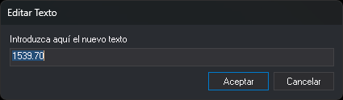

# EDITAR\_TEXTO
<!-- id: editar-texto -->

Cambia el contenido de un texto del archivo de dibujo activo.

## Parámetros

No admite parámetros.

## Observaciones

La orden muestra el mensaje «Selecciona el texto a editar...» y solicita que selecciones un texto con el botón de dato o con el de tentativo. Solo se pueden seleccionar textos del archivo de dibujo activo. La orden no admite otros tipos de entidad, como complejos o cotas, ni textos borrados. Si la entidad seleccionada no es válida, suena el aviso de error.

Tras seleccionar el texto, la orden muestra el cuadro de diálogo **Editar texto** con el contenido actual. La orden edita un solo texto cada vez.

Al aceptar el cuadro de diálogo:

* Si el contenido ha cambiado, la orden sustituye el texto por una copia con el contenido nuevo. La copia conserva el código, la posición, la altura, la rotación, la justificación y los atributos del original. La copia se añade al final del archivo de dibujo y el texto original se borra. Si el original no se puede borrar, o la copia no se puede añadir, el texto no cambia y suena el aviso de error.
* Si el contenido no ha cambiado, el texto no se modifica.
* Si el campo está vacío, el texto no se modifica y suena el aviso de error. Para borrar un texto, usa una orden de borrado.

**Cancelar** cierra el cuadro de diálogo sin cambiar el texto.

La orden [UNDO](/digi3d-ai/referencia/ventana-de-dibujo/ordenes/u/undo.md) deshace la sustitución.

Si la variable [REPITE](/digi3d-ai/referencia/ventana-de-dibujo/variables/r/repite.md) está activa, la orden vuelve a solicitar un texto al terminar, también tras cancelar el cuadro de diálogo.

## Cuadro de diálogo Editar texto

* **Introduzca aquí el nuevo texto**: contenido del texto. Al abrir el cuadro de diálogo, el campo contiene el texto actual. El campo es de una sola línea.
* **Aceptar**: sustituye el texto por el contenido del campo.
* **Cancelar**: cierra el cuadro de diálogo sin cambiar el texto.

## Características de la orden

| Tipo de orden | [Orden interactiva](/digi3d-ai/referencia/ventana-de-dibujo/ordenes-interactivas.md) |
| :--- | :--- |
| Repite automáticamente | Sí |
| Opción del menú donde aparece la orden | _Editar/Textos/Editar un texto_ |
| Barra de herramientas en la que aparece la orden | Textos |
| Extensión | DigiNG.OrdenesStandard.dll |
| Variables relacionadas | [REPITE](/digi3d-ai/referencia/ventana-de-dibujo/variables/r/repite.md) — repite la última orden ejecutada |
| Órdenes relacionadas | [CAMB\_TEXTO](/digi3d-ai/referencia/ventana-de-dibujo/ordenes/c/camb-texto.md) [BORRAR\_TEXTO](/digi3d-ai/referencia/ventana-de-dibujo/ordenes/b/borrar-texto.md) [REEMPLAZAR\_TEXTO](/digi3d-ai/referencia/ventana-de-dibujo/ordenes/r/reemplazar-texto.md) |
| Nombre interno | {897A5AA9-E36F-4d1c-A943-26C9E489BF5B} |
